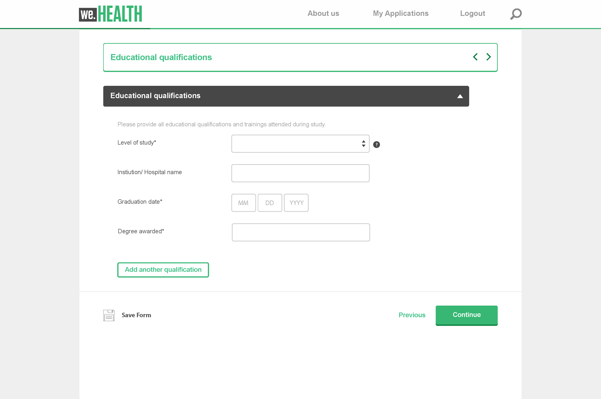

# アダプティブフォームのコアコンポーネントの概要 {#adaptive-forms-core-components-introduction}

Adobe Experience Manager のアダプティブフォームのコアコンポーネントを使用すると、柔軟性とカスタマイズオプションを利用して、魅力的な登録フォームを作成できます。

## コアコンポーネント  {#overview}

Adobe Experience Manager（AEM）のコンポーネントとは、ページやフォームの作成に使用される構築ブロックを意味します。 作成者がコンテンツを作成および管理するためのシンプルで強力な方法が提供されると同時に、開発者はカスタムコンポーネントの作成に必要な柔軟性と拡張性を活用できます。 これらは、web サイトやフォームの開発時間を短縮し、メンテナンスコストを削減するように設計されており、特定のニーズに合わせて柔軟かつ容易にカスタマイズできます。

また、コアコンポーネントはレスポンシブに設計されており、デスクトップ、タブレット、スマートフォンなど様々なデバイスに対応します。 また、web コンテンツを作成するための堅牢で信頼性の高いソリューションであり、最新の web 標準規格とベストプラクティスにも準拠しています。

全体的に、コアコンポーネントは AEM で web コンテンツを作成および管理するための不可欠なツールであり、開発時間と保守コストの削減に役立つ一方で、web サイト訪問者に優れたユーザーエクスペリエンスを提供する強力で柔軟なソリューションです。

## アダプティブフォームのコアコンポーネント

アダプティブフォームのコアコンポーネントとは、Adobe Experience Manager WCM コアコンポーネントの基盤上に構築された、オープンソースの 24 個のコンポーネントで、BEM に準拠しています。 これらは、ユーザーのデバイス、ブラウザー、画面サイズに適合するアダプティブフォームの作成に使用するように特別に設計されています。

これらのコンポーネントは、テキストフィールド、チェックボックス、ドロップダウンメニューなど、様々なフォームフィールドオプションを提供することで、例外的なデータ取得および登録エクスペリエンスを作成するために使用できます。 また、検証、条件付きロジック、レスポンシブデザインなどの機能も含まれ、ユーザーフレンドリーで使いやすいフォームを作成できます。

さらに、これらのコンポーネントはオープンソースなので、開発者は組織の特定のニーズに合わせて簡単にカスタマイズおよび拡張できます。 また、これらのコンポーネントは、拡張性と保守性が確保される BEM 手法に基づいて構築されています。

## 機能 {#features}

|  |  |
|---|---|
| 本番で使用可能 | アダプティブフォームのコアコンポーネントは、24 個の堅牢な WCM コンポーネントです。 |
| クラウド対応 |  [AEM Forms as a Cloud Service](https://experienceleague.adobe.com/docs/experience-manager-cloud-service/content/forms/home.html?lang=ja) で使用可能です。 |
| 用途が広い | コンポーネントは、ほぼすべてのレイアウトの作成にフォーム作成者が使用できる汎用的な概念を表します。 |
| 設定可能 | テンプレートレベルの[コンテンツポリシー](https://experienceleague.adobe.com/docs/experience-manager-cloud-service/content/implementing/developing/full-stack/components-templates/templates.html?lang=ja#content-policies)で、許可される機能と許可されない機能を定義します。 |
| 高いアクセシビリティ | ARIA ラベル、キーボードナビゲーション（[既知の問題](https://github.com/adobe/aem-core-wcm-components/issues?utf8=✓&amp;q=is%3Aissue+is%3Aopen+accessibility+in%3Atitle)）、および支援テクノロジー（スクリーンリーダーなど）用のテキストを提供します。 |
| テーマ設定可能 | コンポーネントは[スタイルシステム](https://experienceleague.adobe.com/docs/experience-manager-cloud-service/content/sites/authoring/features/style-system.html?lang=ja)を実装し、マークアップは [BEM CSS の命名規則](https://getbem.com/)に従っています。 |
| カスタマイズ可能 | いくつかのパターンが用意されているので、HTML の調整から高度な機能の再利用まで、カスタマイズが容易になっています。 |
| バージョン管理 | [バージョン管理ポリシー](https://github.com/adobe/aem-core-wcm-components/wiki/Versioning-policies)が設定されているので、影響を受ける可能性のある改善の際にも、コアコンポーネントが原因でサイトが機能しなくなることはありません。 |
| オープンソース | 何か問題がある場合は、改善案を寄稿できます。 |

<!-- comply with [WCAG 2.1 standard](https://www.w3.org/TR/WCAG21/), -->

## メリット {#benefits}

データキャプチャのエクスペリエンスは、リードジェネレーションと登録において重要です。アダプティブフォームのコアコンポーネントは、データキャプチャ用に最適化されたフォームを作成するための強力なソリューションです。 基盤コンポーネントを介してこれらのエクスペリエンスを作成するために、コアコンポーネントを使用する理由には次のようなものがあります。

* **GitHub で利用可能および包括的なドキュメント**：AEM アダプティブフォームのコアコンポーネントはオープンソースであり、GitHub で利用できます。包括的なドキュメントも用意されています。 これにより、開発者はコンポーネントとその動作を理解し、開発に貢献することが容易になります。 また、[aemcomponents.dev](https://www.aemcomponents.dev/) web サイトは、開発者がコンポーネントの動作を確認し、詳細なドキュメントにアクセスできる貴重なリソースです。

* **スタイル設定のための BEM モデル**：コアコンポーネントは、スタイル設定に BEM（ブロック要素修飾子）モデルに従います。BEM は、CSS を整理するための、広く使用されている確立された手法です。 これにより、開発者はスタイルの編成方法と、特定のニーズに合わせてスタイルを変更する方法を理解しやすくなります。

* **サードパーティライブラリへの依存なし**:コアコンポーネントの利点の 1 つは、JQuery や Underscore など、サードパーティの JavaScript ライブラリに依存しない点です。 これにより、コンポーネントが高速で軽量になり、既存の AEM 実装に統合しやすくなります。

* **パフォーマンスとアクセシビリティへの焦点**：コアコンポーネントは、パフォーマンスとアクセシビリティを考慮して構築されており、それは Google Lighthouse のスコアと web のバイタルスコアに大きく反映されています。 これにより、開発者はアクセシブルでパフォーマンスの高い web ページを容易に作成できます。これは、現在のデジタル環境でますます重要になっています。

* **Sites 30 のテンプレートおよびテーマのフォームコンポーネント**：コアコンポーネントは、Sites 30 のテンプレートおよびテーマでフォームコンポーネントをサポートしており、開発者は AEM 内でフォームを簡単に作成およびカスタマイズできます。

* **スタイル設定が容易**：コアコンポーネントは、基盤コンポーネントとは異なり、スタイル設定が容易です。 テーマの作成プロセスは Sites に似ていますが、同じテーマと CSS を親 Sites ページから継承できます。 さらに、スタイル設定に BEM モデルが採用されているため、容易にスタイルを理解して変更できます。

* **アクセシビリティ**：アダプティブフォームのコアコンポーネントは、障害のあるユーザー（スクリーンリーダーなどの支援テクノロジーを使用しているユーザーを含む）がフォームを確実に使用できるように、アクセシビリティに関する標準規格およびガイドラインをサポートしています。

<!-- >, such as  [WCAG 2.1 standard](https://www.w3.org/TR/WCAG21/), to ensure that forms can be used by people with disabilities, including those using assistive technologies such as screen readers.

*   **Alignment with AEM Sites**: The Core Components are designed to be more aligned with AEM Sites, making it easier for Sites users to adopt and use them without having to learn anything new. The components use the same front-end pipeline as Sites, making it easier to style and modify their appearance. 

<!-- Additionally, the following points further illustrate this alignment:

    *   **Authoring experience inline with Page editor**: The Core Components have an authoring experience that is inline with the Sites editor, with dialogs and other experiences similar to the Page editor. This makes it easier for Sites users to create and manage forms within the familiar context of the Sites editor.

    *   **Inline form editing in Sites editor**: The Core Components allow  inline form editing within the Sites editor, avoiding the need to switch back and forth between editors. This streamlines the authoring experience and makes it easier to create and manage forms.

    *   **Inheriting Sites features in Forms**: Forms authored within a Sites page inherit the same features as Sites. This provides a seamless and integrated experience for creating and managing forms within the context of AEM Sites 
    
    <!--including Multi Site Manager, the ability to use Sites components within a form for static content, support for scheduled publish/unpublish, form translation aligned with Sites translation, versioning, and targeting -->

## 要件 {#requirements}

アダプティブフォームのコアコンポーネントには、以下の要件があります。

| AEM | AEM Forms のアドオン | コアコンポーネント |
|---|---|---|
| AEM as a Cloud Service | Forms - デジタル登録 | [リリース 2.20.8](/help/versions.md)+ |

## アダプティブフォームのコアコンポーネント {#components}

 [アダプティブフォームエディター](https://experienceleague.adobe.com/docs/experience-manager-cloud-service/content/forms/adaptive-forms-authoring/authoring-adaptive-forms-core-components/create-an-adaptive-form-on-forms-cs/creating-adaptive-form-core-components.html?lang=ja)を使用して、コアコンポーネントをベースとするアダプティブフォームを作成できます。 アダプティブフォームのコアコンポーネントの現在のバージョンでは、次のコンポーネントを使用できます。

* アコーディオン
* ボタン
* チェックボックスグループ
* 日付選択
* ドロップダウンリスト
* メール入力
* フォームコンテナ
* ファイル添付
* フッター
* ヘッダー
* 水平タブ
* 画像
* 数値入力
* パネルコンテナ
* ラジオボタン
* リセットボタン
* 送信ボタン
* 電話入力
* テキスト入力
* テキスト
* タイトル
* ウィザード
