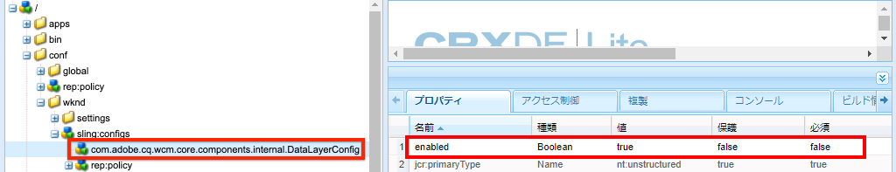

# コアコンポーネントでの Adobe Client Data Layer の使用{#data-layer-core-components}

Adobe Client Data Layer の目標は、あらゆるスクリプトであらゆる種類のデータを表示およびアクセスできる標準化された方法を提供し、Web サイトを測定する際の手間を軽減することです。

Adobe Client Data Layer はプラットフォームに依存しませんが、AEM で使用するためにコアコンポーネントに完全に統合されています。

Adobe Client Data Layer のコードは、コアコンポーネントと同様、開発者向けドキュメントと共に GitHub で入手できます。このドキュメントでは、コアコンポーネントがデータレイヤーとやり取りする方法の概要について説明しますが、技術的な詳細は GitHub ドキュメントに従います。

>[!TIP]
>
>Adobe Client Data Layer の詳細については、[GitHub リポジトリのリソースを参照してください。](https://github.com/adobe/adobe-client-data-layer)
>
>Adobe Client Data Layer とコアコンポーネントの統合に関する技術的な詳細については、コアコンポーネントリポジトリの [`DATA_LAYER_INTEGRATION.md`](https://github.com/adobe/aem-core-wcm-components/blob/master/DATA_LAYER_INTEGRATION.md) ファイルを参照してください。

## インストールとアクティベーション {#installation-activation}

コアコンポーネントリリース2.9.0以降、データレイヤーはコアコンポーネントと共にAEMクライアントライブラリとして配布され、インストールは必要ありません。 AEM Project Archetype v. 24以降で生成されるすべての [プロジェクトには、デフォルトでアクティブ化されたデータレイヤーが含まれ](/help/developing/archetype/overview.md) ます。

データレイヤーを手動でアクティブにするには、 [コンテキストに応じた設定を作成する必要があります](/help/developing/context-aware-configs.md) 。

1. フォルダの下に次の構造を作成し `/conf/<mySite>` ます。 `<mySite>` はサイトのプロジェクトの名前です。
   * `/conf/<mySite>/sling:configs/com.adobe.cq.wcm.core.components.internal.DataLayerConfig`
   * 各ノードの `jcr:primaryType` 設定先 `nt:unstructured`。
1. `enabled` という名前のブール型プロパティを追加し、`true` に設定します。

   

   *WKNDリファレンスサイトのDataLayerConfigの場所*

1. Add a `sling:configRef` property to the `jcr:content` node of your site below `/content` (e.g. `/content/<mySite>/jcr:content`) and set it to `/conf/<mySite>` from the previous step.

1. 有効にすると、エディター外のサイトのページを読み込んで、アクティベーションを検証することができます。Inspectのページソースと `<body>` タグには属性を含める必要があります `data-cmp-data-layer-enabled`

   ```html
   <body class="page basicpage" id="page-id" data-cmp-data-layer-enabled>
       <script>
         window.adobeDataLayer = window.adobeDataLayer || [];
         adobeDataLayer.push({
             page: JSON.parse("{\x22page\u002D6c5d4b9fdd\x22:{\x22xdm:language\x22:\x22en\x22,\x22repo:path\x22:\x22\/content\/wknd\/language\u002Dmasters\/en.html\x22,\x22xdm:tags\x22:[],\x22xdm:template\x22:\x22\/conf\/wknd\/settings\/wcm\/templates\/landing\u002Dpage\u002Dtemplate\x22,\x22@type\x22:\x22wknd\/components\/page\x22,\x22dc:description\x22:\x22WKND is a collective of outdoors, music, crafts, adventure sports, and travel enthusiasts that want to share our experiences, connections, and expertise with the world.\x22,\x22dc:title\x22:\x22WKND Adventures and Travel\x22,\x22repo:modifyDate\x22:\x222020\u002D09\u002D29T07:50:13Z\x22}}"),
             event:'cmp:show',
             eventInfo: {
                 path: 'page.page\u002D6c5d4b9fdd'
             }
         });
       </script>
   ```

1. また、ブラウザーの開発者ツールを開き、コンソールでJavaScriptオブジェクトを `adobeDataLayer` 使用できるようにします。 次のコマンドを入力して、現在のページのデータレイヤーの状態を取得します。

   ```js
   window.adobeDataLayer.getState();
   ```

## コアコンポーネントのデータスキーマ {#data-schemas}

コアコンポーネントがデータレイヤーで使用するスキーマのリストを以下に示します。

### コンポーネント／コンテナ項目スキーマ {#item}

コンポーネント／コンテナ項目スキーマは、次のコンポーネントで使用されます。

* [パンくず](/help/components/breadcrumb.md)
* [ボタン](/help/components/button.md)
* [言語ナビゲーション](/help/components/language-navigation.md)
* [リスト](/help/components/list.md)
* [ナビゲーション](/help/components/navigation.md)
* [ティーザー](/help/components/teaser.md)
* [テキスト](/help/components/text.md)
* [タイトル](/help/components/title.md)

コンポーネント／コンテナ項目スキーマは、次のように定義されます。

```javascript
id: {                   // component ID
    @type               // resource type
    repo:modifyDate     // last modified date
    dc:title            // title
    dc:description      // description
    xdm:text            // text
    xdm:linkURL         // link URL
    parentId            // parent component ID
}
```

次の[イベント](#events)は、コンポーネント／コンテナ項目スキーマに関連します。

* `cmp:click`

### ページスキーマ {#page}

ページスキーマは、次のコンポーネントで使用されます。

* [ページ](/help/components/page.md)

ページスキーマは次のように定義されます。

```javascript
id: {
    @type
    repo:modifyDate
    dc:title
    dc:description
    xdm:text
    xdm:linkURL
    parentId
    xdm:tags            // page tags
    repo:path           // page path
    xdm:template        // page template
    xdm:language        // page language
}
```

ページの読み込み時に `cmp:show` イベントがトリガされます。 このイベントは、開始タグのすぐ下にあるインラインJavaScriptからディスパッチされるので、データレイヤーイベントキューで最も早いイベントになり `<body>` ます。

### コンテナスキーマ {#container}

コンテナスキーマは、次のコンポーネントで使用されます。

* [アコーディオン](/help/components/accordion.md)
* [タブ](/help/components/tabs.md)
* [カルーセル](/help/components/carousel.md)

コンテナスキーマは次のように定義されます。

```javascript
id: {
    @type
    repo:modifyDate
    dc:title
    dc:description
    xdm:text
    xdm:linkURL
    parentId
    shownItems          // array of the displayed item IDs
}
```

次の[イベント](#events)は、コンテナスキーマに関連します。

* `cmp:click`
* `cmp:show`
* `cmp:hide`

### 画像スキーマ {#image}

画像スキーマは、次のコンポーネントで使用されます。

* [画像](/help/components/image.md)

画像スキーマは次のように定義します。

```javascript
id: {
    @type
    repo:modifyDate
    dc:title
    dc:description
    xdm:text
    xdm:linkURL
    parentId
    image               // asset detail (see below section)
}
```

次の[イベント](#events)は、画像スキーマに関連します。

* `cmp:click`

### アセットスキーマ {#asset}

アセットスキーマは、[画像コンポーネント](/help/components/image.md)内で使用されます。

アセットスキーマは次のように定義します。

```javascript
id: {
    repo:id             // asset UUID
    repo:path           // asset path
    @type               // asset resource type
    xdm:tags            // asset tags
    repo:modifyDate
}
```

次の[イベント](#events)は、アセットスキーマに関連します。

* `cmp:click`

## コアコンポーネントのイベント {#events}

コアコンポーネントは、データレイヤーを介してトリガーされるイベントが多数あります。 データレイヤーと対話操作するためのベストプラクティスは、イベントリスナーを [登録し](https://github.com/adobe/adobe-client-data-layer/wiki#addeventlistener)** 、イベントタイプをトリガーしたイベントやコンポーネントに基づいてアクションを実行することです。 これにより、非同期スクリプトで競合が発生する可能性を回避できます。

AEMコアコンポーネントが提供する初期設定のイベントを以下に示します。

* **`cmp:click`** — クリック可能な要素（`data-cmp-clickable` 属性を持つ要素）をクリックすると、データレイヤーによって `cmp:click` イベントがトリガーされます。
* **`cmp:show`** および **`cmp:hide`** — アコーディオン（展開/折りたたみ）、カルーセル（次へ／前へのボタン）、タブ（タブ選択）の各コンポーネントを操作すると、データレイヤーがそれぞれ`cmp:show`および`cmp:hide`イベントをトリガーします。ページの読み込み時にも `cmp:show` イベントがディスパッチされ、最初のイベントと見なされます。
* **`cmp:loaded`**  — データレイヤーにページ上のコアコンポーネントが入力されるとすぐに、データレイヤーは `cmp:loaded` イベントをトリガーします。

### コンポーネントによってトリガーされるイベント {#events-components}

次の表に、これらのイベントと共にイベントをトリガーする標準的なコアコンポーネントを示します。

| コンポーネント | イベント |
|---|---|
| [アコーディオン](/help/components/accordion.md) | `cmp:show` および `cmp:hide` |
| [ボタン](/help/components/button.md) | `cmp:click` |
| [パンくず](/help/components/breadcrumb.md) | `cmp:click` |
| [カルーセル](/help/components/carousel.md) | `cmp:show` および `cmp:hide` |
| [言語ナビゲーション](/help/components/language-navigation.md) | `cmp:click` |
| [ナビゲーション](/help/components/navigation.md) | `cmp:click` |
| [ページ](/help/components/page.md) | `cmp:show` |
| [タブ](/help/components/tabs.md) | `cmp:show` および `cmp:hide` |
| [ティーザー](/help/components/teaser.md) | `cmp:click` |

### イベントパス情報 {#event-path-info}

AEMコアコンポーネントによってトリガーされる各データレイヤーイベントには、以下のJSONオブジェクトを含むペイロードが含まれます。

```json
eventInfo: {
    path: '<component-path>'
}
```

ここ `<component-path>` で、はイベントをトリガーしたデータレイヤー内のコンポーネントへのJSONパスです。  を介して使用できる値は、イベントをトリガーしたコンポーネントの現在の状態を取得するパラメーターとして使用できるので重要で `event.eventInfo.path`す。こ `adobeDataLayer.getState(<component-path>)` のパラメーターを使用すると、カスタムコードが追加のデータにアクセスしてデータレイヤーに追加できます。

次に例を示します。

```js
function logEventObject(event) {
    if(event.hasOwnProperty("eventInfo") && event.eventInfo.hasOwnProperty("path")) {
        var dataObject = window.adobeDataLayer.getState(event.eventInfo.path);
        console.debug("The component that triggered this event: ");
        console.log(dataObject);
    }
}

window.adobeDataLayer = window.adobeDataLayer || [];
window.adobeDataLayer.push(function (dl) {
     dl.addEventListener("cmp:show", logEventObject);
});
```

## チュートリアル

データレイヤーとコアコンポーネントをさらに詳しく調べたい場合は、 [この実践チュートリアルをご覧ください](https://docs.adobe.com/content/help/en/experience-manager-learn/sites/integrations/adobe-client-data-layer/data-layer-overview.html)。
