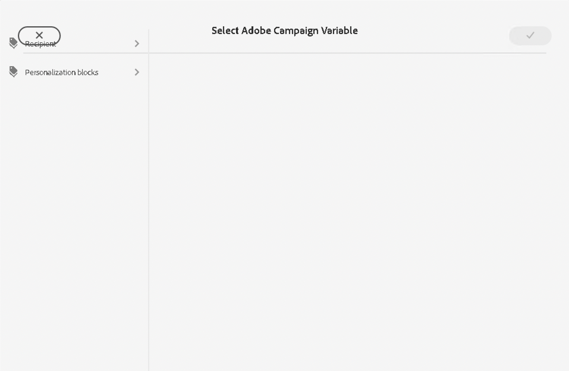
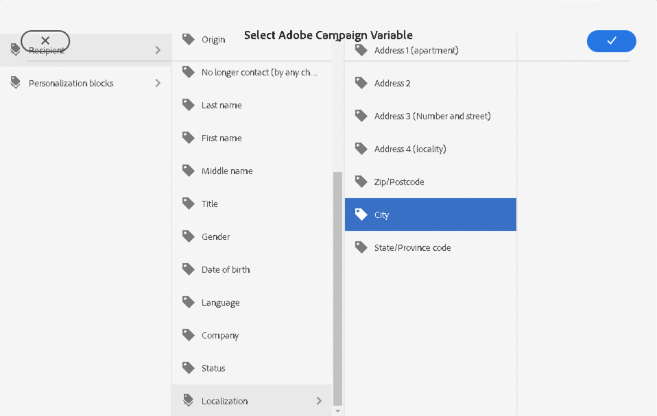
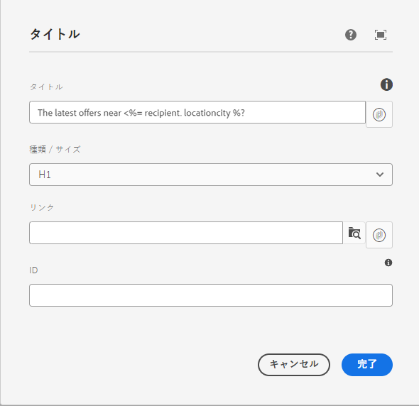

# Campaign 変数 {#campaign-variables}

キャンペーン変数を使用してパーソナライズされたメールコンテンツを作成します。 キャンペーン変数は、Adobe Campaign の値のプレースホルダーとして機能し、メールコンテンツに挿入することができます。 コンテンツが Adobe Campaign 経由で送信されると、Campaign は、これらの変数を受信者のパーソナライズされたコンテンツで置き換えます。

## 使用方法 {#usage}

メールコアコンポーネントを使用すると、共通のテキストフィールドの横にあるパーソナライズ機能ボタンを使用して、キャンペーン変数に簡単にアクセスできます。 ボタンを押すと、パーソナライズ機能フィールドを選択できるダイアログが表示されます。

使用可能なパーソナライズ機能フィールドのリストが Adobe Campaign インスタンスと同期されます。 このフィールドは、スキーマ `nms:seedMember` 内の Adobe Campaign で管理されます。`nms:seedMember` のすべてのフィールドはまた、受信者テーブルにも存在する必要があります。

## Adobe Campaign の変数ダイアログを選択 {#dialog}

「Adobe Campaign の変数を選択」ダイアログは、メールコアコンポーネントの多くの編集ダイアログで使用できます。 該当するフィールドの横にある「**Adobe Campaign の変数を選択**」アイコンをクリックするだけで、これを使用することができます。 このアイコンは 2 つの形式で表示されます。

両方のアイコンをクリックすると、**Adobe Campaign の変数を選択** ダイアログが開きます。

列表示を使用して、挿入する変数を見つけます。 列内のノードをクリックすると、その子が右側の新しい列に表示されます。 これにより、変数コンテンツ構造をナビゲートすることができます。

挿入する変数を選択し、ダイアログの右上にあるチェックマークをクリックします。

次に、変数がメールコアコンポーネントの編集ダイアログのフィールドに挿入されます。

ダイアログの左上にある X をクリックすると、いつでもキャンセルしてダイアログを閉じることができます。
