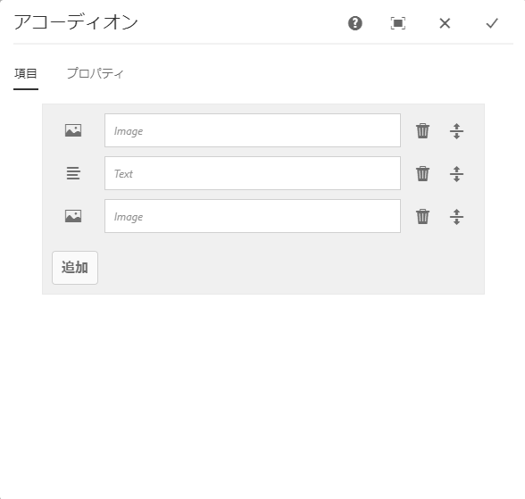
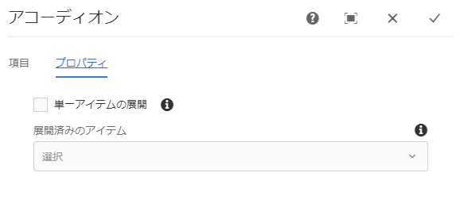
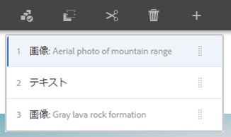
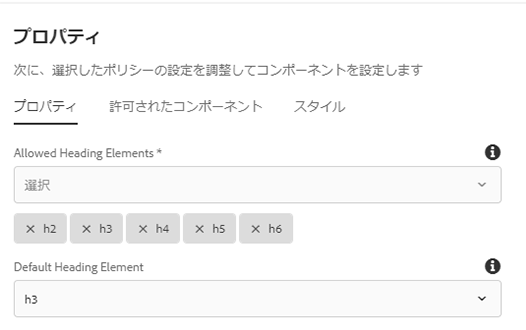

# Accordion Component{#accordion-component}

コアコンポーネントアコーディオンコンポーネントを使用すると、ページ上のアコーディオンに配置されたパネルのコレクションを作成できます。

## 使用 {#usage}

The Core Component Accordion component allows for the creation of a collection of components, composed as panels, and arranged in an accordion on a page, similar to the [Tabs Component](tabs.md), but allows for expanding and collapsing of the panels.

* The accordion&#39;s properties can be defined in the [configure dialog](#configure-dialog).
* The order of the panels of the accordion can be defined in the configure dialog as well as the [select panel popover](#select-planel.md).
* Defaults for the Accordion Component when adding it to a page can be defined in the [design dialog](#design-dialog).

## Version and Compatibility {#version-and-compatibility}

アコーディオンコンポーネントの現在のバージョンは、2019年6月のコアコンポーネントのリリース2.5.0で導入されたv1であり、このドキュメントで説明しています。

次の表に、サポートされているコンポーネントのすべてのバージョン、コンポーネントのバージョンが互換性があるAEMバージョン、および以前のバージョンのドキュメントへのリンクを示します。

| コンポーネントバージョン | AEM 6.3 | AEM 6.4 | AEM 6.5 |
|--- |--- |--- |---|
| v1 | 互換性 | 互換性 | 互換性 |

For more information about Core Component versions and releases, see the document [Core Components Versions](versions.md).

## Sample Component Output {#sample-component-output}

To experience the Accordion Component as well as see examples of its configuration options as well as HTML and JSON output, visit the [Component Library](http://opensource.adobe.com/aem-core-wcm-components/library/accordion.html).

## Technical Details {#technical-details}

The latest technical documentation about the Accordion Component [can be found on GitHub](https://github.com/adobe/aem-core-wcm-components/tree/master/content/src/content/jcr_root/apps/core/wcm/components/accordion/v1/accordion).

Further details about developing Core Components can be found in the [Core Components developer documentation](developing.md).

## Configure Dialog {#configure-dialog}

設定ダイアログでは、コンテンツ作成者がアコーディオンアイテムやパネルの定義、およびページへの訪問者の動作と表示方法を定義できます。

### Items Tab {#items-tab}

**「追加」** ボタンを使用してコンポーネントセレクターを開き、パネルとして追加するコンポーネントを選択します。追加すると、エントリがリストに追加され、次の列が含まれます。

* **アイコン** -リスト内で簡単に識別できるようにする、パネルのコンポーネントタイプのアイコン。マウスを移動すると、コンポーネント名がツールチップとして表示されます。
* **説明** -パネルのテキストとして使用される説明。パネルで選択したコンポーネントの名前に初期設定します。
* **削除** -をタップまたはクリックして、アコーディオンコンポーネントからパネルを削除します。
* **整列** -タップまたはクリックしてドラッグし、パネルの順序を並べ替えます。

### Properties Tab {#properties-tab}

* **単一項目の拡張** -選択すると、1つのアコーディオン項目が同時に展開されます。1つのアイテムを展開すると、その項目がすべて折りたたまれます。
* **項目の拡張** -このオプションは、ページが読み込まれるときにデフォルトで展開される項目を定義します。
   * **単一項目の拡張** が選択されている場合は、1つのパネルを選択する必要があります。デフォルトでは、最初のパネルが選択されます。
   * **単一項目の拡張** が選択されていない場合、このオプションは複数選択であり、オプションです。

## Select Panel Popover {#seelct-panel-popover}

The content author can use the **Select Panel** option on the component toolbar to change to a different panel for editing as well as to easily rearrange the order of the panels within the accordion.

Once selecting the **Select Panel** option in the component toolbar, the configured accordion panels are displayed as a drop-down.

* リストは、割り当てられたパネルの割り当て順に並べられ、番号付けに反映されます。
* パネルのコンポーネントタイプが最初に表示され、その後に薄いフォントでパネルの説明が表示されます。
* ドロップダウンのエントリをタップまたはクリックして、エディターのビューをそのパネルに切り替えます。
* パネルは、ドラッグハンドルを使用して配置し直すことができます。

## Design Dialog {#design-dialog}

デザインダイアログでは、テンプレート作成者がアコーディオンコンポーネントを使用するコンテンツ作成者とアコーディオンコンポーネントを配置するときにデフォルトセットを使用するオプションを定義できます。

### Properties Tab {#properties-tab-design}

* **許可されている見出し要素** -このマルチ選択ドロップダウンでは、発言者によって選択できるHTML要素のアコーディオン項目を定義します。
* **デフォルトの見出し要素** -このドロップダウンで、デフォルトのアコーディオン項目の見出しHTML要素を定義します。

### Allowed Components Tab {#allowed-components-tab}

**「許可されているコンポーネント** 」タブを使用して、コンテンツ作成者がアコーディオンコンポーネントのパネルにアイテムとして追加できるコンポーネントを定義します。

The Allowed Components tab functions in the same way as the tab of the same name when [defining the policy and properties of a Layout Container in the Template Editor.](https://helpx.adobe.com/experience-manager/6-5/sites/authoring/using/templates.html)

### Styles Tab {#styles-tab}

The Accordion Component supports the AEM [Style System](authoring.md#component-styling).
