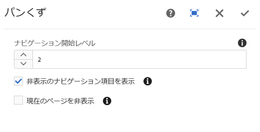
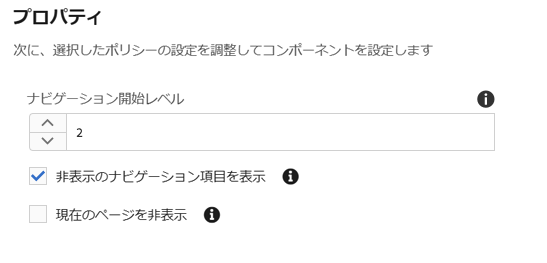

# パンくずリスト（v1）{#breadcrumb-component-v}

コアコンポーネントパンくずコンポーネントはナビゲーションコンポーネントで、コンテンツ階層内のページの場所に基づいてリンクのパンくずリストを構築します。

## 使用方法 {#usage}

階層階層コンポーネントには、サイト階層内の現在のページの位置が表示され、ページの訪問者が現在の場所からページ階層をナビゲートできます。これは多くの場合、ページヘッダーまたはフッターに統合されます。

デフォルトのナビゲーションレベルや、現在のページまたは非表示のページを表示する機能は [、デザインダイアログのテンプレート作成者によって定義](breadcrumb-v1.md#main-pars_title_1995166862)できます。コンテンツエディターでは、非表示のページを表示するかどうか、 [また編集ダイアログでコンポーネントの実際のナビゲーションレベルを選択](breadcrumb-v1.md#main-pars_title)できます。

## バージョンと互換性 {#version-and-compatibility}

本書では、元々、コアコンポーネントのリリース1.0.0で導入された、AEM6.3のリリース1.0.0について説明します。

次の表に、パンくずリストコンポーネントのv1の互換性を示します。

| AEM のバージョン | パンくずコンポーネントv1 |
|--- |--- |
| 6.3 | 互換性 |
| 6.4 | 互換性 |

>[!CAUTION]
>
>本書では、パンくずリストのv1について説明します。
>パンくずリストコンポーネントの現在のバージョンについて詳しくは [、パンくずリスト](breadcrumb.md) のドキュメントを参照してください。

## サンプルコンポーネントの出力 {#sample-component-output}

以下は、We. Retailから [取得されたサンプル](https://helpx.adobe.com/experience-manager/6-4/sites/developing/using/we-retail.html)です。

### スクリーンショット {#screenshot}


### HTML {#html}

```
<div class="cmp cmp-breadcrumb aem-GridColumn aem-GridColumn--default--12">

<ol class="breadcrumb">
    <li class="breadcrumb-item ">
        <a href="/content/we-retail/us.html">
            United States
        </a>
    </li>

    <li class="breadcrumb-item ">
        <a href="/content/we-retail/us/en.html">
            English
        </a>
    </li>

    <li class="breadcrumb-item active">
        
            Experience
        
    </li>
</ol>
 
</div>
```

### JSON {#json}

```
"breadcrumb": {
              "columnClassNames": "aem-GridColumn aem-GridColumn--default--12",
              ":type": "weretail/components/content/breadcrumb"
            }
```

>[!NOTE]
>
>コアコンポーネントからのJSONエクスポートには、コアコンポーネントのリリース1.1.0が必要です。詳しくは [、コアコンポーネントv1](versions.md#main-pars_title_236368006) の互換性情報を参照してください。

## ダイアログを編集 {#edit-dialog}

編集ダイアログでは、コンテンツ作成者がパンくずリスト内の非表示ページとアクティブページを抑制し、表示する階層の深さを抑制できます。



* **ナビゲーションレベルを開始-** 階層内のパンくずリストコンポーネントの階層内で、現在のページまで移動し始める必要があります。例: We. Retail

   * 1から始まる `/content/we-retail`
   * 2開始 `/content/we-retail/<country>`

* **非表示** -パンくずリストで非表示にマークされているページを表示（デフォルトでは表示されません）
* **現在**のページを非表示にする-パンくずリストの現在のページを表示しない（デフォルトで表示）

## デザインダイアログ {#design-dialog}

デザインダイアログでは、テンプレート作成者が、パンくずリスト内の非表示ページとアクティブページを非表示にしたり、表示する必要のある階層の深さを非表示にしたりするためのオプションを定義できます。



* **ナビゲーションレベルを開始** するナビゲーションレベル-パンくずリストコンポーネントがページに追加されたときにパンくずリストコンポーネントが現在のページまで移動するように階層内のデフォルト値を定義します。
* **非表示を表示** -ページにパンくずリストコンポーネントが追加されたときに、「非表示 **** 」オプションのデフォルト値を定義します。

   * 作成者のオプションを有効または無効にすることはできません。デフォルト値のみを設定します。

* **現在を非表示** -パンくずリストコンポーネントがページに追加されたときに、「現在 **の非表示」** オプションのデフォルト値を定義します。

   * 作成者のオプションを有効または無効にすることはできません。デフォルト値のみを設定します。

## 技術的詳細 {#technical-details}

パンくずリストコンポーネント [に関する最新の技術ドキュメントは、GitHubで確認](https://github.com/adobe/aem-core-wcm-components/tree/master/content/src/content/jcr_root/apps/core/wcm/components/breadcrumb/v1/breadcrumb)できます。

コアコンポーネントプロジェクト全体をGitHubからダウンロードできます。

コアコンポーネントの開発について詳しくは、 [コアコンポーネント開発者向けドキュメント](developing.md)を参照してください。
