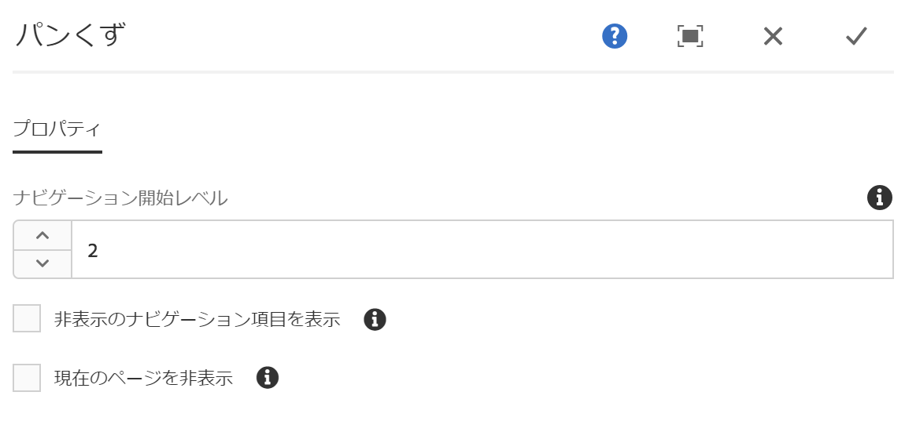

# パンくずコンポーネント{#breadcrumb-component}

コアコンポーネントパンくずコンポーネントはナビゲーションコンポーネントで、コンテンツ階層内のページの場所に基づいてリンクのパンくずリストを構築します。

## 使用方法 {#usage}

階層階層コンポーネントには、サイト階層内の現在のページの位置が表示され、ページの訪問者が現在の場所からページ階層をナビゲートできます。これは多くの場合、ページヘッダーまたはフッターに統合されます。

デフォルトのナビゲーションレベルや、現在のページまたは非表示のページを表示する機能などのオプションは [、デザインダイアログのテンプレート作成者によって定義](#design-dialog)できます。コンテンツエディターでは、非表示のページを表示するかどうか、 [また編集ダイアログでコンポーネントの実際のナビゲーションレベルを選択](#edit-dialog)できます。

## バージョンと互換性 {#version-and-compatibility}

現在のバージョンのパンくずリストはv2であり、2018年1月のコアコンポーネントのリリース2.0.0で導入されています。このドキュメントで説明しています。

次の表に、サポートされているコンポーネントのすべてのバージョン、コンポーネントのバージョンが互換性があるAEMバージョン、および以前のバージョンのドキュメントへのリンクを示します。

| コンポーネントバージョン | AEM 6.3 | AEM 6.4 | AEM 6.5 |
|--- |--- |--- |--- |
| v2 | 互換性 | 互換性 | 互換性 |
| [v1](breadcrumb-v1.md) | 互換性 | 互換性 | 互換性 |

コアコンポーネントバージョンとリリースについて詳しくは、ドキュメント [コアコンポーネントバージョン](versions.md)を参照してください。

## サンプルコンポーネントの出力 {#sample-component-output}

以下は、We. Retailから [取得されたサンプル](https://helpx.adobe.com/experience-manager/6-5/sites/developing/using/we-retail.html)です。

### スクリーンショット {#screenshot}


### HTML {#html}

```
<nav class="cmp-breadcrumb">
    <ol class="cmp-breadcrumb__list">
        <li class="cmp-breadcrumb__item">
            <a href="/content/we-retail/us.html" class="cmp-breadcrumb__item-link">
                United States
            </a>
        </li>
    
        <li class="cmp-breadcrumb__item">
            <a href="/content/we-retail/us/en.html" class="cmp-breadcrumb__item-link">
                English
            </a>
        </li>
    
        <li class="cmp-breadcrumb__item cmp-breadcrumb__item--active">
            
                Experience
            
        </li>
    </ol>
</nav>
```

### JSON {#json}

```
"breadcrumb":{  
                     "columnClassNames":"aem-GridColumn aem-GridColumn--default--12",
                     "items":[  
                        {  
                           "page":{  
                              "path":"/content/we-retail/us",
                              "pageTitle":null,
                              "name":"us",
                              "description":null,
                              "title":"United States"
                           },
                           "active":false
                        },
                        {  
                           "page":{  
                              "path":"/content/we-retail/us/en",
                              "pageTitle":null,
                              "name":"en",
                              "description":null,
                              "title":"English"
                           },
                           "active":false
                        },
                        {  
                           "page":{  
                              "path":"/content/we-retail/us/en/experience",
                              "pageTitle":null,
                              "name":"experience",
                              "description":null,
                              "title":"Experience"
                           },
                           "active":true
                        }
                     ],
                     ":type":"weretail/components/content/breadcrumb"
                  }
```

>[!NOTE]
>
>Core Componentsリリース2.1.0では、パンくずリストコンポーネントは [schema.orgマイクロデータ](https://schema.org/BreadcrumbList)をサポートしています。

### 技術的詳細 {#technical-details}

パンくずリストコンポーネント [に関する最新の技術ドキュメントは、GitHubで確認](https://github.com/adobe/aem-core-wcm-components/blob/master/content/src/content/jcr_root/apps/core/wcm/components/breadcrumb/v2/breadcrumb)できます。

コアコンポーネントの開発について詳しくは、 [コアコンポーネント開発者向けドキュメント](developing.md)を参照してください。

## ダイアログを編集 {#edit-dialog}

編集ダイアログでは、コンテンツ作成者がパンくずリスト内の非表示ページとアクティブページを抑制し、表示する階層の深さを抑制できます。



* **ナビゲーション開始レベル** -階層内の階層階層コンポーネントで、現在のページまで移動し始める必要があります。例: We. Retail

   * 0開始日 `/content`

   * 1から始まる `/content/we-retail`
   * 2開始 `/content/we-retail/<country>`

* **非表示のナビゲーション項目** を表示-パンくずリストで非表示にマークされているページを表示（デフォルトでは表示されません）
* **現在のページを非表示**-パンくずリスト内の現在のページを非表示にします（デフォルトで表示されます）。

## デザインダイアログ {#design-dialog}

デザインダイアログでは、テンプレート作成者が、パンくずリスト内の非表示ページとアクティブページを非表示にしたり、表示する必要のある階層の深さを非表示にしたりするためのオプションを定義できます。

### メインタブ {#main-tab}


* **ナビゲーション開始レベル** -パンくずリストコンポーネントがページに追加されたときにパンくずリストコンポーネントが現在のページまで移動する必要がある場合に、階層内のデフォルト値を定義します。
* **非表示のナビゲーション項目を表示** -ページにパンくずリストコンポーネント **が追加されたときに、非表示のナビゲーション項目** を表示オプションのデフォルト値を定義します。

   * 作成者のオプションを有効または無効にすることはできません。デフォルト値のみを設定します。

* **現在のページを非表示**にする-ページにパンくずリストコンポーネントが追加されたときに、現在のページ **** を非表示オプションのデフォルト値を定義します。

   * 作成者のオプションを有効または無効にすることはできません。デフォルト値のみを設定します。

### 「スタイル」タブ {#styles-tab}

パンくずリストコンポーネントは、AEM [スタイルシステムをサポート](authoring.md#component-styling)しています。