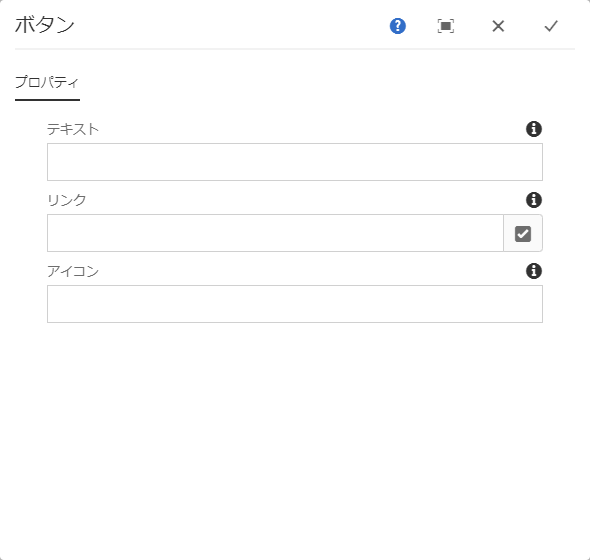

# Button Component{#button-component}

コアコンポーネントボタンコンポーネントを使用すると、ページ上のボタン項目を設定および表示できます。

## 使用 {#usage}

コアコンポーネントボタンコンポーネントを使用すると、ページにボタンを含めることができます。

* The button&#39;s properties can be selected in the [configure dialog](#configure-dialog).
* Styles for the Button Component can be defined in the [design dialog](#design-dialog).

## Version and Compatibility {#version-and-compatibility}

ボタンコンポーネントの現在のバージョンは、2019年6月のコアコンポーネントのリリース2.5.0で導入されたv1であり、このドキュメントで説明しています。

次の表に、サポートされているコンポーネントのすべてのバージョン、コンポーネントのバージョンが互換性があるAEMバージョン、および以前のバージョンのドキュメントへのリンクを示します。

| コンポーネントバージョン | AEM 6.3 | AEM 6.4 | AEM 6.5 |
|--- |--- |--- |---|
| v1 | 互換性 | 互換性 | 互換性 |

For more information about Core Component versions and releases, see the document [Core Components Versions](versions.md).

## Sample Component Output {#sample-component-output}

To experience the Button Component as well as see examples of its configuration options as well as HTML and JSON output, visit the [Component Library](http://opensource.adobe.com/aem-core-wcm-components/library/button.html).

## Technical Details {#technical-details}

The latest technical documentation about the Button Component [can be found on GitHub](https://github.com/adobe/aem-core-wcm-components/tree/master/content/src/content/jcr_root/apps/core/wcm/components/button/v1/button).

Further details about developing Core Components can be found in the [Core Components developer documentation](developing.md).

## Configure Dialog {#configure-dialog}

設定ダイアログでは、コンテンツ作成者がボタンを定義し、そのページへの訪問者の行動と表示方法を定義できます。

* **テキスト** -ボタンに表示するテキスト
* **リンク** - AEM内のコンテンツページ、外部リソースまたはアンカーへのリンク
   * **選択ダイアログ** を使用して、AEM内のパスを選択します。
* **アイコン** -ボタンにアイコンを表示するための識別子

## Design Dialog {#design-dialog}

### Styles Tab {#styles-tab}

The Image Component supports the AEM [Style System](authoring.md#component-styling).
