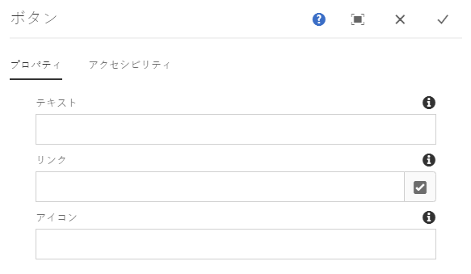
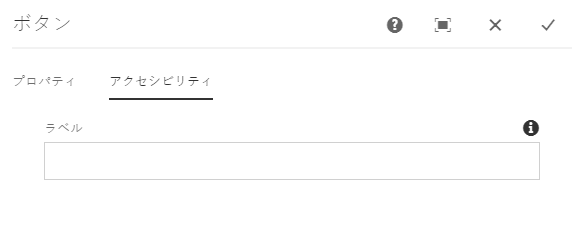

# ボタンコンポーネント{#button-component}

コアコンポーネントのボタンコンポーネントを使用すると、ページ上にボタンアイテムを設定および表示することができます。

## 使用方法 {#usage}

コアコンポーネントのボタンコンポーネントを使用すると、ページにボタンを含めることができます。

* ボタンのプロパティは、[設定ダイアログ](#configure-dialog)で選択できます。
* ボタンコンポーネントのスタイルは、[デザインダイアログ](#design-dialog)で定義できます。

## バージョンと互換性 {#version-and-compatibility}

このドキュメントでは、ボタンコンポーネントの現在のバージョン（2019 年 6 月にコアコンポーネントのリリース 2.5.0 で導入された v1）について説明します。

コンポーネントのすべてのサポート対象バージョン、コンポーネントの各バージョンと互換性のある AEM バージョン、以前のバージョンのドキュメントへのリンクを次の表に示します。

| コンポーネントのバージョン | AEM 6.3 | AEM 6.4 | AEM 6.5 |
|--- |--- |--- |---|
| v1 | 互換性あり | 互換性あり | 互換性あり |

コアコンポーネントのバージョンとリリースについて詳しくは、[コアコンポーネントのバージョン](versions.md)を参照してください。

## コンポーネント出力のサンプル {#sample-component-output}

ボタンコンポーネントを実際に体験し、その設定オプションや HTML および JSON 出力の例を確認するには、[コンポーネントライブラリ](http://opensource.adobe.com/aem-core-wcm-components/library/button.html)を参照してください。

## 技術的詳細 {#technical-details}

ボタンコンポーネント [に関する最新の技術ドキュメントは、GitHubで確認](https://github.com/adobe/aem-core-wcm-components/tree/master/content/src/content/jcr_root/apps/core/wcm/components/button/v1/button)できます。

コアコンポーネントの開発について詳しくは、[コアコンポーネント開発者向けドキュメント](developing.md)を参照してください。

## 設定ダイアログ {#configure-dialog}

設定ダイアログでは、ボタンそのものと、ページの訪問者に対するボタンの動作および表示をコンテンツ作成者が定義できます。

### 「プロパティ」タブ {#properties-tab}

* **テキスト** - ボタンに表示するテキスト
* **リンク** - AEM 内のコンテンツページ、外部リソース、アンカーへのリンク
   * **選択ダイアログ**&#x200B;を使用して、AEM 内のパスを選択します
* **アイコン** - ボタンにアイコンを表示するための識別子

### アクセシビリティタブ {#accessibility-tab}

**「アクセシビリティ** 」タブでは、コンポーネントの [ARIAアクセシビリティ](https://www.w3.org/WAI/standards-guidelines/aria/) ラベルに値を設定できます。

* **ラベル** -コンポーネントのARIAラベル属性の値

## デザインダイアログ{#design-dialog}

### 「スタイル」タブ {#styles-tab}

画像コンポーネントは AEM [スタイルシステム](authoring.md#component-styling)をサポートします。
