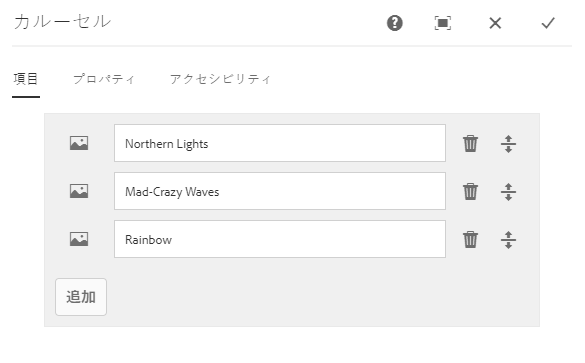
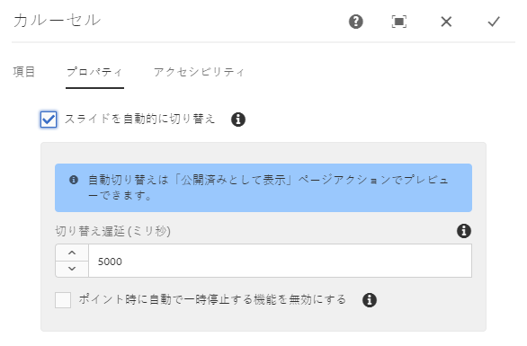
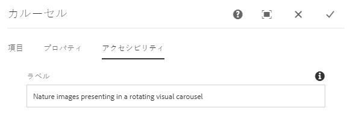

# カルーセルコンポーネント{#carousel-component}

コアコンポーネントのカルーセルコンポーネントを使用すれば、コンテンツ作成者は、ナビゲーション可能なカルーセルにコンテンツを表示できます。

## 使用方法 {#usage}

カルーセルコンポーネントを使用すれば、コンテンツ作成者は、複数のスライドから成る回転式のカルーセルとしてコンテンツを編成できます。

[編集ダイアログ](#edit-dialog)では、コンテンツ作成者は、複数のスライドの作成、命名、並べ替えをおこなったり、遅延時間の指定が可能な自動切り替え機能を有効にしたりできます。[デザインダイアログ](#design-dialog)を使用すれば、テンプレート作成者は、カルーセルに追加できるコンポーネントを定義したり、自動切り替えを有効化または無効化したり、スタイルをカスタマイズしたりできます。

## バージョンと互換性 {#version-and-compatibility}

このドキュメントでは、カルーセルコンポーネントの現在のバージョン（2018 年 10 月にコアコンポーネントのリリース 2.2.0 で導入された v1）について説明します。

コンポーネントのすべてのサポート対象バージョン、コンポーネントの各バージョンと互換性のある AEM バージョン、以前のバージョンのドキュメントへのリンクを次の表に示します。

| コンポーネントのバージョン | AEM 6.3 | AEM 6.4 | AEM 6.5 |
|--- |--- |--- |--- |
| v1 | 互換性あり | 互換性あり | 互換性あり |

コアコンポーネントのバージョンとリリースについて詳しくは、[コアコンポーネントのバージョン](versions.md)を参照してください。

## コンポーネント出力のサンプル {#sample-component-output}

カルーセルコンポーネントを体験したり、その設定オプションの例や、HTML 出力や JSON 出力の例を確認したりするには、[コンポーネントライブラリ](http://opensource.adobe.com/aem-core-wcm-components/library/carousel.html)にアクセスしてください。

### 技術的詳細 {#technical-details}

カルーセルコンポーネントに関する最新の技術ドキュメ [ントは、GitHubで入手できます](https://github.com/adobe/aem-core-wcm-components/blob/master/content/src/content/jcr_root/apps/core/wcm/components/carousel/v1/carousel)。

コアコンポーネントの開発について詳しくは、[コアコンポーネント開発者向けドキュメント](developing.md)を参照してください。

## 編集ダイアログ{#edit-dialog}

編集ダイアログでは、コンテンツ作成者がスライドの追加、名前変更、並べ替えをおこなったり、自動切り替えの設定を定義したりできます。

### 「項目」タブ {#items-tab}

タブとして追加するコンポーネントを選択するためのコンポーネントセレクターを開くには、「**追加**」ボタンを使用します。追加が完了すると、以下の列を含むエントリがリストに追加されます。

* **アイコン** - リスト内で簡単に識別できるようにするための、タブのコンポーネントタイプのアイコン。マウスポインターを置くと、完全なコンポーネント名がツールチップとして表示されます。
* **説明** - タブのテキストとして使用される説明。デフォルトでは、タブ用に選択されたコンポーネントの名前に設定されます。
* **削除** - タップまたはクリックすると、タブコンポーネントからタブが削除されます。
* **並べ替え** - タップまたはクリックしてドラッグすると、タブを並べ替えることができます。

### 「プロパティ」タブ {#properties-tab}

「**プロパティ**」タブでは、コンテンツ作成者は、スライドが自動的に切り替わるように設定できます。

* **スライドを自動的に切り替え** - 有効にすると、コンポーネントは指定した遅延の後で、自動的に次のスライドへと進みます。
* **切り替え遅延** - 「スライドを自動的に切り替え」を選択した場合、この値に基づいて切り替え間の遅延（ミリ秒単位）が定義されます。
* **ポイント時に自動で一時停止する機能を無効にする** - 「**スライドを自動的に切り替え**」を選択した場合、カルーセルの上にマウスカーソルが置かれるたびに、カルーセルの切り替えが自動的に一時停止します。切り替えが一時停止しないようにするには、このオプションを選択します。

>[!NOTE]
>
>**編集**&#x200B;モードでは、スライドを進めるためのコントロールが有効になりません。カルーセ [**ルを、公開さ** れたコンテンツの読者と同様に操作するには、プレビューモードまたは「公開](https://helpx.adobe.com/experience-manager/6-5/sites/authoring/using/editing-content.html)**** 済みとして表示」オプションを使用します。
>
>**編集**&#x200B;モードでは、自動進行機能は有効になりません。Use **[View as Published](https://helpx.adobe.com/experience-manager/6-5/sites/authoring/using/editing-content.html)** option to see the auto-advance feature as a reader of the published content would.

### 「アクセシビリティ」タブ {#accessibility-tab}

On the **Accessibility** tab, values can be set for [ARIA accessibility](https://www.w3.org/WAI/standards-guidelines/aria/) labels for the component.

* **ラベル** - コンポーネントの ARIA ラベル属性の値

## パネルを選択{#select-panel}

コンポーネントツールバーの&#x200B;**パネルを選択**&#x200B;オプションを使用すれば、コンテンツ作成者は編集用に別のスライドに切り替えたり、簡単にスライドを並べ替えたりできます。

コンポーネントツールバーの&#x200B;**パネルを選択**&#x200B;オプションを選択すると、設定済みのスライドがドロップダウンとして表示されます。

* リスト内のスライドは割り当てられた順番で並べられ、その順番が通し番号に反映されます。
* まずスライドのコンポーネントタイプが表示され、次にスライドの説明が薄いフォントで表示されます。

* ドロップダウン内の 1 つのエントリをタップまたはクリックすると、エディターのビューがそのスライドに切り替わります。
* ドラッグハンドルを使用すれば、スライドをインプレースで並べ替えることができます。

## デザインダイアログ{#design-dialog}

デザインダイアログでは、テンプレート作成者が、カルーセルコンポーネントにスライドとして追加できるコンポーネントを定義したり、自動切り替えのデフォルト値を定義したり、コンテンツ作成者が利用できるカスタムスタイルを定義したりできます。

### 「プロパティ」タブ {#properties-tab-1}

「**プロパティ**」タブを使用すれば、コンテンツ作成者がカルーセルコンポーネントをページに追加したときのスライド切り替えのデフォルト設定を定義できます。

* **スライドを自動的に切り替え** - コンテンツ作成者がカルーセルコンポーネントをページに追加したときに、カルーセルを次のスライドに自動的に進めるオプションをデフォルトで有効にするかどうかを定義します。
* **切り替え遅延** - コンテンツ作成者がカルーセルコンポーネントをページに追加したときの、スライド間の切り替え遅延（ミリ秒単位）のデフォルト値を定義します。
* **ポイント時に自動で一時停止する機能を無効にする** - コンテンツ作成者が「**スライドを自動的に切り替え**」を選択した場合に、自動スライド一時停止を無効にするためのオプションをデフォルトで有効にするかどうかを定義します。

### 「許可されるコンポーネント」タブ {#allowed-components-tab}

「**許可されるコンポーネント**」タブでは、コンテンツ作成者がカルーセルコンポーネントにスライドとして追加できるコンポーネントを定義できます。

「許可されるコンポーネント」タブの動作は、[テンプレートエディターでレイアウトコンテナのポリシーやプロパティを定義する](https://helpx.adobe.com/experience-manager/6-5/sites/authoring/using/templates.html)

### 「スタイル」タブ {#styles-tab}

カルーセルコンポーネントは AEM [スタイルシステム](authoring.md#component-styling)をサポートします。
