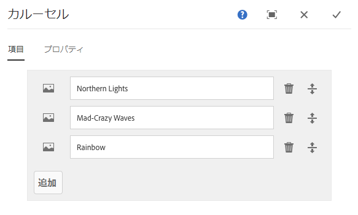
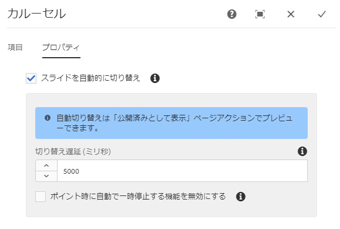
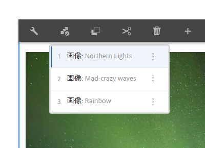
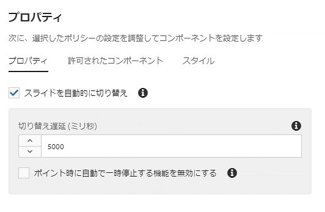

# カルーセルコンポーネント{#carousel-component}

コアコンポーネントカルーセルコンポーネントを使用すると、コンテンツ作成者はナビゲーション可能なカルーセル内にコンテンツを表示できます。

## 使用方法 {#usage}

コンテンツ作成者はカルーセルコンポーネントを使用して、スライドの回転カルーセル内のコンテンツを整理します。

[編集ダイアログ](#edit-dialog) では、コンテンツ作成者が複数のスライドを作成、名前付けおよび順序付け、自動トランジションを遅延と共に有効にすることができます。[デザインダイアログ](#design-dialog)で、テンプレート作成者は、カルーセルに追加できるコンポーネントの定義、自動トランジションの有効化または無効化、スタイルのカスタマイズを行うことができます。

## バージョンと互換性 {#version-and-compatibility}

カルーセルコンポーネントの最新バージョンはv1であり、2018年10月のコアコンポーネントのリリース2.2.0で導入されました。このドキュメントで説明しています。

次の表に、サポートされているコンポーネントのすべてのバージョン、コンポーネントのバージョンが互換性があるAEMバージョン、および以前のバージョンのドキュメントへのリンクを示します。

| コンポーネントバージョン | AEM 6.3 | AEM 6.4 | AEM 6.5 |
|--- |--- |--- |--- |
| v1 | 互換性 | 互換性 | 互換性 |

コアコンポーネントバージョンとリリースについて詳しくは、ドキュメント [コアコンポーネントバージョン](versions.md)を参照してください。

## サンプルコンポーネントの出力 {#sample-component-output}

以下は、We. Retailから [取得されたサンプル](https://helpx.adobe.com/experience-manager/6-5/sites/developing/using/we-retail.html)です。

### スクリーンショット {#screenshot}

### コンポーネントライブラリ {#component-library}

カルーセルコンポーネントを体験するには、その設定オプションの例とHTMLおよびJSON出力の例を参照 してください。

### 技術的詳細 {#technical-details}

カルーセルコンポーネント [に関する最新の技術ドキュメントは、GitHubで確認](https://github.com/adobe/aem-core-wcm-components/blob/master/content/src/content/jcr_root/apps/core/wcm/components/carousel/v1/carousel)できます。

コアコンポーネントの開発について詳しくは、 [コアコンポーネント開発者向けドキュメント](developing.md)を参照してください。

## ダイアログを編集 {#edit-dialog}

編集ダイアログでは、コンテンツ作成者がスライドの追加、名前の変更および並べ替え、自動トランジション設定の定義を行うことができます。

### 「アイテム」タブ {#items-tab}

**「追加」** ボタンを使用してコンポーネントセレクターを開き、タブとして追加するコンポーネントを選択します。追加すると、エントリがリストに追加され、次の列が含まれます。

* **アイコン** -リストで簡単に識別できるようにする、タブのコンポーネントタイプのアイコン。マウスを移動すると、コンポーネント名がツールチップとして表示されます。
* **説明** -タブのテキストとして使用される説明。タブに対して選択されたコンポーネントの名前にデフォルトで設定されます。
* **削除** -タブコンポーネントからタブをタップまたはクリックして削除します。
* **並べ替え** -タップまたはクリックしてドラッグし、タブを並べ替えます。

### 「プロパティ」タブ {#properties-tab}

**「プロパティ** 」タブで、コンテンツ作成者はスライドを自動的に移行するように設定できます。

* **自動トランジションスライド** -アクティブな場合、指定した遅延後にコンポーネントが自動的に次のスライドに進みます。
* **トランジション遅延** -スライドを自動的にトランジションするときに、この値を使用してトランジション間のトランジションの間隔を定義します（ミリ秒単位）。
* **カーソルを合わせ** たときに自動一時停止を無効にする- **自動的にトランジションをスライド** すると、カルーセルの上にカーソルを置くとカルーセルトランジションが自動的に一時停止します。トランジションを一時停止しないようにするには、このオプションを選択します。

>[!NOTE]
>
>スライドショーコントロールは **、編集** モードでは有効になっていません。公開済みコンテンツの読者としてカルーセルを操作するには [**、プレビュー** モード](https://helpx.adobe.com/experience-manager/6-5/sites/authoring/using/editing-content.html) または「公開済みとして **[表示」](https://helpx.adobe.com/experience-manager/6-5/sites/authoring/using/editing-content.html)** オプションを使用します。
>
>自動進む機能は **、編集** モードでは有効になっていません。**[「公開済みとして表示」](https://helpx.adobe.com/experience-manager/6-5/sites/authoring/using/editing-content.html)** オプションを使用すると、公開済みコンテンツの読者として自動早送り機能を確認できます。

## パネルを選択 {#select-panel}

コンテンツ作成者は、コンポーネントツールバーの **「パネル** を選択」オプションを使用して、編集用に別のスライドに変更したり、スライドの順序を簡単に並べ替えることができます。

コンポーネントツールバーの **「パネル** を選択」オプションを選択すると、設定済みのスライドがドロップダウンとして表示されます。

* リストは、割り当てられたスライドの割り当て順に並べ替えられ、番号付けに反映されます。
* 最初にスライドのコンポーネントタイプが表示され、続いて薄いフォントでスライドの説明が表示されます。

* ドロップダウンのエントリをタップまたはクリックして、エディターのビューをスライドに切り替えます。
* スライドは、ドラッグハンドルを使用して順番に並べ替えることができます。

## デザインダイアログ {#design-dialog}

デザインダイアログでは、テンプレート作成者が、スライドとして追加できるコンポーネントをカルーセルコンポーネントに定義したり、自動トランジションデフォルトを定義したり、コンテンツ作成者が使用できるカスタムスタイルを定義したりできます。

### 「プロパティ」タブ {#properties-tab-1}

「 **プロパティ** 」タブを使用して、コンテンツ作成者がカルーセルコンポーネントをページに追加したときのスライドトランジションのデフォルト設定を定義します。

* **自動的にスライドを切り替え** -コンテンツ作成者がカルーセルコンポーネントをページに追加したときに、カルーセルを自動的に次のスライドに自動的に進むオプションを定義するかどうかを定義します。
* **トランジション遅延** -コンテンツ作成者がページにカルーセルコンポーネントを追加したときに、スライド間のトランジション遅延のデフォルト値を定義します。
* **ホバー時に自動停止を無効にする** -デフォルトでは、コンテンツ作成者が **自動的にスライドをスライド** するときに自動スライド一時停止を無効にするオプションが有効になっているかどうかを定義します。

### 許可されているコンポーネントタブ {#allowed-components-tab}

**「許可されているコンポーネント** 」タブを使用して、コンテンツ作成者がカルーセルコンポーネントにスライドとして追加できるコンポーネントを定義します。

「許可されているコンポーネント」タブの機能は、テンプレートエディターでレイアウトコンテナのポリシーとプロパティ [を定義するときに、同じ名前のタブと同じ方法で機能します。](https://helpx.adobe.com/experience-manager/6-5/sites/authoring/using/templates.html)

### 「スタイル」タブ {#styles-tab}

カルーセルコンポーネントは、AEM [スタイルシステムをサポート](authoring.md#component-styling)しています。