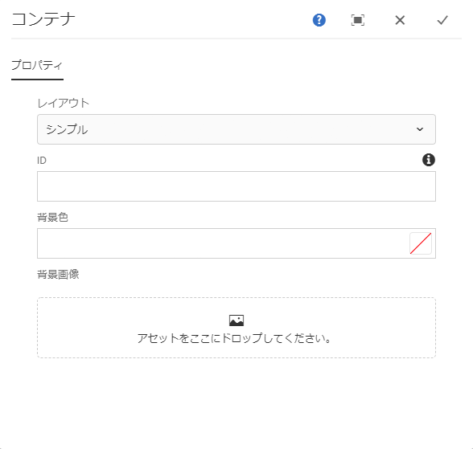
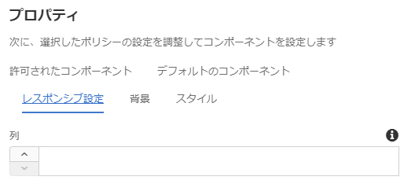
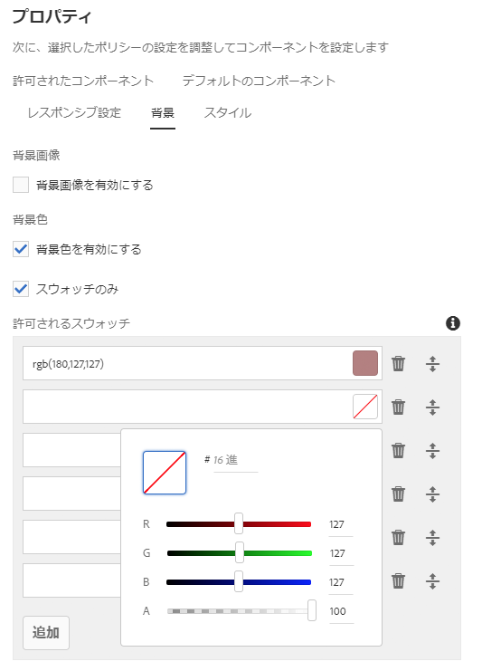

# コンテナコンポーネント{#container-component}

コアコンポーネントのコンテナコンポーネントを使用すると、ページ上に複数の追加コンポーネント用のコンテナを作成できます。

## 使用方法 {#usage}

コアコンポーネントのコンテナコンポーネントを使用すると、ページ上に複数の追加コンポーネント用のコンテナを作成したり、他のコンポーネントをグループ化して共通のスタイルやレイアウトを適用したりできます。

* コンテナのプロパティは、[設定ダイアログ](#configure-dialog)で選択できます。
* コンテナコンポーネントをページに追加するときのデフォルト設定は、[デザインダイアログ](#design-dialog)で定義できます。

## バージョンと互換性 {#version-and-compatibility}

このドキュメントでは、コンテナコンポーネントの現在のバージョン（2019 年 6 月にコアコンポーネントのリリース 2.5.0 で導入された v1）について説明します。

コンポーネントのすべてのサポート対象バージョン、コンポーネントの各バージョンと互換性のある AEM バージョン、以前のバージョンのドキュメントへのリンクを次の表に示します。

| コンポーネントのバージョン | AEM 6.3 | AEM 6.4 | AEM 6.5 |
|--- |--- |--- |---|
| v1 | 互換性あり | 互換性あり | 互換性あり |

コアコンポーネントのバージョンとリリースについて詳しくは、[コアコンポーネントのバージョン](versions.md)を参照してください。

## コンポーネント出力のサンプル {#sample-component-output}

コンテナコンポーネントを実際に体験し、その設定オプションや HTML および JSON 出力の例を確認するには、[コンポーネントライブラリ](http://opensource.adobe.com/aem-core-wcm-components/library/container.html)を参照してください。

## 技術的詳細 {#technical-details}

Container Componentに関する最新の技術ドキュメントは、GitHub [で入手できます](https://github.com/adobe/aem-core-wcm-components/tree/master/content/src/content/jcr_root/apps/core/wcm/components/container/v1/container)。

コアコンポーネントの開発について詳しくは、[コアコンポーネント開発者向けドキュメント](developing.md)を参照してください。

## 設定ダイアログ {#configure-dialog}

設定ダイアログでは、コンテナアイテムそのものと、ページの訪問者に対するコンテナアイテムの動作および表示をコンテンツ作成者が定義できます。

* **レイアウト** - このオプションはコンテナコンポーネントの動作またはレイアウト動作を定義します。
   * **シンプル** - コンテナをシンプルなコンポーネントコレクションとして定義します。
   * **レスポンシブグリッド** — コンテナを [AEMレスポンシブグリッドとして定義します。](https://helpx.adobe.com/experience-manager/6-5/sites/authoring/using/responsive-layout.html)
* **ID** - コンポーネントに適用する HTML ID 属性を定義します。
* **背景色** - [設定に応じて](#background-tab)、自由形式の RGB 値として定義するか、カラーピッカーを使用して定義します。
* **背景画像** - [設定に応じて](#background-tab)、コンテナの背景色を定義します。

## デザインダイアログ{#design-dialog}

デザインダイアログでは、コンテナコンポーネントの使用時にコンテンツ作成者に提供されるオプションをテンプレート作成者が定義できます。

### 「許可されるコンポーネント」タブ {#allowed-components-tab}

「**許可されるコンポーネント**」タブでは、コンテンツ作成者がコンテナコンポーネントにアイテムとして追加できるコンポーネントを定義できます。

「許可されるコンポーネント」タブの動作は、[テンプレートエディターでレイアウトコンテナのポリシーやプロパティを定義する](https://helpx.adobe.com/experience-manager/6-5/sites/authoring/using/templates.html)

### 「デフォルトコンポーネント」タブ {#default-components-tab}

The Default Components tab is used to define which component is added to the component when a particular asset type is dropped on the container, similar to [how default components are defined on the page template](https://helpx.adobe.com/experience-manager/6-5/sites/authoring/using/templates.html#EditingTemplatesTemplateAuthors).

### 「レスポンシブ設定」タブ {#responsive-settings-tab}

* **列** - 結果として得られるコンテナのグリッド内の列数を定義します。

### 「背景」タブ {#background-tab}

* **背景画像**
   * **背景画像を有効にする** - コンテナの背景画像をコンテンツ作成者が定義できるようにします。
* **背景色**
   * **背景色を有効にする** - コンテナの背景色をコンテンツ作成者が定義できるようにします。
   * **スウォッチのみ** - コンテナの背景色に事前に定義されているカラースウォッチからのみコンテンツ作成者が選択できるようにします。
      * 「**背景色を有効にする**」を選択した場合にのみ使用可能です。
* **許可されるスウォッチ** - コンテナの背景色をコンテンツ作成者が選択できる事前定義済みカラーを定義します。
   * 「**追加**」ボタンを使用して、事前定義済みのカラースウォッチを追加します。追加が完了すると、以下の列を含むエントリがリストに追加されます。
   * **値** - RGB 値を使用して手動で色を定義します。
      * カラーピッカーをタップまたはクリックすると、個々の RGB 値を調整するか 16 進数値を定義して、色を選択しやすくなります。
   * **削除** - タップまたはクリックすると、スウォッチを削除できます。
   * **並べ替え** - タップまたはクリックしてドラッグすると、スウォッチを並べ替えることができます。

### 「スタイル」タブ {#styles-tab}

コンテナコンポーネントでは、AEM [スタイルシステム](authoring.md#component-styling)をサポートしています。
