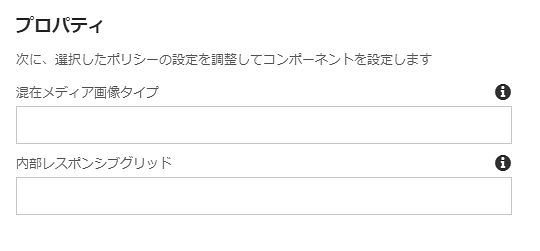

# コンテンツフラグメントコンポーネント{#content-fragment-component}

コアコンポーネントコンテンツフラグメントコンポーネントを使用すると [、コンテンツフラグメントを表示](https://helpx.adobe.com/experience-manager/6-5/assets/using/content-fragments.html)できます。

>[!NOTE]
>
>コアコンポーネントのリリース2.4.0より前に、コンテンツフラグメントコンポーネントはコアコンポーネントの拡張機能として使用でき、個別にダウンロードして明示的に有効にする必要がありました。

## 使用方法 {#usage}

コアコンポーネントコンテンツフラグメントコンポーネントを使用すると、コンテンツフラグメント [をページ](https://helpx.adobe.com/experience-manager/6-5/assets/using/content-fragments.html) に含めることができます。

* フラグメントとそのプロパティは、設定ダイアログで [選択](#configure-dialog)できます。
* 特定の画像およびグリッドを処理するリソースタイプは、デザインダイアログで [定義](#design-dialog)できます。
* 編集オプションで、選択したフラグメントがコンテンツフラグメントエディター内 [に開き](https://helpx.adobe.com/content/help/en/experience-manager/6-5/assets/using/content-fragments.html)ます。

## バージョンと互換性 {#version-and-compatibility}

コンテンツフラグメントコンポーネントの現在のバージョンはv1であり、2017年10月のコアコンポーネントのリリース1.1.0で導入されました。このドキュメントで説明しています。

次の表に、サポートされているコンポーネントのすべてのバージョン、コンポーネントのバージョンが互換性があるAEMバージョン、および以前のバージョンのドキュメントへのリンクを示します。

| コンポーネントバージョン | AEM 6.3 | AEM 6.4 | AEM 6.5 |
|--- |--- |--- |---|
| v1 | 互換性 | 互換性 | 互換性 |

>[!NOTE]
>
>リリース2.4.0より前のバージョンでは、コンテンツフラグメントコンポーネントは拡張子フォルダー内にありました。
>
> `apps/core/wcm/extension/components/contentfragment/v1/contentfragment`
> 
>2.4.0から、次の場所に移動しました。
>
>`apps/core/wcm/components/contentfragment/v1/contentfragment`
>
>v1はどちらもv1ですが、拡張機能フォルダーから使用されたコンテンツフラグメントコンポーネントは、それに関連するプロキシコンポーネントの移行に必要となります。これにより、リリース2.4.0以降のコアコンポーネントにアップグレードするときに、新しいリソースタイプを使用する必要があります。

コアコンポーネントバージョンとリリースについて詳しくは、ドキュメント [コアコンポーネントバージョン](versions.md)を参照してください。

## サンプルコンポーネントの出力 {#sample-component-output}

コンテンツフラグメントコンポーネントを体験するには、その設定オプションの例およびHTMLおよびJSON出力の例に加えて [、コンポーネントライブラリを参照](http://opensource.adobe.com/aem-core-wcm-components/library/content-fragment.html)してください。

## 技術的詳細 {#technical-details}

コンテンツフラグメントコンポーネント [に関する最新の技術ドキュメントは、GitHubで入手](https://github.com/adobe/aem-core-wcm-components/tree/master/content/src/content/jcr_root/apps/core/wcm/components/contentfragment/v1/contentfragment)できます。

コアコンポーネントの開発について詳しくは、 [コアコンポーネント開発者向けドキュメント](developing.md)を参照してください。

## ダイアログの設定 {#configure-dialog}

設定ダイアログでは、コンテンツ作成者がコンテンツフラグメントとそのフラグメントの要素を定義することができます。

* **コンテンツフラグメント**

   * 目的のコンテンツフラグメントへのパス
   * **選択ダイアログ** を使用してフラグメントを検索できます

* **要素** -コンテンツフラグメントの要素
* **バリエーション** -使用するコンテンツフラグメントのバリエーション（デフォルトは **マスター**）

* **段落**

   * **すべて** -すべての段落を表示
   * **範囲**

      * 表示する段落の範囲をセミコロンで区切って指定します
      * 1st、3番目 `1;3-5;7;9-*` から5番目、最後の段落の3番目、および9番目の部分を含む場合

* **見出しを独自の段落として処理する**

## デザインダイアログ {#design-dialog}

デザインダイアログでは、テンプレート作成者が混在メディア画像とレスポンシブグリッドを処理するために使用するリソースタイプを定義できます。

* **混在メディア画像タイプ**

   * 混在メディア画像のレンダリングに使用される Sling リソースタイプ

* **内部レスポンシブグリッド**

   * 内部レスポンシブグリッドに使用されるSlingリソースタイプ