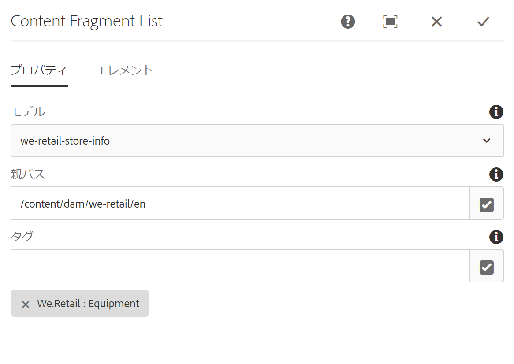
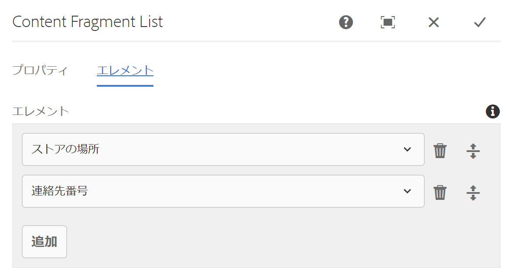

# コンテンツフラグメントリストコンポーネント{#content-fragment-list-component}

Core Component Content Fragment Listコンポーネントを使用すると、コンテンツフラグメントの [リストを表示](https://helpx.adobe.com/experience-manager/6-5/assets/using/content-fragments.html)できます。

## 使用方法 {#usage}

コアコンポーネントコンテンツフラグメントリストコンポーネントを使用すると、コンテンツフラグメントモデルに基づいてページ上に [コンテンツフラグメント](https://helpx.adobe.com/experience-manager/6-5/assets/using/content-fragments.html) のリストを含めることができます。これは、他のアプリケーションで簡単に使用できる [ヘッドレスコンテンツ](https://helpx.adobe.com/experience-manager/6-5/sites/developing/user-guide.html?topic=/experience-manager/6-5/sites/developing/morehelp/headless.ug.js) を作成する場合に特に便利です。

* 設定ダイアログで [リストとそのプロパティを選択](#configure-dialog)できます。
* スタイルは [、デザインダイアログのコンポーネントに適用](#design-dialog)できます。

## バージョンと互換性 {#version-and-compatibility}

コンテンツフラグメントコンポーネントの現在のバージョンは、2019年5月のコアコンポーネントのリリース2.4.0で導入されたv1であり、このドキュメントで説明しています。

次の表に、サポートされているコンポーネントのすべてのバージョン、コンポーネントのバージョンが互換性があるAEMバージョン、および以前のバージョンのドキュメントへのリンクを示します。

| コンポーネントバージョン | AEM 6.3 | AEM 6.4 | AEM 6.5 |
|--- |--- |--- |---|
| v1 | 互換性 | 互換性 | 互換性 |

コアコンポーネントバージョンとリリースについて詳しくは、ドキュメント [コアコンポーネントバージョン](versions.md)を参照してください。

## サンプルコンポーネントの出力 {#sample-component-output}

コンテンツフラグメントリストコンポーネントを体験するには、およびHTMLおよびJSON出力の設定オプションと、 [HTMLおよびJSON出力の例を参照](http://opensource.adobe.com/aem-core-wcm-components/library/content-fragment-list.html)してください。

## 技術的詳細 {#technical-details}

コンテンツフラグメントリストコンポーネント [に関する最新の技術ドキュメントは、GitHubで入手](https://github.com/adobe/aem-core-wcm-components/blob/master/content/src/content/jcr_root/apps/core/wcm/components/contentfragmentlist/v1/contentfragmentlist)できます。

コアコンポーネントの開発について詳しくは、 [コアコンポーネント開発者向けドキュメント](developing.md)を参照してください。

## ダイアログの設定 {#configure-dialog}

設定ダイアログでは、コンテンツの作成者が、リストとそれらのフラグメントの要素を含める要素を定義することができます。

### 「プロパティ」タブ

**「プロパティ** 」タブでは、リストに含めるコンテンツフラグメントを定義します。これは、主に選択したコンテンツフラグメントモデルに基づいていますが、使用できるフィルターオプションもあります。

* **モデル** -リストが基づくコンテンツフラグメントモデルのパス。
   * デフォルトでは、 **モデルパス** として定義されたモデルのすべてのコンテンツフラグメントがリストに含まれます。
* **親パス** -リストを作成する親パス。
   * 選択した **モデルパス** に基づいてコンテンツフラグメントが、指定し **た親パスに基づいてフィルタリング**されます。
   * フィールドの右側にある「選択を **開くダイアログ** 」ボタンをクリックまたはタップして、パスを指定します。
* **タグ** -指定したタグを持つコンテンツフラグメントのみがリストに含まれます。
   * フィールドの右側にある「選択を **開くダイアログ** 」ボタンをクリックまたはタップして、タグを指定します。
   * 選択したタグの横にあるXをクリックまたはタップして、削除します。

### 「エレメント」タブ

デフォルトでは、コンテンツフラグメントモデルのすべてのエレメントがリストに含まれます。**要素** を使用すると、含める特定の要素のみを指定できます。

* **要素** -指定したリスト内のコンテンツフラグメントの要素のみが表示されます。
   * **追加** ボタンをクリックまたはタップして新しい要素を追加
   * **削除** ボタンをクリックまたはタップして、選択した要素を削除します
   * **順序** ハンドルをドラッグして、要素の順序を並べ替えます。

## デザインダイアログ {#design-dialog}

デザインダイアログでは、テンプレート作成者がコンテンツフラグメントリストコンポーネントに適用するスタイルを定義できます。