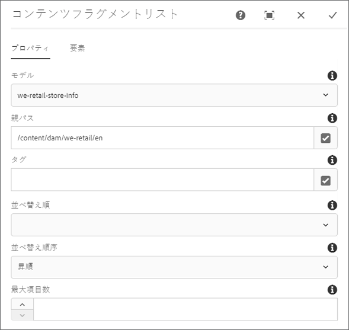

# コンテンツフラグメントリストコンポーネント{#content-fragment-list-component}

コアコンポーネントのコンテンツフラグメントリストコンポーネントを使用すれば、[コンテンツフラグメント](https://helpx.adobe.com/jp/experience-manager/6-5/assets/using/content-fragments.html)のリストを表示できます。

## 使用方法 {#usage}

コアコンポーネントのコンテンツフラグメントリストコンポーネントを使用すれば、コンテンツフラグメントモデルに基づいて[コンテンツフラグメント](https://helpx.adobe.com/jp/experience-manager/6-5/assets/using/content-fragments.html)のリストをページに組み込むことができます。これは、他のアプリケーションで容易に使用できる[ヘッドレスコンテンツ](https://helpx.adobe.com/jp/experience-manager/6-5/sites/developing/user-guide.html?topic=/experience-manager/6-5/sites/developing/morehelp/headless.ug.js)を作成する場合に特に便利です。

* リストとそのプロパティは、[設定ダイアログ](#configure-dialog)で選択できます。
* スタイルは、[デザインダイアログ](#design-dialog)でコンポーネントに適用できます。

## バージョンと互換性 {#version-and-compatibility}

このドキュメントでは、コンテンツフラグメントコンポーネントの現在のバージョン（2019 年 5 月にコアコンポーネントのリリース 2.4.0 で導入された v1）について説明します。

コンポーネントのすべてのサポート対象バージョン、コンポーネントの各バージョンと互換性のある AEM バージョン、以前のバージョンのドキュメントへのリンクを次の表に示します。

| コンポーネントのバージョン | AEM 6.3 | AEM 6.4 | AEM 6.5 |
|--- |--- |--- |---|
| v1 | 互換性あり | 互換性あり | 互換性あり |

コアコンポーネントのバージョンとリリースについて詳しくは、[コアコンポーネントのバージョン](versions.md)を参照してください。

## コンポーネント出力のサンプル {#sample-component-output}

コンテンツフラグメントリストコンポーネントを実際に体験し、その設定オプションや HTML および JSON 出力の例を確認するには、[コンポーネントライブラリ](http://opensource.adobe.com/aem-core-wcm-components/library/content-fragment-list.html)を参照してください。

## 技術的詳細 {#technical-details}

コンテンツフラグメントリストコンポーネントに関する最新の技術ドキュメントについては、[GitHub](https://github.com/adobe/aem-core-wcm-components/blob/master/content/src/content/jcr_root/apps/core/wcm/components/contentfragmentlist/v1/contentfragmentlist) を参照してください。

コアコンポーネントの開発について詳しくは、[コアコンポーネント開発者向けドキュメント](developing.md)を参照してください。

## 設定ダイアログ {#configure-dialog}

設定ダイアログでは、リストを構成するコンテンツフラグメントとそれらのフラグメントを組み込む要素をコンテンツ作成者が定義できます。

### 「プロパティ」タブ

「**プロパティ**」タブでは、リストに含めるコンテンツフラグメントを定義します。主に、選択したコンテンツフラグメントモデルに基づいていますが、他のフィルターオプションも使用できます。

* **モデル** - リストの基となるコンテンツフラグメントモデルのパス。
   * デフォルトでは、**モデルパス**&#x200B;として定義された、モデルのすべてのコンテンツフラグメントがリストに含まれます。
* **親パス** - リストを作成する元となる親パス。
   * 選択した&#x200B;**モデルパス**&#x200B;に基づくコンテンツフラグメントが、指定した&#x200B;**親パス**&#x200B;上のフラグメントにフィルタリングされます。
      * フィールドの右側にある「**選択ダイアログを開く**」ボタンをクリックまたはタップして、パスを指定します。
* **タグ** - 指定したタグを持つコンテンツフラグメントのみリストに含まれます。
   * フィールドの右側にある「**選択ダイアログを開く**」ボタンをクリックまたはタップして、タグを指定します。
   * 選択したタグの横にある「X」をクリックまたはタップすれば、そのタグを削除できます。
* **並べ替え順** - リストの並べ替えに使用するコンテンツフラグメントモデルのフィールド
   * 選択できるのは、テキストフィールド（数値、日付、時刻など）のみです。
* **ソート順序** - 「**並べ替え順**」フィールドによるリストの並べ替え方法
   * 昇順または降順
* **最大項目数** - リストに表示する項目の最大数
   * 値が指定されない場合は、すべての項目が返されます。

>[!NOTE]
>コアコンポーネントのリリース 2.7.0 では、「**並べ替え順**」、「**ソート順序**」、「**最大項目数**」の各オプションが導入されました。

### 「要素」タブ

（「**最大項目数**」フィールドで制限されない限り）デフォルトでは、コンテンツフラグメントモデルのすべての要素がリストに含まれます。「**要素**」タブを使用すると、含める特定の要素を指定できます。

* **要素** - 指定したリストに含まれているコンテンツフラグメントの要素のみ表示されます。
   * 「**追加**」ボタンをクリックまたはタップすると、新しい要素を追加できます。
   * 「**削除**」ボタンをクリックまたはタップすると、選択した要素を削除できます。
   * 「**順序**」ハンドルをドラッグすると、要素の順序を並べ替えることができます。

## デザインダイアログ{#design-dialog}

デザインダイアログでは、コンテンツフラグメントリストコンポーネントに適用するスタイルをテンプレート作成者が定義できます。
