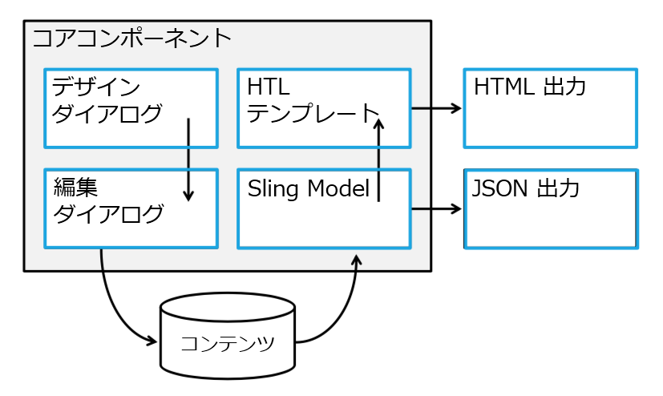

# コアコンポーネントのカスタマイズ{#customizing-core-components}

[コアコンポーネント](developing.md) は、シンプルなスタイリングから高度な機能再利用まで、簡単なカスタマイズを可能にするいくつかのパターンを実装しています。

## 柔軟なアーキテクチャ {#flexible-architecture}

コアコンポーネントは、最初から柔軟性と拡張性を備えていました。アーキテクチャの概要を見て、カスタマイズの場所を示します。



* [デザインダイアログ](authoring.md#edit-and-design-dialogs) では、編集ダイアログで作成者が実行できる操作と実行できないものを定義します。
* [編集ダイアログ](authoring.md#edit-and-design-dialogs) には、使用できるオプションのみが表示されます。
* [Slingモデルは](#customizing-the-logic-of-a-core-component) 、ビュー（テンプレート）のコンテンツを検証して準備します。
* [Slingモデル](#customizing-the-logic-of-a-core-component) の結果は、SPAユースケースのためにJSONにシリアライズできます。
* [HTLは、従来のサーバー側レンダリング用にHTML](#customizing-the-markup) サーバー側をレンダリングします。
* [HTML出力](#customizing-the-markup) はセマンティック、アクセシブル、検索エンジン、およびスタイルが容易です。

また、すべてのコアコンポーネントは [スタイルシステムを実装](customizing.md)します。

## カスタマイズパターン {#customization-patterns}

### ダイアログのカスタマイズ {#customizing-dialogs}

コアコンポーネントダイアログで使用できる設定オプションをカスタマイズして、デザインダイアログまたは編集ダイアログで [カスタマイズ](authoring.md)することができます。

各ダイアログには一貫したノード構造があります。この構造を継承コンポーネントで複製して [、Sling Resource Merge](https://helpx.adobe.com/experience-manager/6-4/sites/developing/using/sling-resource-merger.html) および [Hide条件](https://helpx.adobe.com/experience-manager/6-5/sites/developing/using/hide-conditions.html) を使用して、元のダイアログのセクションの非表示、置き換え、並べ替えを行うことができるようにすることをお勧めします。複製する構造は、タブ項目のノードレベルまで定義されます。

現在のバージョンのダイアログに対して行われた変更と完全に互換性を持たせるには、タブ項目レベルの下の構造（非表示、追加、置換、並べ替えなど）は非常に重要です。代わりに、親のタブ項目は `sling:hideResource` 、プロパティ（ [Sling Resource Mergeプロパティ](https://helpx.adobe.com/experience-manager/6-5/sites/developing/using/sling-resource-merger.html)を参照）によって非表示にする必要があります。また、新しく追加されたタブ項目には、bospoke設定フィールドが含まれています。`sling:orderBefore` を使用して、必要に応じてタブ項目の並べ替えを行うことができます。

以下のダイアログでは、推奨されるダイアログ構造と、前述のように継承されたタブを表示および置換する方法について説明します。

<!-- 

Comment Type: annotation
Last Modified By: ims-author-CE1E2CE451D1F0680A490D45@AdobeID
Last Modified Date: 2017-04-17T17:43:20.265-0400

Should we provide guidance on how to name their CSS classes, etc. to align to component re-usability best-practices? We tout that we follow bootstrap css naming, should we be counseling customers to align similarly? .cmp- 
<component name="">
  -- 
 <element>
   - 
  <element descriptor="">
    ? 
  </element> 
 </element> 
</component>

 -->

```xml
<?xml version="1.0" encoding="UTF-8"?>
<jcr:root xmlns:sling="https://sling.apache.org/jcr/sling/1.0"
          xmlns:jcr="https://www.jcp.org/jcr/1.0"
          xmlns:nt="https://www.jcp.org/jcr/nt/1.0"
          xmlns:granite="https://www.adobe.com/jcr/granite/1.0"
          jcr:primaryType="nt:unstructured">
    <content jcr:primaryType="nt:unstructured">
        <items jcr:primaryType="nt:unstructured">
            <tabs jcr:primaryType="nt:unstructured">
                <items jcr:primaryType="nt:unstructured">
                        <originalTab
                                jcr:primaryType="nt:unstructured"
                                sling:hideResource="true"/>
                        </originalTab>
                        <myTab
                               jcr:primaryType="nt:unstructured"
                               jcr:title="My Tab"
                               sling:resourceType="granite/ui/components/coral/foundation/container"/>
                               <!-- myTab content -->
                        </myTab>
                </items>
            </basic>
        </items>
    </content>
</jcr:root>
```

### コアコンポーネントのロジックのカスタマイズ {#customizing-the-logic-of-a-core-component}

コアコンポーネントのビジネスロジックはSlingモデルに実装されます。このロジックはSling委任パターンを使用して拡張できます。

例えば、タイトルコアコンポーネントは、要求されたリソースの `jcr:title` プロパティを使用して、タイトルテキストを提供します。プロパティが `jcr:title` 定義されていない場合、現在のページタイトルへのフォールバックが実装されます。現在のページのタイトルが常に表示されるように動作を変更します。

コアコンポーネントのモデルの実装はプライベートなので、委任パターンを使用して拡張する必要があります。

```java
@Model(adaptables = SlingHttpServletRequest.class,
       adapters = Title.class,
       resourceType = "myproject/components/pageHeadline")
public class PageHeadline implements Title {
    @ScriptVariable private Page currentPage;
    @Self @Via(type = ResourceSuperType.class)
    private Title title;
    @Override public String getText() {
        return currentPage.getTitle();
    }
    @Override public String getType() {
        return title.getType();
    }
}
```

委任パターンについて詳しくは、SlingモデルのコアコンポーネントGitHub Wiki記事 [の委任パターンを参照](https://github.com/adobe/aem-core-wcm-components/wiki/Delegation-Pattern-for-Sling-Models)してください。

### マークアップのカスタマイズ {#customizing-the-markup}

高度なスタイル設定では、コンポーネントのマークアップ構造が異なることがあります。

これは、コアコンポーネントからプロキシコンポーネントに変更する必要があるHTLファイルをコピーすることで簡単に行うことができます。

コアパンくずリストコンポーネントの例を再度取り込んで、マークアップ出力をカスタマイズすると、 `breadcrumb.html` ファイルは、コアパンくずリストをポイントするサイト固有 `sling:resourceSuperTypes` のコンポーネントにコピーする必要があります。

<!-- 

Comment Type: annotation
Last Modified By: ims-author-CE1E2CE451D1F0680A490D45@AdobeID
Last Modified Date: 2017-04-17T17:43:20.265-0400

Should we provide guidance on how to name their CSS classes, etc. to align to component re-usability best-practices? We tout that we follow bootstrap css naming, should we be counseling customers to align similarly? .cmp- 
<component name="">
  -- 
 <element>
   - 
  <element descriptor="">
    ? 
  </element> 
 </element> 
</component>

 -->

### コンポーネントのスタイル設定 {#styling-the-components}

カスタマイズの最初の形式は、CSSスタイルを適用することです。

これを簡単にするために、コアコンポーネントは、Bootstrapから [インスピレーションを得られる標準化された命名規則に従ってい](https://getbootstrap.com/)ます。また、個々のコンポーネントのスタイルを容易にターゲット化および名前空間化するために、各コアコンポーネントは「 `cmp`」および「 `cmp-<name>`」クラスを持つDIV要素にラップされています。

例えば、v1Coreパンくず者コンポーネントのHTLファイルを確認します。 [breadcrumb.html](https://github.com/adobe/aem-core-wcm-components/blob/master/content/src/content/jcr_root/apps/core/wcm/components/breadcrumb/v2/breadcrumb/breadcrumb.html)では、要素が出力されることがわかり `ol.breadcrumb > li.breadcrumb-item > a`ます。そのため、CSSルールがそのコンポーネントの階層階層クラスにのみ影響するようにするには、次のようにすべてのルールを階層化する必要があります。

```shell
.cmp-breadcrumb .breadcrumb {}  
.cmp-breadcrumb .breadcrumb-item {}  
.cmp-breadcrumb a {}
```

さらに、各コアコンポーネントはAEM [スタイルシステム機能](https://helpx.adobe.com/experience-manager/6-5/sites/authoring/using/style-system.html) を活用して、テンプレート作成者がページ作成者によってコンポーネントに適用できる追加のCSSクラス名を定義できるようにします。これにより、各テンプレートに対して、許可されているコンポーネントスタイルのリストと、そのいずれかの要素がデフォルトでその種類のすべてのコンポーネントに適用されるかどうかを定義できます。

## カスタマイズの互換性のアップグレード {#upgrade-compatibility-of-customizations}

3種類のアップグレードが可能です。

* AEMバージョンのアップグレード
* コアコンポーネントの新しいマイナーバージョンへのアップグレード
* コアコンポーネントのメジャーバージョンへのアップグレード

一般的に、コンポーネントのバージョンが移行する新しいAEMバージョンもサポートしていないため、AEMのアップグレードはコアコンポーネントまたはカスタマイズに影響しません。また、コンポーネントのバージョンでは、移行中の新しいAEMバージョンもサポート [されていません](https://helpx.adobe.com/experience-manager/6-5/release-notes/deprecated-removed-features.html)。

このページで説明されているカスタマイズパターンが使用されている限り、新しいメジャーバージョンに切り替えずにコアコンポーネントをアップグレードすることは、カスタマイズには影響しません。

コアコンポーネントの新しいメジャーバージョンへの切り替えは、コンテンツ構造にのみ対応していますが、カスタマイズを再配色する必要がある場合があります。このページで説明するカスタマイズの種類に影響する変更を強調表示するために、各コンポーネントバージョンに対して変更ログが公開されます。

## カスタマイズのサポート {#support-of-customizations}

AEMコンポーネントの場合と同様に、カスタマイズについて認識することがいくつかあります。

1. **コアコンポーネントのコードは直接変更しないでください。**

   これにより、完全にはサポートされず、コンポーネントの今後の更新が難しいプロセスになります。代わりに、このページで説明するカスタマイズ方法を使用してください。

1. **カスタムコードは独自の責任です。**

   サポートプログラムではカスタムコードはカバーされません。また、ドキュメントに記載 [](using.md) されているバニラコアコンポーネントで再現できない問題が報告されます。

1. **廃止された機能および削除された機能をご覧ください。**

   新しいAEMバージョンがアップグレードされるたびに [、使用されていない機能](https://helpx.adobe.com/experience-manager/6-5/release-notes/deprecated-removed-features.html) ページに目を通すことで、使用されているすべてのAPIが引き続き対象となるようにしてください。

[コアコンポーネントのサポート](developing.md#core-component-support) セクションも参照してください。

**関連項目：**

* [コアコンポーネント](using.md) の使用-独自のプロジェクトのコアコンポーネントの使用を習得できます。
* [コンポーネントガイドライン](guidelines.md) -コアコンポーネントの実装パターンを学習します。
