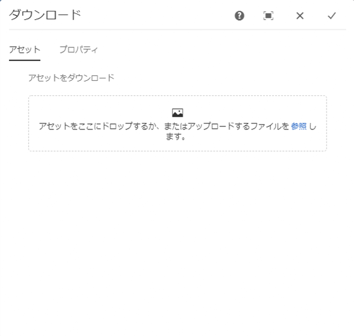
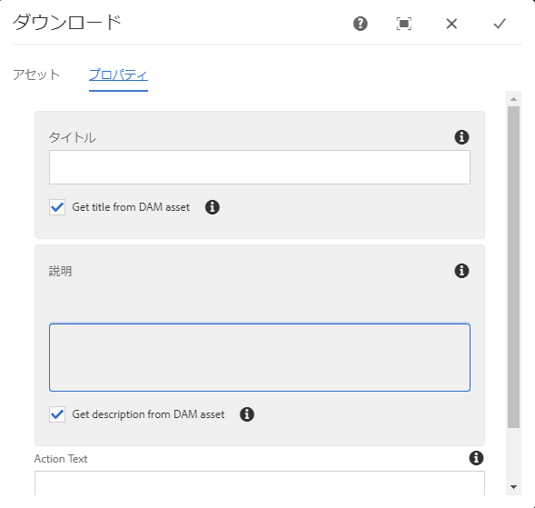

# ダウンロードコンポーネント{#download-component}

コアコンポーネントのダウンロードコンポーネントを使用すると、ダウンロードオプションをページ上に作成できます。

## 使用方法 {#usage}

コアコンポーネントのダウンロードコンポーネントを使用すると、ダウンロードオプションとその関連アセットをページに含めることができます。

* ダウンロードオプションのプロパティは、[設定ダイアログ](#configure-dialog)で選択できます。
* ダウンロードコンポーネントのデフォルト設定は、[デザインダイアログ](#design-dialog)で定義できます。

## バージョンと互換性 {#version-and-compatibility}

このドキュメントでは、ダウンロードコンポーネントの現在のバージョン（2019 年 6 月にコアコンポーネントのリリース 2.5.0 で導入された v1）について説明します。

コンポーネントのすべてのサポート対象バージョン、コンポーネントの各バージョンと互換性のある AEM バージョン、以前のバージョンのドキュメントへのリンクを次の表に示します。

| コンポーネントのバージョン | AEM 6.3 | AEM 6.4 | AEM 6.5 |
|--- |--- |--- |---|
| v1 | 互換性あり | 互換性あり | 互換性あり |

コアコンポーネントのバージョンとリリースについて詳しくは、[コアコンポーネントのバージョン](versions.md)を参照してください。

## コンポーネント出力のサンプル {#sample-component-output}

ダウンロードコンポーネントを実際に体験し、その設定オプションや HTML および JSON 出力の例を確認するには、[コンポーネントライブラリ](http://opensource.adobe.com/aem-core-wcm-components/library/download.html)を参照してください。

## 技術的詳細 {#technical-details}

ダウンロードコンポーネントに関する最新の技術ドキュメントについては、[GitHub](https://github.com/adobe/aem-core-wcm-components/tree/master/content/src/content/jcr_root/apps/core/wcm/components/download/v1/download) を参照してください。

コアコンポーネントの開発について詳しくは、[コアコンポーネント開発者向けドキュメント](developing.md)を参照してください。

## 設定ダイアログ {#configure-dialog}

設定ダイアログでは、ダウンロードアイテムそのものと、ページの訪問者に対するダウンロードアイテムの動作および表示をコンテンツ作成者が定義できます。

### 「アセット」タブ {#asset-tab}

ダウンロードアセットの選択は、[画像コンポーネント](image.md)の機能とよく似ており、同じく AEM の DAM を利用しています。

* **アセットをダウンロード**
   * [アセットブラウザー](https://helpx.adobe.com/jp/experience-manager/6-5/sites/authoring/using/author-environment-tools.html)からアセットをドロップするか、「**参照**」オプションをタップすると、ローカルファイルシステムからアップロードできます。
   * 現在選択されている画像を選択解除するには、「**クリア**」をタップまたはクリックします。
   * アセットエディターで[アセットのレンディションを管理](https://helpx.adobe.com/jp/experience-manager/6-5/assets/using/managing-assets-touch-ui.html)するには、「**編集**」をタップまたはクリックします。

### 「プロパティ」タブ {#properties-tab}

* **タイトル** - ダウンロードアイテムのヘッドラインとして表示されます。
   * **DAM アセットからタイトルを取得** - タイトルに DAM アセットのタイトルが自動的に入力されます。
* **説明** - ダウンロードアイテムを説明するサブヘッドラインとして表示されます。
   * **DAM アセットから説明を取得** - 説明に DAM アセットの説明が自動的に入力されます。
* **アクションテキスト** - ダウンロードアイテムのアクションテキストとして表示されます。
   * このフィールドは、ファイルシステムからアセットをアップロードする場合には必須です。
   * **インライン表示** - 指定した&#x200B;**アクションテキスト**&#x200B;がインライン表示されます。

## デザインダイアログ{#design-dialog}

デザインダイアログでは、ダウンロードコンポーネントの使用時にコンテンツ作成者に提供されるオプションをテンプレート作成者が定義できます。

### 「プロパティ」タブ {#properties-tab-design}

* **デフォルトのアクションテキスト** - 作成者がダウンロードコンポーネントをページに追加したときに表示されるデフォルトの&#x200B;**アクションテキスト**&#x200B;を定義します。
* **ファイルシステムからのアップロードを許可** - コンテンツ作成者が自分のローカルファイルシステムからアセットをダウンロードアセットとしてアップロードできるようにします。
   * デフォルト値はオフです。
* **タイトルタイプ** - ダウンロードコンポーネントのタイトルに使用する HTML 要素。
   * 値が選択されていない場合、デフォルト値は H3 です。
* **ファイルサイズを表示** - アセットのファイルサイズがダウンロードコンポーネントに表示されます。
   * デフォルト値はオンです。
* **ファイル形式を表示** - アセットのファイル形式がダウンロードコンポーネントに表示されます。
   * デフォルト値はオンです。
* **ファイル名を表示** - アセットのファイル名がダウンロードコンポーネントに表示されます。
   * デフォルト値はオンです。

### 「スタイル」タブ {#styles-tab}

画像コンポーネントは AEM [スタイルシステム](authoring.md#component-styling)をサポートします。
