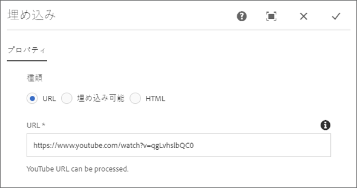
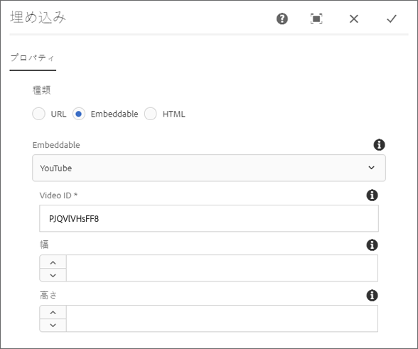
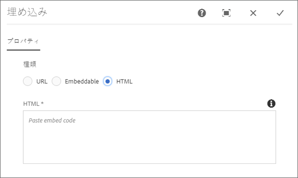
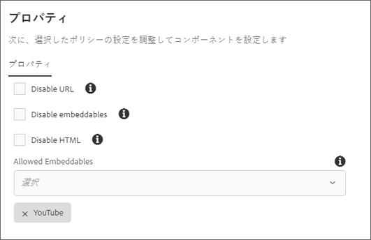

# 埋め込みコンポーネント{#embed-component}

The Core Components Embed Component allows embedding external content in an AEM content page.

## 使用方法 {#usage}

The Core Component Embed Component allows the content author to define selected external content to be embedded within an AEM content page. さらに、埋め込む自由形式のHTMLを定義するオプションもあります。

* The component's properties can be defined in the [configure dialog](#configure-dialog).
* コンポーネントをページに追加するときのデフォルト設定は、[デザインダイアログ](#design-dialog)で定義できます。

## バージョンと互換性 {#version-and-compatibility}

埋め込みコンポーネントの現在のバージョンはv1で、2019年9月にリリース2.7.0のコアコンポーネントで導入され、このドキュメントで説明されています。

コンポーネントのすべてのサポート対象バージョン、コンポーネントの各バージョンと互換性のある AEM バージョン、以前のバージョンのドキュメントへのリンクを次の表に示します。

| コンポーネントのバージョン | AEM 6.3 | AEM 6.4 | AEM 6.5 |
|--- |--- |--- |---|
| v1 | 互換性あり | 互換性あり | 互換性あり |

コアコンポーネントのバージョンとリリースについて詳しくは、[コアコンポーネントのバージョン](versions.md)を参照してください。

## コンポーネント出力のサンプル {#sample-component-output}

To experience the Embed Component as well as see examples of its configuration options as well as HTML and JSON output, visit the [Component Library](http://opensource.adobe.com/aem-core-wcm-components/library/embed.html).

## 技術的詳細 {#technical-details}

The latest technical documentation about the Embed Component [can be found on GitHub](https://github.com/adobe/aem-core-wcm-components/tree/master/content/src/content/jcr_root/apps/core/wcm/components/embed/v1/embed).

コアコンポーネントの開発について詳しくは、[コアコンポーネント開発者向けドキュメント](developing.md)を参照してください。

## 設定ダイアログ {#configure-dialog}

The configure dialog allows the content author to define the external resource to be embedded on the page. First choose which type of resource should be embedded: URL, Embeddable, or HTML.************

### URL {#url}

The simplest embed is the URL. Simply paste the URL of the resource you wish to embed in the URL field. **** The component will attempt to access the resource and if it can be rendered by one of the processors, it will display a confirmation message below the **URL** field. そうでない場合は、フィールドにエラーのマークが付けられます。

The Embed Component ships with processors for the following types of resources:

* Resources that comply with the oEmbed standard including Facebook Post, Instagram, SoundCloud, Twitter, and YouTube
* Pinterest

開発者は、埋め込みコンポーネントの開発者ドキ [ュメントに従って、URLプロセッサーを追加できます。](https://github.com/adobe/aem-core-wcm-components/tree/master/content/src/content/jcr_root/apps/core/wcm/components/embed/v1/embed#extending-the-embed-component)

### 埋め込み可能 {#embeddable}

埋め込み可能な変数を使用すると、埋め込みリソースをよりカスタマイズでき、パラメータ化したり、追加情報を含めたりできます。 An author is able to select from pre-configured trusted embeddables and the component ships with a Youtube embeddable out-of-the-box.

「埋め込 **み可能** 」フィールドは、使用するプロセッサの種類を定義します。 In the case of the YouTube embeddable you can then define:

* **ビデオID** — 埋め込むリソースのYouTubeからの一意のビデオID。
* **幅** — 埋め込みビデオの幅
* **Height** — 埋め込みビデオの高さ。

その他の埋め込み可能なフィールドも同様で、埋め込みコンポーネントの開発者向けドキ [ュメントに従って開発者が定義することができます。](https://github.com/adobe/aem-core-wcm-components/tree/master/content/src/content/jcr_root/apps/core/wcm/components/embed/v1/embed#extending-the-embed-component)

>[!NOTE]
>埋め込み可能なデータは、デザインダイアログを使用してテンプレ [ートレベルで有効にする](#design-dialog) 、ページの作成者が使用できるようにする必要があります。

### HTML {#html}

埋め込みコンポーネントを使用して、自由形式のHTMLをページに追加できます。

>[!NOTE]
>スクリプトなどの安全でないタグは、入力したHTMLからフィルタされ、結果のページにレンダリングされません。

## デザインダイアログ{#design-dialog}

デザインダイアログを使用すると、テンプレート作成者は、埋め込みコンポーネントを使用するコンテンツ作成者が使用できるオプションを定義でき、埋め込みコンポーネントを配置する際に設定されるデフォルトを定義できます。

* **URLを無効にする** — 選択した場合に、コンテ **ンツ作成者のURL** オプションを無効にします。
* **埋め込み可能** — 許可されている埋め込み可 **能なプロセッサーに関係なく、選択時にコンテンツ作成者の「埋め込み可能** 」オプションを無効にします。
* **HTMLを無効にする** — 選択すると、コンテ **ンツ作成者のHTML** オプションが無効になります。
* **Allowed Embeddables - Multislect that defines which embeddable processors are available to the content author, provided that the Embeddable option is active.******
