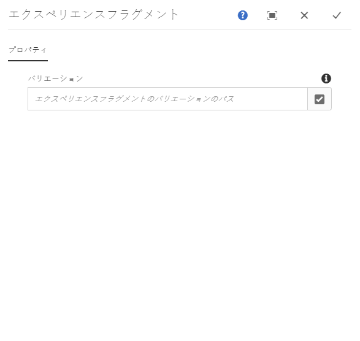
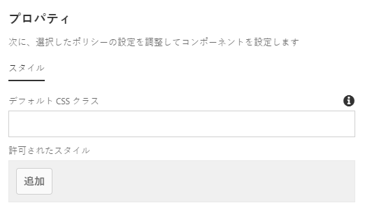

# エクスペリエンスフラグメントコンポーネント{#experience-fragment-component}

コアコンポーネントのエクスペリエンスフラグメントコンポーネントを使用すると、コンテンツ作成者は、ローカライズされたサイト構造をサポートしながら、エクスペリエンスフラグメントのバリエーションをページに配置できます。

## 使用方法 {#usage}

コアコンポーネントのエクスペリエンスフラグメントコンポーネントを使用すると、コンテンツ作成者が、既存のエクスペリエンスフラグメントバリエーションから選択してコンテンツページに配置できます。エクスペリエンスフラグメントコンポーネントでは、ローカライズされたサイト構造もサポートしています。

* このコンポーネントのプロパティは、[設定ダイアログ](#configure-dialog)で定義できます。
* コンポーネントをページに追加するときのデフォルト設定は、[デザインダイアログ](#design-dialog)で定義できます。

## ローカライズされたサイト構造のサポート {#localized-site-structure}

エクスペリエンスフラグメントコンポーネントは、ローカライズされたサイト構造に適応でき、ページのローカリゼーションに基づいて適切なエクスペリエンスフラグメントをレンダリングします。それには、エクスペリエンスフラグメントが次の条件を満たす必要があります。

* エクスペリエンスフラグメントコンポーネントがテンプレートに追加される。
* このテンプレートが、`/content/<site>` 配下のローカライズされた構造の一部となる新しいコンテンツページの作成に使用される。
* コンテンツページで参照されるエクスペリエンスフラグメントが、同じコンポーネント名を使用するなど、`/content/<site>` 配下のサイトと同じパターンに従っており、`/content/experience-fragments` 配下のローカライズされたエクスペリエンスフラグメント構造の一部となる。

この場合、現在のページと同じローカリゼーション（言語、ブループリント、ライブコピーのいずれか）を持つフラグメントがテンプレートの一部としてレンダリングされます。

この動作は、テンプレートに追加されたエクスペリエンスフラグメントコンポーネントに限られます。個々のコンテンツページに追加されたエクスペリエンスフラグメントコンポーネントは、コンポーネント内で設定されたとおりのエクスペリエンスフラグメントレンディションをレンダリングします。

* エクスペリエンスフラグメントコンポーネントのローカリゼーション機能の仕組みの例については、以下の節 [を参照してくださ](#example)い。
* コアコンポーネントのローカリゼーション機能の連携の例については、コアコンポーネントページの [ローカリゼーション機能を参照してください](localization.md)。

### 例 {#example}

コンテンツが次のような構造になっているとします。

```
/content
+-- experience-fragments
   \-- we-retail
      +-- language-masters
      +-- us
         +-- en
            +-- footerTextXf
            \-- headerTextXf
         \-- es
            +-- footerTextXf
            \-- headerTextXf
      \-- ch
         +-- de
            +-- footerTextXf
            \-- headerTextXf
         +-- fr
            +-- footerTextXf
            \-- headerTextXf
         \-- it
            +-- footerTextXf
            \-- headerTextXf
+-- we-retail
   +-- language-masters
   +-- us
      +-- en
      \-- es
   +-- ch
      +-- de
      +-- fr
      \-- it
+-- wknd-events
\-- wknd-shop
```

`/content/experience-fragments/we-retail` 配下の構造が `/content/we-retail` の構造を反映していることに注意してください。

このとき、エクスペリエンスフラグメントコンポーネント `/content/experience-fragments/we-retail/us/en/footerTextXf` がテンプレートに配置される場合、ローカライズされたページをそのテンプレートに基づいて作成すると、ローカライズされたコンテンツページに対応するローカライズされたエクスペリエンスフラグメントが自動的にレンダリングされます。

したがって、同じテンプレートを使用する `/content/we-retail/ch/de` 下のコンテンツページに移動すると、`/content/experience-fragments/we-retail/us/en/footerTextXf` ではなく `/content/experience-fragments/we-retail/ch/de/footerTextXf` がレンダリングされます。

### フォールバック {#fallback}

エクスペリエンスフラグメントコンポーネントでは、対応するローカライズされたコンポーネントを次の順序で探します。

1. まず、言語ルートを探します。
1. 言語ルートが見つからない場合は、ブループリントを探します。
1. ブループリントが見つからない場合は、ライブコピーを探します。
1. ライブコピーが見つからない場合は、コンポーネントで設定されているエクスペリエンスフラグメントがデフォルトで選択されます。

## バージョンと互換性 {#version-and-compatibility}

現在のバージョンのExperience Fragment Componentはv1で、2019年9月にリリース2.6.0のコアコンポーネントで導入され、このドキュメントで説明されています。

コンポーネントのすべてのサポート対象バージョン、コンポーネントの各バージョンと互換性のある AEM バージョン、以前のバージョンのドキュメントへのリンクを次の表に示します。

| コンポーネントのバージョン | AEM 6.3 | AEM 6.4 | AEM 6.5 |
|--- |--- |--- |---|
| v1 | 互換性あり | 互換性あり | 互換性あり |

コアコンポーネントのバージョンとリリースについて詳しくは、[コアコンポーネントのバージョン](versions.md)を参照してください。

## コンポーネント出力のサンプル {#sample-component-output}

エクスペリエンスフラグメントコンポーネントを実際に体験し、その設定オプションや HTML および JSON 出力の例を確認するには、[コンポーネントライブラリ](http://opensource.adobe.com/aem-core-wcm-components/library/experience-fragment.html)を参照してください。

## 技術的詳細 {#technical-details}

Experience Fragmentコンポーネントに関する最新の技術ドキュメ [ントは、GitHubで入手できます](https://github.com/adobe/aem-core-wcm-components/tree/master/content/src/content/jcr_root/apps/core/wcm/components/experience-fragment/v1/experience-fragment)。

コアコンポーネントの開発について詳しくは、[コアコンポーネント開発者向けドキュメント](developing.md)を参照してください。

## 設定ダイアログ {#configure-dialog}

設定ダイアログでは、ページでレンダリングするエクスペリエンスフラグメントバリエーションをコンテンツ作成者が選択できます。



「**選択ダイアログを開く**」ボタンを使用して、コンポーネントセレクターを開き、コンテンツページに追加するエクスペリエンスフラグメントコンポーネントバリエーションを選択します。

なお、エクスペリエンスフラグメントコンポーネントをテンプレートに追加する場合、エクスペリエンスフラグメントがローカライズされていれば、テンプレートは自動的にローカライズされます。したがって、ページ上にレンダリングされるものは、明示的に選択したコンポーネントと異なる場合があります。詳しくは、[上記の例](#example)を参照してください。

## デザインダイアログ{#design-dialog}

デザインダイアログでは、エクスペリエンスフラグメントコンポーネントの使用時にコンテンツ作成者に提供されるオプションと、エクスペリエンスフラグメントコンポーネントの配置時のデフォルト設定をテンプレート作成者が定義できます。



エクスペリエンスフラグメントコンポーネントでは、AEM [スタイルシステム](authoring.md#component-styling)をサポートしています。
