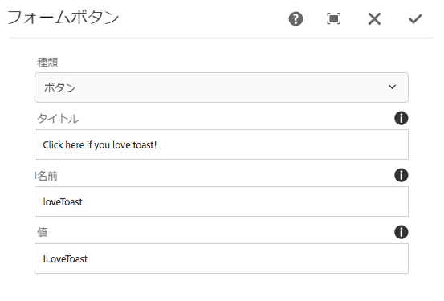

# フォームボタンコンポーネント（v1）{#form-button-component-v}

Core Component Form Buttonコンポーネントを使用すると、アクションをトリガーするためのボタンフィールドをフォームに含めることができます。

## 使用方法 {#usage}

Core Component Form Buttonコンポーネントを使用すると、ボタンフィールドを作成できます。これにより、フォームの送信をトリガーしたり [、フォームコンテナコンポーネントとともに使用することができ](form-container.md)ます。

ボタンのプロパティは [、設定ダイアログのコンテンツエディターで定義](form-button-v1.md#main-pars_title)できます。

## バージョンと互換性 {#version-and-compatibility}

本書では、元々、コアコンポーネントのリリース1.0.0とAEM6.3で導入された、フォームボタンコンポーネントのv1について説明します。

次の表に、フォームボタンコンポーネントのv1の互換性を示します。

| AEM のバージョン | フォームボタンコンポーネントv1 |
|--- |--- |
| 6.3 | 互換性 |
| 6.4 | 互換性 |

>[!CAUTION]
>
>本書では、フォームボタンコンポーネントのv1について説明します。
>
>フォームボタンコンポーネントの現在のバージョンについて詳しくは [、フォームボタンコンポーネント](form-button.md) ドキュメントを参照してください。

## サンプルコンポーネントの出力 {#sample-component-output}

以下は、We. Retailから [取得されたサンプル](https://helpx.adobe.com/experience-manager/6-4/sites/developing/using/we-retail.html)です。

### スクリーンショット {#screenshot}


### HTML {#html}

```
<div class="cmp cmp-button aem-GridColumn aem-GridColumn--default--12">
    <div class="cmp cmp-button">
        <button type="BUTTON" class="btn btn-action btn-primary" name="loveToast" value="ILoveToast">
            Click here if you love toast!
        </button>
    </div>
</div>
```

### JSON {#json}

```
"container": {
              "columnClassNames": "aem-GridColumn aem-GridColumn--default--12",
              "columnCount": 12,
              "gridClassNames": "aem-Grid aem-Grid--12 aem-Grid--default--12",
              ":items": {
                "button": {
                  "columnClassNames": "aem-GridColumn aem-GridColumn--default--12",
                  ":type": "weretail/components/form/button",
                  "name": "loveToast",
                  "jcr:title": "Click here if you love toast!",
                  "type": "submit",
                  "value": "ILoveToast"
                }
              },
              ":itemsOrder": [
                "button"
              ],
              ":type": "weretail/components/form/container"
            }
```

>[!NOTE]
>
>コアコンポーネントからのJSONエクスポートには、コアコンポーネントのリリース1.1.0が必要です。詳しくは [、コアコンポーネントv1](versions.md#main-pars_title_236368006) の互換性情報を参照してください。

## ダイアログの設定 {#configure-dialog}

設定ダイアログでは、コンテンツ作成者がボタンのパラメーターを定義できます。



* **種類**
   * **ボタン**
   * **送信**

* **タイトル** -ボタンに表示されるテキスト
   * 何も指定しなかった場合、ボタンの種類がデフォルトに設定されます

* **名前** -フォームデータとともに送信されるボタンの名前
* **値** -フォームデータと共に送信されるボタンの値

## デザインダイアログ {#design-dialog}

フォームボタンコンポーネントのデザインダイアログはありません。

## 技術的詳細 {#technical-details}

フォームボタンコンポーネント [に関する最新の技術ドキュメントは、GitHubで確認](https://github.com/adobe/aem-core-wcm-components/tree/master/content/src/content/jcr_root/apps/core/wcm/components/form/button/v1/button)できます。

コアコンポーネントプロジェクト全体をGitHubからダウンロードできます。

コアコンポーネントの開発について詳しくは、 [コアコンポーネント開発者向けドキュメント](developing.md)を参照してください。
