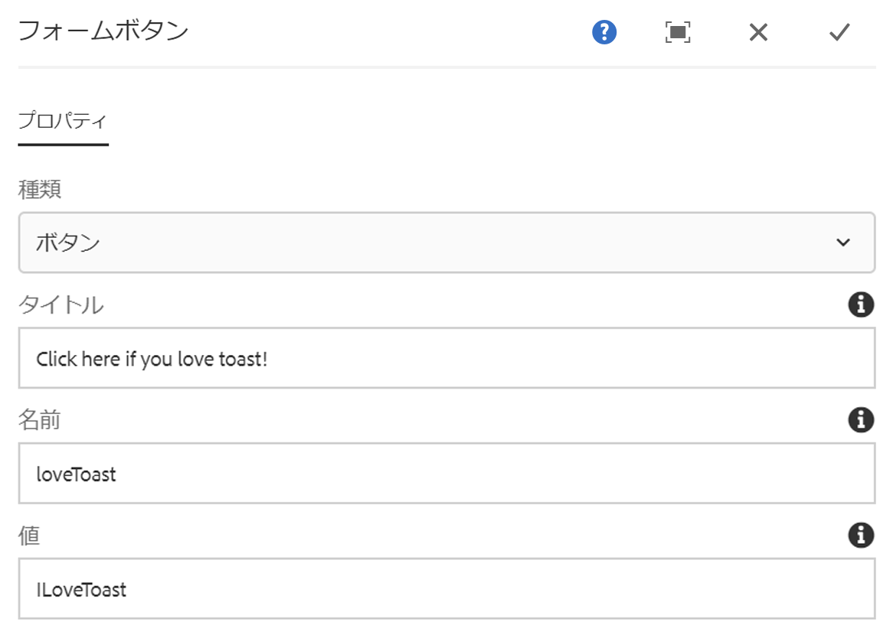

# フォームボタンコンポーネント{#form-button-component}

コアコンポーネントのフォームボタンコンポーネントを使用すれば、アクションをトリガーするボタンをページに含めることができます。

## 使用方法 {#usage}

コアコンポーネントのフォームボタンコンポーネントを使用すれば、フォームの送信をトリガーすることが多いボタンフィールドを作成できます。このコンポーネントは、[フォームコンテナコンポーネント](form-container.md)と共に使用するためのものです。

ボタンのプロパティは、コンテンツ編集者が[設定ダイアログ](form-button.md)で定義できます。

## バージョンと互換性 {#version-and-compatibility}

このドキュメントでは、フォームボタンコンポーネントの現在のバージョン（2018 年 1 月にコアコンポーネントのリリース 2.0.0 で導入された v2）について説明します。

コンポーネントのすべてのサポート対象バージョン、コンポーネントの各バージョンと互換性のある AEM バージョン、以前のバージョンのドキュメントへのリンクを次の表に示します。

| コンポーネントのバージョン | AEM 6.3 | AEM 6.4 | AEM 6.5 | クラウドサービスとしてのAEM |
|--- |--- |--- |--- |---|
| v2 | 互換性あり | 互換性あり | 互換性あり | 互換性あり |
| [v1](form-button-v1.md) | 互換性あり | 互換性あり | 互換性あり | - |

コアコンポーネントのバージョンとリリースについて詳しくは、[コアコンポーネントのバージョン](versions.md)を参照してください。

## コンポーネント出力のサンプル {#sample-component-output}

以下は [We.Retailのサンプルです](https://helpx.adobe.com/experience-manager/6-5/sites/developing/using/we-retail.html)。

### スクリーンショット {#screenshot}


### HTML {#html}

```
<div class="container responsivegrid aem-GridColumn aem-GridColumn--default--12">
<form method="POST" action="/content/we-retail/us/en/experience.html" id="new_form" name="new_form" enctype="multipart/form-data" class="cmp-form aem-Grid aem-Grid--12 aem-Grid--default--12">
    <input type="hidden" name=":formstart" value="/content/we-retail/us/en/experience/jcr:content/root/responsivegrid/container">
    
    <div class="button aem-GridColumn aem-GridColumn--default--12">
<button type="BUTTON" class="cmp-form-button" name="loveToast" value="ILoveToast">Click here if you love toast!</button>
</div>

</form>
</div>
```

### JSON {#json}

```
"button":{  
                           "columnClassNames":"aem-GridColumn aem-GridColumn--default--12",
                           ":type":"core/wcm/sandbox/components/form/button/v2/button",
                           "name":"loveToast",
                           "jcr:title":"Click here if you love toast!",
                           "type":"button",
                           "value":"ILoveToast"
                        }
```

### 技術的詳細 {#technical-details}

The latest technical documentation about the Form Button Component [can be found on GitHub](https://adobe.com/go/aem_cmp_tech_form_button_v2).

コアコンポーネントの開発について詳しくは、[コアコンポーネント開発者向けドキュメント](developing.md)を参照してください。

## 設定ダイアログ {#configure-dialog}

設定ダイアログでは、コンテンツ作成者がボタンのパラメーターを定義できます。

### 「プロパティ」タブ {#properties-tab}



* **種類**

   * **ボタン**
   * **送信**

* **タイトル** - ボタンに表示されるテキスト

   * 指定しない場合は、デフォルトでボタンの種類が表示されます

* **名前** - ボタンの名前（フォームデータと共に送信されます）
* **値** - ボタンの値（フォームデータと共に送信されます）

## デザインダイアログ{#design-dialog}

### 「スタイル」タブ {#styles-tab}

フォームボタンコンポーネントは、AEM [スタイルシステム](authoring.md#component-styling)をサポートしています。
