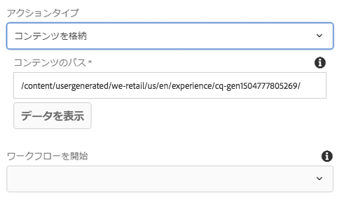
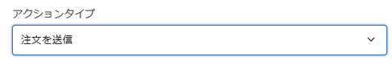
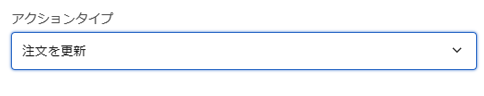
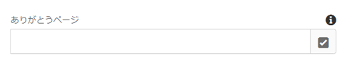

# フォームコンテナコンポーネント（v1）{#form-container-component-v}

コアコンポーネントのフォームコンテナコンポーネントを使用すれば、シンプルな送信フォームを作成できます。

## 使用方法 {#usage}

フォームコンテナコンポーネントは、シンプルな WCM フォームをサポートし、フォームコンポーネントの追加が可能なネスト構造を使用しているので、シンプルな情報送信フォームおよび機能を作成できます。

[設定ダイアログ](form-container-v1.md#main-pars_title)を使用して、コンテンツ編集者は、フォーム送信でトリガーされるアクションの種類、送信されたコンテンツの保存先、ワークフローをトリガーするかどうかを定義できます。The template author can use the [design dialog](form-container-v1.md#main-pars_title_1995166862) to define the allow components and their mappings similar to the design dialog for the [standard layout container in the template editor](https://helpx.adobe.com/experience-manager/6-4/sites/authoring/using/templates.html#main-pars_title_1754153843).

## バージョンと互換性 {#version-and-compatibility}

このドキュメントでは、AEM 6.3 に付属しているコアコンポーネントのリリース 1.0.0 で最初に導入されたフォームコンテナコンポーネント v1 について説明します。

フォームコンテナコンポーネント v1 の互換性を次の表に示します。

| AEM のバージョン | フォームコンテナコンポーネント v1 |
|--- |--- |
| 6.3 | 互換性あり |
| 6.4 | 互換性あり |

>[!CAUTION]
>
>このドキュメントでは、フォームコンテナコンポーネント v1 について説明します。
>
>フォームコンテナコンポーネントの現在のバージョンについて詳しくは、[フォームコンテナコンポーネント](form-container.md)のドキュメントを参照してください。

## 設定ダイアログ {#settings-dialog}

設定ダイアログでは、コンポーネントの送信時に実行されるアクションをコンテンツ作成者が定義できます。

選択した&#x200B;**アクションタイプ**&#x200B;に応じて、コンテナ内で使用可能なオプションが変わります。使用可能なアクションタイプは次のとおりです。

* [メール](form-container-v1.md#main-pars_title_966511656)
* [コンテンツを格納](form-container-v1.md#main-pars_title_2065985840)
* [注文を送信](form-container-v1.md#main-pars_title_686874527)
* [注文を更新](form-container-v1.md#main-pars_title_410109286)

タイプに関係なく、各アクションに適用される[一般的な設定](form-container-v1.md#main-pars_title_375403046)があります。

### メール {#mail}

アクションタイプが「メール」の場合、フォームが送信されると、指定した受信者に電子メールが送信されます。

* **件名** - フォーム送信時に送信される電子メールの件名
* **差出人** - フォーム送信時に送信される電子メールの差出人の電子メールアドレス
* **宛先-** - フォーム送信時に電子メールを受信する受信者のアドレス
   * アドレスを追加するには、「**追加**」ボタンをタップまたはクリックします
   * 電子メールアドレスを削除するには、「**削除**」ボタンをタップまたはクリックします
* **CC** - フォーム送信時に送信される電子メールのカーボンコピーを受信する受信者のアドレス
   * アドレスを追加するには、「**追加**」ボタンをタップまたはクリックします
   * 電子メールアドレスを削除するには、「**削除**」ボタンをタップまたはクリックします

### コンテンツを格納 {#store-content}

フォームが送信されると、フォームのコンテンツは、指定されたリポジトリの場所に保存されます。

* **コンテンツのパス** - 送信されたコンテンツが格納されるコンテンツリポジトリのパス
* **データを表示** - タップまたはクリックすると、保存された送信済みデータが JSON 形式で表示されます
* **ワークフローを開始** - フォーム送信時に保存されたコンテンツをペイロードとしてワークフローを開始するように設定します

### 注文を送信 {#submit-order}

フォームが送信されると、注文が送信されます。

### 注文を更新 {#update-order}

フォームが送信されると、注文が更新されます。

### 一般的な設定 {#general-settings}

「ありがとうございます」ページは、選択したアクションタイプに関係なくいつでも定義できます。

フォーム送信の完了後、ユーザーは指定したページにリダイレクトされます。

* 選択ダイアログを使用して、AEM 内のリソースを選択します。
* 「ありがとうございます」ページが AEM にない場合は、絶対 URL を指定します。絶対 URL 以外の URL は、AEM からの相対 URL と解釈されます。
* 空白のままにすると、送信後にフォームが再度表示されます。

## デザインダイアログ{#design-dialog}

The design dialog allows the template author to define the allowed components and their mappings for the container similar to the design dialog for the [standard layout container in the template editor](https://helpx.adobe.com/experience-manager/6-4/sites/authoring/using/templates.html#main-pars_title_1754153843).

## 技術的詳細 {#technical-details}

The latest technical documentation about the Form Container Component [can be found on GitHub](https://github.com/adobe/aem-core-wcm-components/tree/master/content/src/content/jcr_root/apps/core/wcm/components/form/container/v1/container).

コアコンポーネントプロジェクト全体を GitHub からダウンロードできます。

コアコンポーネントの開発について詳しくは、[コアコンポーネント開発者向けドキュメント](developing.md)を参照してください。
