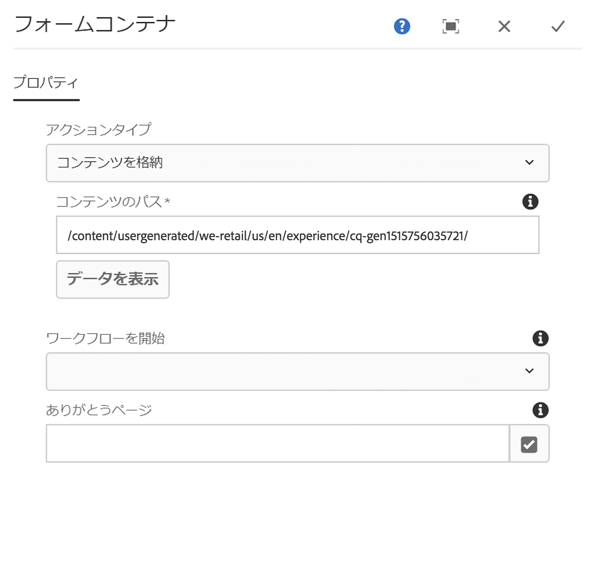
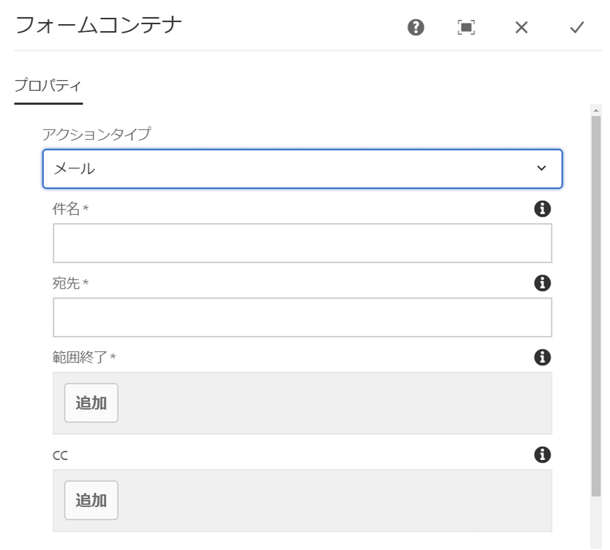
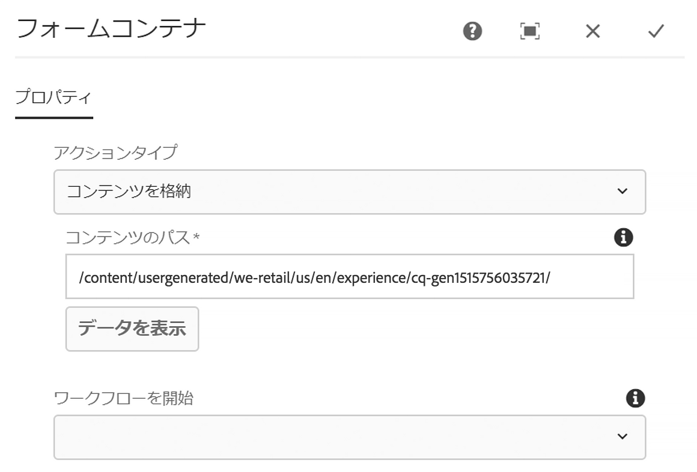

# フォームコンテナコンポーネント{#form-container-component}

コアコンポーネントのフォームコンテナコンポーネントを使用すれば、シンプルな送信フォームを作成できます。

## 使用方法 {#usage}

フォームコンテナコンポーネントでは、シンプルな WCM フォームをサポートし、フォームコンポーネントの追加が可能なネスト構造を使用しているので、シンプルな情報送信フォームおよび機能を作成できます。

[設定ダイアログ](#configure-dialog)を使用して、コンテンツ編集者は、フォーム送信でトリガーされるアクション、送信されたコンテンツの保存先、ワークフローをトリガーするかどうかを定義できます。テンプレート作成者は、[デザインダイアログ](#design-dialog)を使用して、[テンプレートエディターにおける標準レイアウトコンテナ](https://helpx.adobe.com/jp/experience-manager/6-5/sites/authoring/using/templates.html)のデザインダイアログと同様に、許可されるコンポーネントとそのマッピングを定義できます。

>[!NOTE]
>
>コアコンポーネントのフォームコンテナコンポーネントでは、コアコンポーネントのフォームコンポーネント（ボタン、テキスト、非表示など）のみ使用できます。[基盤コンポーネント](https://helpx.adobe.com/jp/experience-manager/6-5/sites/authoring/using/default-components-foundation.html)のフォームコンポーネントをコアコンポーネントのフォームコンテナ内で使用すること（およびその逆の使用）はサポートされていません。

## バージョンと互換性 {#version-and-compatibility}

このドキュメントでは、フォームコンテナコンポーネントの現在のバージョン（2018 年 1 月にコアコンポーネントのリリース 2.0.0 で導入された v2）について説明します。

コンポーネントのすべてのサポート対象バージョン、コンポーネントの各バージョンと互換性のある AEM バージョン、以前のバージョンのドキュメントへのリンクを次の表に示します。

| コンポーネントのバージョン | AEM 6.3 | AEM 6.4 | AEM 6.5 |
|--- |--- |--- |--- |
| v2 | 互換性あり | 互換性あり | 互換性あり |
| [v1](form-container-v1.md) | 互換性あり | 互換性あり | 互換性あり |

コアコンポーネントのバージョンとリリースについて詳しくは、[コアコンポーネントのバージョン](versions.md)を参照してください。

## 技術的詳細 {#technical-details}

フォームコンテナコンポーネントに関する最新の技術ドキュメントについては、[GitHub](https://github.com/adobe/aem-core-wcm-components/blob/master/content/src/content/jcr_root/apps/core/wcm/components/form/container/v2/container) を参照してください。

コアコンポーネントの開発について詳しくは、[コアコンポーネント開発者向けドキュメント](developing.md)を参照してください。

## 設定ダイアログ {#configure-dialog}

設定ダイアログでは、コンポーネントの送信時に実行されるアクションをコンテンツ作成者が定義できます。

選択した **アクションタイプ** に応じて、コンテナ内で使用可能なオプションが変わります。使用可能なアクションタイプは次のとおりです。

* [メール](#mail)
* [コンテンツを格納](#store-content)
* [注文を送信](#submit-order)
* [注文を更新](#update-order)

タイプに関係なく、各アクションに適用される[一般的な設定](#general-settings)があります。

### メール {#mail}

アクションタイプが「メール」の場合、フォームが送信されると、指定した受信者に電子メールが送信されます。

* **件名** - フォーム送信時に送信される電子メールの件名
* **差出人** - フォーム送信時に送信される電子メールの差出人の電子メールアドレス
* **宛先-** - フォーム送信時に電子メールを受信する受信者のアドレス

   * アドレスを追加するには、「**追加**」ボタンをタップまたはクリックします
   * 電子メールアドレスを削除するには、「**削除**」ボタンをタップまたはクリックします
* **CC** - フォーム送信時に送信される電子メールのカーボンコピーを受信する受信者のアドレス
   * アドレスを追加するには、「**追加**」ボタンをタップまたはクリックします
   * 電子メールアドレスを削除するには、「**削除**」ボタンをタップまたはクリックします

### コンテンツを格納 {#store-content}

フォームが送信されると、フォームのコンテンツは、指定されたリポジトリの場所に保存されます。

* **コンテンツのパス** - 送信されたコンテンツが格納されるコンテンツリポジトリのパス
* **データを表示** - タップまたはクリックすると、保存された送信済みデータが JSON 形式で表示されます
* **ワークフローを開始** - 保存されたコンテンツをフォーム送信時のペイロードとして使用し、ワークフローを開始するように設定します

### 注文を送信 {#submit-order}

フォームが送信されると、注文が送信されます。

### 注文を更新 {#update-order}

フォームが送信されると、注文が更新されます。

### 一般的な設定 {#general-settings}

「ありがとうございます」ページは、選択したアクションタイプに関係なくいつでも定義できます。

フォーム送信の完了後、ユーザーは指定したページにリダイレクトされます。

* 選択ダイアログを使用して、AEM 内のリソースを選択します。
* 「ありがとうございます」ページが AEM にない場合は、絶対 URL を指定します。絶対 URL 以外の URL は、AEM からの相対 URL と解釈されます。
* 空白のままにすると、送信後にフォームが再度表示されます。

## デザインダイアログ{#design-dialog}

デザインダイアログを使用すれば、テンプレート作成者は、[テンプレートエディターにおける標準レイアウトコンテナ](https://helpx.adobe.com/jp/experience-manager/6-5/sites/authoring/using/templates.html)のデザインダイアログと同様に、許可されるコンポーネントとそのコンテナマッピングを定義できます。