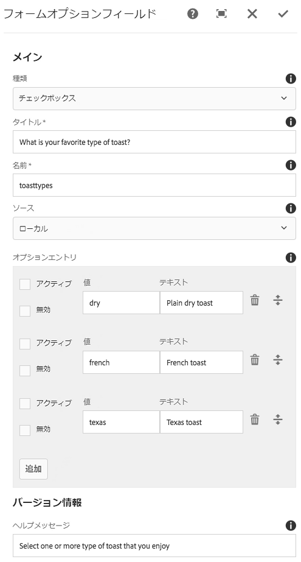

# フォームオプションコンポーネント（v1）{#form-options-component-v}

コアコンポーネントフォームのオプションコンポーネントを使用すると、様々な形式の事前定義済みオプションから選択できます。

## 使用方法 {#usage}

Core Component Form Options Componentを使用すると、様々な種類のオプションを様々な方法で送信でき、 [フォームコンテナコンポーネントとともに使用することができ](form-container.md)ます。

オプション、ラベル、個々のオプションのプレゼンテーションは [、設定ダイアログのコンテンツエディターで定義](form-options-v1.md#main-pars_title)できます。

## バージョンと互換性 {#version-and-compatibility}

本書では、元々、コアコンポーネントのリリース1.0.0とAEM6.3で導入されたフォームオプションコンポーネントのv1について説明します。

次の表に、Form Options Componentのv1との互換性を示します。

| コンポーネントバージョン | AEM 6.3 | AEM 6.4 |
|--- |--- |--- |
| v2 | 互換性 | 互換性 |
| v1 | 互換性 | 互換性 |

>[!CAUTION]
>
>本書では、フォームオプションコンポーネントのv1について説明します。
>
>フォームオプションコンポーネントの現在のバージョンの詳細については [、&quot;Form Options Component](form-options.md) 」ドキュメントを参照してください。

## サンプルコンポーネントの出力 {#sample-component-output}

以下は、We. Retailから [取得されたサンプル](https://helpx.adobe.com/experience-manager/6-4/sites/developing/using/we-retail.html)です。

### スクリーンショット {#screenshot}


### HTML {#html}

```
<div class="cmp cmp-form aem-GridColumn aem-GridColumn--default--12">
<form method="POST" action="/content/we-retail/us/en/experience.html" id="new_form" name="new_form" enctype="multipart/form-data" class="aem-Grid aem-Grid--12 aem-Grid--default--12 ">
    <input type="hidden" name=":formstart" value="/content/we-retail/us/en/experience/jcr:content/root/responsivegrid/container">
    
    <div class="cmp cmp-options aem-GridColumn aem-GridColumn--default--12">

    <fieldset class="form-group checkbox">
        <legend>What is your favorite type of toast?</legend>
        
        <div class="checkbox-item">
            <label>
              <input type="checkbox" name="toasttypes" value="dry">
              Plain dry toast
            </label>
        </div>
<div class="checkbox-item">
            <label>
              <input type="checkbox" name="toasttypes" value="french">
              French toast
            </label>
        </div>
<div class="checkbox-item">
            <label>
              <input type="checkbox" name="toasttypes" value="texas">
              Texas toast
            </label>
        </div>

    </fieldset>
    
</div>
    
</form></div>
```

### JSON {#json}

```
"container": {
              "columnClassNames": "aem-GridColumn aem-GridColumn--default--12",
              "columnCount": 12,
              "gridClassNames": "aem-Grid aem-Grid--12 aem-Grid--default--12",
              ":items": {
                "options": {
                  "columnClassNames": "aem-GridColumn aem-GridColumn--default--12",
                  ":type": "weretail/components/form/options",
                  "name": "toastTypes",
                  "jcr:title": "What is your favorite type of toast?",
                  "source": "local",
                  "type": "checkbox"
                }
              },
              ":itemsOrder": [
                "options"
              ],
              ":type": "weretail/components/form/container"
            }
```

>[!NOTE]
>
>コアコンポーネントからのJSONエクスポートには、コアコンポーネントのリリース1.1.0が必要です。詳しくは [、コアコンポーネントv1](versions.md#main-pars_title_236368006) の互換性情報を参照してください。

## ダイアログの設定 {#configure-dialog}

設定ダイアログでは、コンテンツ作成者が表示するオプションの種類、ラベル、使用可能なオプションを定義できます。



* **オプションの表示**方法

   * **チェックボックス**
   * **ラジオボタン**
   * **ドロップダウン**
   * **複数選択ドロップダウン**

* **タイトル** -オプションのラベルとして表示されるタイトル
* **名前** -フォームデータと共に送信されたフィールドの名前
* **ソース** -オプションの定義場所

   * **ローカル** -コンポーネント内で定義
      * Tap or click the **Add** button to add a value, **Delete** to remove a value
      * **値** -フォームの送信時にそのオプションが選択されたときに保存される値
      * **テキスト** -フォームに表示されるオプションのラベル
      * **アクティブ** -フォームの読み込み時に選択したオプションが選択されている
      * **無効** -オプションは選択できませんが、表示されます
      * **リスト** - AEMの任意の場所で定義されている静的リストがオプションに使用されます
         * **List** - AEMの静的リストのパス
            * 参照ボタンを使用したリストリソースの検索
      * **データソース** -オプションにデータソースを使用
         * **データソース** -データソースのリソースタイプ
* **ヘルプメッセージ** -フィールドに入力できるユーザーのヒント

## デザインダイアログ {#design-dialog}

Form Optionsコンポーネントのデザインダイアログはありません。

## 技術的詳細 {#technical-details}

フォームオプションコンポーネント [に関する最新の技術ドキュメントは、GitHubで確認](https://github.com/adobe/aem-core-wcm-components/tree/master/content/src/content/jcr_root/apps/core/wcm/components/form/options/v1/options)できます。

コアコンポーネントプロジェクト全体をGitHubからダウンロードできます。

コアコンポーネントの開発について詳しくは、 [コアコンポーネント開発者向けドキュメント](developing.md)を参照してください。
