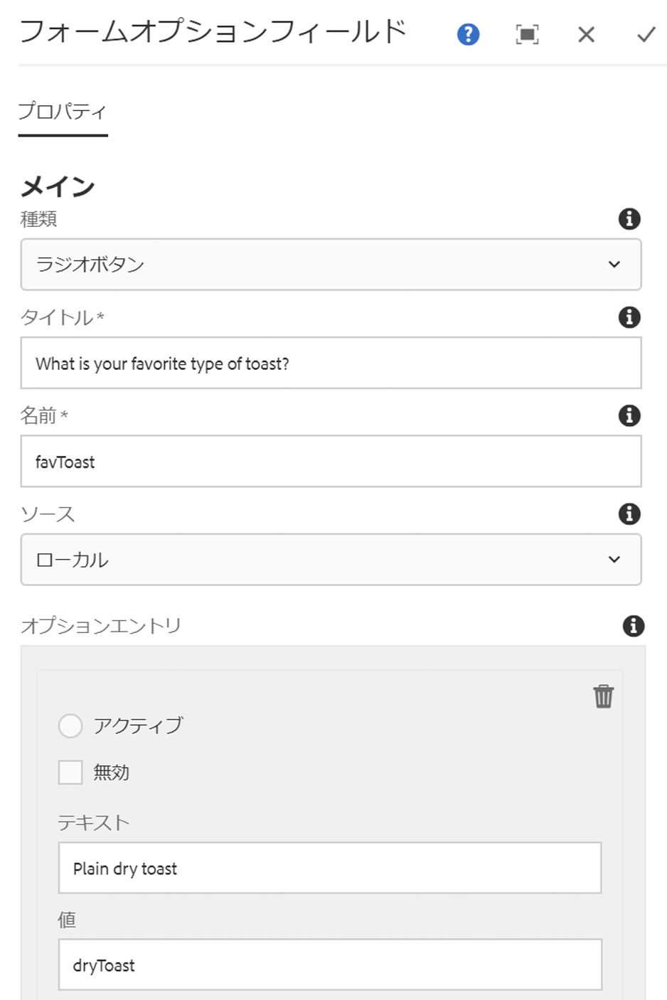

# フォームオプションコンポーネント{#form-options-component}

コアコンポーネントフォームオプションコンポーネントを使用すると、様々な形式の事前定義済みオプションから選択できます。

## 使用方法 {#usage}

コアコンポーネントフォームオプションコンポーネントを使用すると、様々な種類のオプションを様々な方法で送信でき、 [フォームコンテナコンポーネントとともに使用することができ](form-container.md)ます。

オプション、ラベル、個々のオプションのプレゼンテーションは [、設定ダイアログのコンテンツエディターで定義](#configure-dialog)できます。

## バージョンと互換性 {#version-and-compatibility}

フォームオプションコンポーネントの現在のバージョンはv2であり、2018年1月のコアコンポーネントのリリース2.0.0で導入されています。このドキュメントで説明しています。

次の表に、サポートされているコンポーネントのすべてのバージョン、コンポーネントのバージョンが互換性があるAEMバージョン、および以前のバージョンのドキュメントへのリンクを示します。

| コンポーネントバージョン | AEM 6.3 | AEM 6.4 | AEM 6.5 |
|--- |--- |--- |--- |
| v2 | 互換性 | 互換性 | 互換性 |
| [v1](form-options-v1.md) | 互換性 | 互換性 | 互換性 |

コアコンポーネントバージョンとリリースについて詳しくは、ドキュメント [コアコンポーネントバージョン](versions.md)を参照してください。

## サンプルコンポーネントの出力 {#sample-component-output}

以下は、We. Retailから [取得されたサンプル](https://helpx.adobe.com/experience-manager/6-5/sites/developing/using/we-retail.html)です。

### スクリーンショット {#screenshot}


### HTML {#html}

```
<form method="POST" action="/content/we-retail/us/en/experience.html" id="new_form" name="new_form" enctype="multipart/form-data" class="cmp-form aem-Grid aem-Grid--12 aem-Grid--default--12">
    <input type="hidden" name=":formstart" value="/content/we-retail/us/en/experience/jcr:content/root/responsivegrid/container">
    
    <div class="hidden aem-GridColumn aem-GridColumn--default--12">
<input type="hidden" id="form-hidden-66464844" name="hidden">

</div>
<div class="hidden aem-GridColumn aem-GridColumn--default--12">
<input type="hidden" id="form-hidden-858231075" name="hidden">

</div>
<div class="hidden aem-GridColumn aem-GridColumn--default--12">
<input type="hidden" id="form-hidden-862566768" name="hidden">

</div>
<div class="container responsivegrid aem-GridColumn aem-GridColumn--default--12">

    <input type="hidden" name=":formstart" value="/content/we-retail/us/en/experience/jcr:content/root/responsivegrid/container/container">
    
    <div class="options aem-GridColumn aem-GridColumn--default--12">

    <fieldset class="cmp-form-options">
        
            <legend class="cmp-form-options__legend">What is your favorite type of toast?</legend>
            <label class="cmp-form-options__field-label">
                <input class="cmp-form-options__field cmp-form-options__field--radio" type="radio" name="favToast" value="dryToast">
                Plain dry toast
            </label>
<label class="cmp-form-options__field-label">
                <input class="cmp-form-options__field cmp-form-options__field--radio" type="radio" name="favToast" value="frenchToast">
                French Toast
            </label>
<label class="cmp-form-options__field-label">
                <input class="cmp-form-options__field cmp-form-options__field--radio" type="radio" name="favToast" value="texasToast">
                Texas Toast
            </label>

    </fieldset>

</div>

</div></form>
```

### JSON {#json}

```
"container":{  
                           "columnClassNames":"aem-GridColumn aem-GridColumn--default--12",
                           "columnCount":12,
                           "gridClassNames":"aem-Grid aem-Grid--12 aem-Grid--default--12",
                           ":items":{  
                              "options_816658469":{  
                                 "columnClassNames":"aem-GridColumn aem-GridColumn--default--12",
                                 "id":"form-options-269951232",
                                 "title":"What is your favorite type of toast?",
                                 "name":"favToast",
                                 "type":"RADIO",
                                 "items":[  
                                    {  
                                       "value":"dryToast",
                                       "text":"Plain dry toast",
                                       "selected":false,
                                       "disabled":false
                                    },
                                    {  
                                       "value":"frenchToast",
                                       "text":"French Toast",
                                       "selected":false,
                                       "disabled":false
                                    },
                                    {  
                                       "value":"texasToast",
                                       "text":"Texas Toast",
                                       "selected":false,
                                       "disabled":false
                                    }
                                 ],
                                 ":type":"core/wcm/sandbox/components/form/options/v2/options"
                              }
                           },
                           ":itemsOrder":[  
                              "options_816658469"
                           ],
                           ":type":"core/wcm/sandbox/components/form/container/v2/container"
                        }
```

### 技術的詳細 {#technical-details}

フォームオプションコンポーネント [に関する最新の技術ドキュメントは、GitHubで確認](https://github.com/adobe/aem-core-wcm-components/blob/master/content/src/content/jcr_root/apps/core/wcm/components/form/options/v2/options)できます。

コアコンポーネントの開発について詳しくは、 [コアコンポーネント開発者向けドキュメント](developing.md)を参照してください。

## ダイアログの設定 {#configure-dialog}

設定ダイアログでは、コンテンツ作成者が表示するオプションの種類、ラベル、使用可能なオプションを定義できます。



* **タイプ** -オプションの表示方法
   * **チェックボックス**
   * **ラジオボタン**
   * **ドロップダウン**
   * **複数選択ドロップダウン**
* **タイトル**:オプションのラベルとして表示されるタイトル
* **名前**フォームデータと共に送信されたフィールド名
* **Source**
Where the options are defined
   * **コンポーネント内で**定義されているローカル
      * Tap or click the **Add** button to add a value, **Delete** to remove a value
      * **Value**
The value saved when that option is selected when the form is submitted
      * **テキスト**フォームに表示されるオプションのラベル
      * **「アクティブ」**オプションは、フォームの読み込み時に選択したものとしてマークされます
      * **Disabled**
The option is not selectable but still displayed
      * **リスト** Aの静的リストで定義された静的リストは、オプションに使用されます
         * **AEM**の静的リストのパス
            * 参照ボタンを使用したリストリソースの検索
      * **データソース** Aデータソースがオプションに使用される
         * **データソースのデータソース**リソースタイプ
* **ヘルプメッセージ**:フィールドに入力できるユーザーのヒント

## デザインダイアログ {#design-dialog}

### 「スタイル」タブ {#styles-tab}

フォームオプションコンポーネントは、AEM [スタイルシステムをサポート](authoring.md#component-styling)しています。