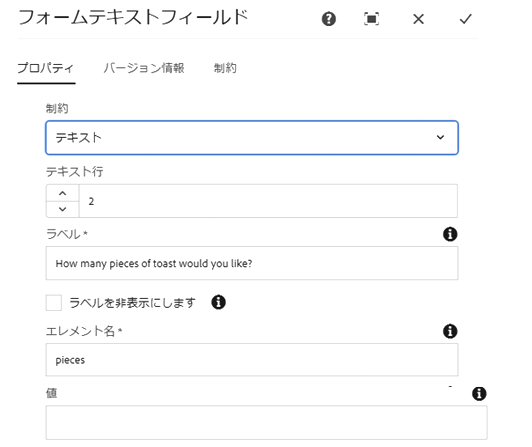
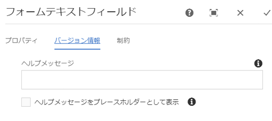
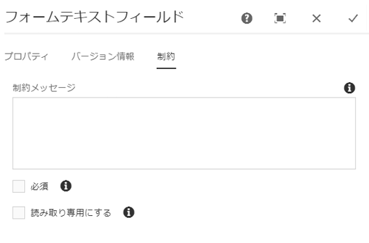

# Form Text Component{#form-text-component}

Core Component Form Textコンポーネントを使用すると、フォームテキストのエントリを送信できます。

## 使用方法 {#usage}

フォームテキストコンポーネントでは、様々なタイプのテキストを送信でき、 [フォームコンテナコンポーネントとともに使用することができ](form-container.md)ます。テキスト検証、ラベルおよびヘルプメッセージのタイプは [、設定ダイアログのコンテンツエディターで定義](#configure-dialog)できます。

## バージョンと互換性 {#version-and-compatibility}

フォームテキストコンポーネントの現在のバージョンはv2であり、2018年1月のコアコンポーネントのリリース2.0.0で導入されています。このドキュメントで説明しています。

次の表に、サポートされているコンポーネントのすべてのバージョン、コンポーネントのバージョンが互換性があるAEMバージョン、および以前のバージョンのドキュメントへのリンクを示します。

| コンポーネントバージョン | AEM 6.3 | AEM 6.4 | AEM 6.5 |
|--- |--- |--- |--- |
| v2 | 互換性 | 互換性 | 互換性 |
| [v1](form-text-v1.md) | 互換性 | 互換性 | 互換性 |

コアコンポーネントバージョンとリリースについて詳しくは、ドキュメント [コアコンポーネントバージョン](versions.md)を参照してください。

## サンプルコンポーネントの出力 {#sample-component-output}

以下は、We. Retailから [取得されたサンプル](https://helpx.adobe.com/experience-manager/6-5/sites/developing/using/we-retail.html)です。

### スクリーンショット {#screenshot}


### HTML {#html}

```
<div class="text aem-GridColumn aem-GridColumn--default--12">
   <div class="cmp-form-text">
      <label for="form-text-2146967">How many pieces of toast would you like?
      </label>
   <input class="cmp-form-text__text" type="number" id="form-text-2146967" name="pieces">
   </div>
</div>
```

### JSON {#json}

```
"text":{  
                     "columnClassNames":"aem-GridColumn aem-GridColumn--default--12",
                     "id":"form-text-2146967",
                     "title":"How many pieces of toast would you like?",
                     "name":"pieces",
                     "value":"",
                     "helpMessage":"",
                     "type":"number",
                     "readOnly":false,
                     "required":false,
                     "requiredMessage":"",
                     "constraintMessage":"",
                     "rows":2,
                     "defaultValue":"",
                     ":type":"core/wcm/components/form/text/v2/text"
                  }
```

### 技術的詳細 {#technical-details}

フォームテキストコンポーネント [に関する最新の技術ドキュメントは、GitHubで入手](https://github.com/adobe/aem-core-wcm-components/tree/master/content/src/content/jcr_root/apps/core/wcm/components/form/text/v2/text)できます。

コアコンポーネントの開発について詳しくは、 [コアコンポーネント開発者向けドキュメント](developing.md)を参照してください。

## ダイアログの設定 {#configure-dialog}

設定ダイアログでは、コンテンツ作成者が入力するテキストの種類とデフォルト値およびラベルを定義できます。

### メインタブ {#main-tab}



* **制約**入力するテキストの種類
   * **テキスト**
   * **テキスト領域**
   * **電子メール**
   * **電話番号**
   * 日付****
   * **番号**
   * **パスワード**
* **テキスト行**テキスト領域に表示する行数（ **制約** がテキスト領域に **設定されている場合のみ表示**）
* **ラベル**:フィールドに表示するラベル
* **ラベルが表示**されないようにラベルを非表示にする必要があります。ラベルがアクセシビリティの目的でのみ必要で、フィールドに関する追加情報を表示しない場合
* **要素名**フォームデータと共に送信されるフィールドの名前
* **フィールドに事前入力されている値**デフォルト値

### タブについて {#about-tab}



* **Help Message**
A hint to the user of what can be entered in the field
* **Display help message as placeholder**
To display the help message inside the form input when it is empty and not focused

### 「制約」タブ{#constraints-tab}



* **制約メッセージ**
   * 値が適切な型でない場合に、フォーム送信時にツールチップとして表示されるメッセージ
   * **テキスト** および **テキスト領域** 制約タイプに対しては表示されません
* **選択した**場合、ユーザーがフォームを送信する前に値に入力する必要がある
* **選択した**場合にのみ読み取り専用にする

## デザインダイアログ {#design-dialog}

フォームテキストコンポーネントのデザインダイアログはありません。