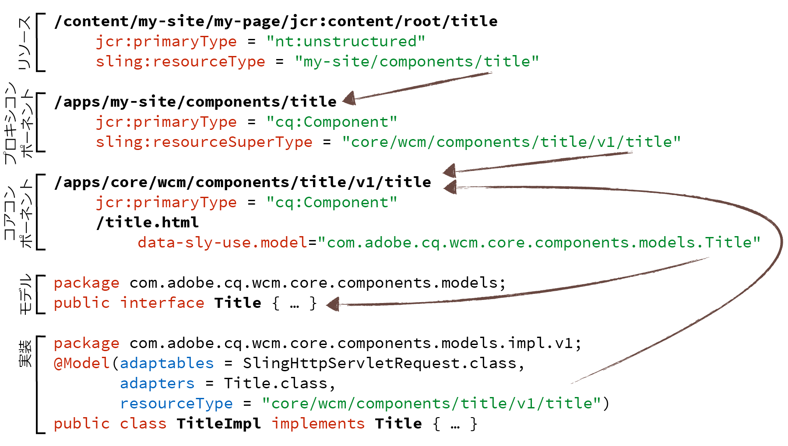
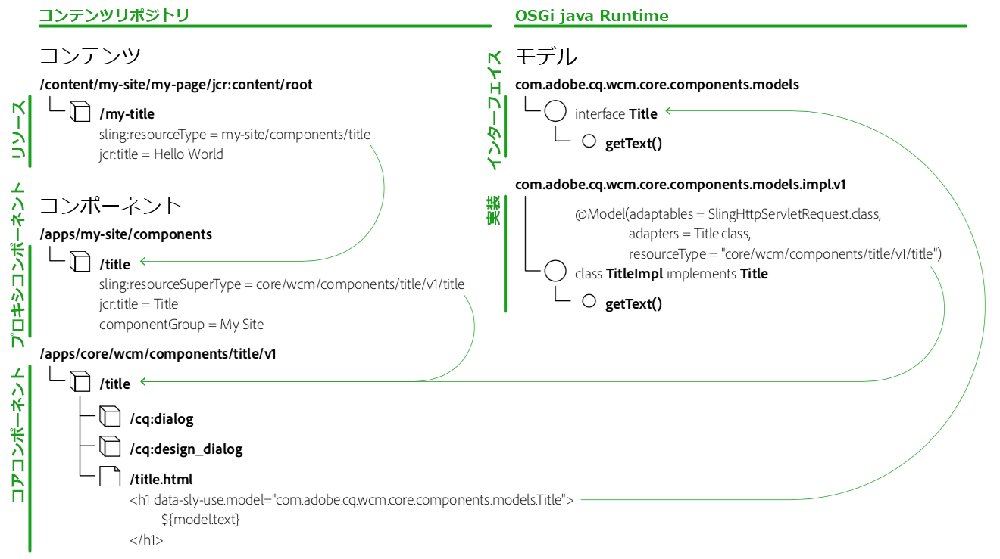

# コンポーネントのガイドライン {#component-guidelines}

[コアコンポーネント](developing.md)は、Foundation コンポーネントとは非常に異なる、最新の実装パターンに従っています。

このページでは、それらのパターンと、それらを使ってオーサリング可能な独自のコンポーネントを構築すべき場合について説明します。最初の節の[一般的なコンポーネントのパターン](guidelines.md)は、あらゆる種類のコンポーネントに適用されますが、2 番目の節の[再利用可能なコンポーネントのパターン](guidelines.md)は、コアコンポーネントのように、複数のサイトやプロジェクトにわたる再利用を目的としたコンポーネントに適用されます。

## 一般的なコンポーネントのパターン {#general-component-patterns}

この節のガイドラインは、コンポーネントが単一のプロジェクトに固有のものかどうか、あるいは複数のサイトやプロジェクトにわたって広く再利用することを目的としているかどうかにかかわらず、あらゆる種類のコンポーネントに推奨されます。

### 設定可能なコンポーネント {#configurable-components}

コンポーネントデザインには、様々なオプションのダイアログを含めることがきます。ダイアログを活用して、コンポーネントを柔軟かつ設定可能にし、バリエーションにすぎないコンポーネントを複数実装するのを防ぐ必要があります。

通常、ワイヤフレームやデザインに似た要素のバリエーションが含まれている場合、それらのバリエーションを異なるコンポーネントとして実装するのではなく、複数のバリエーションの中から選択するためのオプションを含む 1 つのコンポーネントとして実装するようにしてください。

コンポーネントが複数のサイトやプロジェクトをまたいで再利用される場合は、[事前設定可能な機能 ](#pre-configurable-capabilities)の節で詳細を参照してください。

### 関心の分離 {#separation-of-concerns}

通常、コンポーネントのロジック（モデル）とマークアップテンプレート（ビュー）を分離することが推奨されます。これを達成する方法はいくつかありますが、コアコンポーネントでもおこなっているように、[Sling モデル](https://sling.apache.org/documentation/bundles/models.html)をロジックに使用し、[HTML テンプレート言語](https://helpx.adobe.com/jp/experience-manager/htl/using/overview.html)（HTL）をマークアップに使用する方法を推奨します。

Sling モデルは、POJO から必要な変数に簡単にアクセスできるようにする Java 注釈のセットです。コンポーネントの Java ロジックを実装する、シンプルで強力かつ効率的な方法を提供します。

HTL は、AEM 向けに調整された、セキュアでシンプルなテンプレート言語として設計されました。これは様々な種類のロジックを呼び出すことができるので、非常に柔軟性が高くなります。

## 再利用可能なコンポーネントのパターン {#reusable-component-patterns}

この節のガイドラインは他のあらゆるコンポーネントと同様に使用できますが、コアコンポーネントのように、複数のサイトやプロジェクトをまたいで再利用することを目的としたコンポーネントで使用するのが最も理にかなっています。したがって、単一のサイトやプロジェクトでのみ使用されるコンポーネントでは、これらのガイドラインを無視してかまいません。

### 事前設定可能な機能 {#pre-configurable-capabilities}

コンポーネントには、ページ作成者が使用する編集ダイアログのほかに、テンプレート作成者が事前設定をおこなうためのデザインダイアログも含めることができます。[テンプレートエディター](https://helpx.adobe.com/jp/experience-manager/6-5/sites/authoring/using/templates.html)では、「ポリシー」と呼ばれるこれらの事前設定をすべて設定できます。

コンポーネントをできるだけ再利用できるようにするには、事前設定用の意味のあるオプションを用意する必要があります。そうすれば、コンポーネントの機能の有効・無効を切り替えることで、様々なサイトの特定のニーズに対応することができます。

### プロキシコンポーネントパターン {#proxy-component-pattern}

各コンテンツリソースには、そのリソースをレンダリングするためのコンポーネントを参照する `sling:resourceType` プロパティがあります。通常はこれらのプロパティが、複数のサイトで共有されるコンポーネントではなく、サイト固有のコンポーネントを指すように設定することをお勧めします。そうすれば、コンテンツの柔軟性が高まり、あるサイトでコンポーネントの動作を変更する必要が生じてもコンテンツのリファクタリングが不要になります。なぜなら、サイト固有のコンポーネント上でこのカスタマイズを実現でき、そのカスタマイズの影響は他のサイトには及ばないからです。

ただし、プロジェクト固有のコンポーネント間でコードが重複しないようにするには、`sling:resourceSuperType` プロパティを使用して各コンポーネントが共通の親コンポーネントを参照するようにしてください。ほとんど親コンポーネントを参照するだけの、これらプロジェクト固有のコンポーネントは、「プロキシコンポーネント」と呼ばれます。機能をすべて継承する場合はプロキシコンポーネントを完全に空にすることができます。また、プロキシコンポーネントでコンポーネントのいくつかの側面を再定義することもできます。

### コンポーネントのバージョン管理 {#component-versioning}

コンポーネントは時間が経過しても完全に互換性を維持する必要がありますが、互換性を維持できない変更が必要になる場合もあります。これらの相反するニーズへの解決策の 1 つは、リソースタイプパスと実装の完全修飾 Java クラス名に数値を追加して、コンポーネントのバージョン管理を導入することです。このバージョン番号は、[セマンティックバージョン管理のガイドライン](https://semver.org/)で定義されたメジャーバージョンを表します。メジャーバージョンは、後方互換性を維持できない変更でのみインクリメントされます。

コンポーネントの以下の側面に対して互換性のない変更をおこなうと、新しいバージョンになります。

* Sling モデル（セマンティックバージョン管理のガイドラインに準拠）
* HTL スクリプトおよびテンプレート
* HTML マークアップおよび CSS セレクター
* JSON 表現
* ダイアログ

詳しくは、GitHub の [Versioning Policies](https://github.com/adobe/aem-core-wcm-components/wiki/Versioning-Policies) ドキュメントを参照してください。

コンポーネントのバージョン管理では一種のコントラクトが作成されます。このコントラクトはリファクタリングが必要なタイミングを明確にし、アップグレードの際に重要な役割を果たします。[アップグレード時のカスタマイズの互換性](customizing.md#upgrade-compatibility-of-customizations)の節も参照してください。この節では、アップグレード時に様々な形式のカスタマイズでどういった考慮が必要になるかについて説明しています。

コンテンツ移行時に困難が生じないようにするには、コンテンツリソースからバージョン管理されたコンポーネントを直接参照しないことが重要です。経験則として、コンテンツの `sling:resourceType` にバージョン番号を含めないでください。そうしないと、コンポーネントのアップグレード時にコンテンツのリファクタリングも必要になります。これを回避する最善の方法は、前述の[プロキシコンポーネントパターン](#proxy-component-pattern)に従うことです。

### モデルインターフェイス {#model-interfaces}

このパターンでは、HTL の `data-sly-use` 命令が Java インターフェイスを指す一方、Sling モデルの実装もコンポーネントのリソースタイプに自身を登録します。

この形式の二重バインディングと前述の[プロキシコンポーネントパターン](#proxy-component-pattern)の組み合わせにより、次のような優れた拡張ポイントが得られます。

1. あるサイトで、Sling モデルの実装をプロキシコンポーネントのリソースタイプに登録することで、その実装を再定義できます。その際、HTL ファイルのことを気にする必要はありません。HTL ファイルはインターフェイスを指したままでかまいません。
1. あるサイトで、コンポーネントの HTL マークアップを再定義できます。その際、どの実装ロジックを指すべきかを気にする必要はありません。

## まとめ {#putting-it-all-together}

以下に、リソースタイプバインディング構造の全体の概要を示します（タイトルコアコンポーネントの例）。ここでは、コンテンツリソースにバージョン番号が一切含まれないようにするため、サイト固有のプロキシコンポーネントを使用してコンポーネントのバージョン管理が解決されている様子が示されています。次に、コンポーネントの `title.html`[HTL](https://helpx.adobe.com/jp/experience-manager/htl/using/overview.html) ファイルがモデルインターフェイスを指す一方、実装が [Sling モデル](https://sling.apache.org/documentation/bundles/models.html)の注釈を介してコンポーネントの特定のバージョンにバインドされている様子が示されています。

以下に別の概要を示します。ここでは、実装 POJO の詳細は示されていませんが、関連する[テンプレートとポリシー](https://helpx.adobe.com/jp/experience-manager/6-5/sites/developing/using/page-templates-editable.html)の参照方法がわかります。

`cq:allowedTemplates` プロパティは、サイトで使用可能なテンプレートを示し、`cq:template` はページごとに、どのテンプレートが関連付けられているかを示します。すべてのテンプレートは以下の 3 つの部分から構成されています。

* **structure** - すべてのページに強制的に配置され、ページ作成者が削除できないリソース（ページのヘッダーコンポーネントやフッターコンポーネントなど）を含みます。
* **initial** - ページ作成時にページに複製される初期コンテンツを含みます。
* **policies** - コンポーネントごとに、ポリシー（コンポーネントの事前設定）へのマッピングを含みます。このマッピングにより、複数のテンプレートにわたるポリシーの再利用、したがってポリシーの一元管理が可能となります。

## AEM プロジェクトアーキタイプ {#aem-project-archetype}

[AEM プロジェクトアーキタイプ](overview.md)は、最小限の Adobe Experience Manager プロジェクトを独自のプロジェクトの起点として作成します。これには、推奨のプロキシパターンを使用してコアコンポーネントのロジックと適切な実装をおこなうために、SlingModels を使用したカスタム HTL コンポーネントの helloworld の例が含まれます。

**関連項目：**

* [コアコンポーネントの使用](using.md) - 独自のプロジェクトにコアコンポーネントを導入する方法について説明します。
* [コアコンポーネントのカスタマイズ](customizing.md) - コアコンポーネントのスタイル設定とカスタマイズの方法について説明します。
