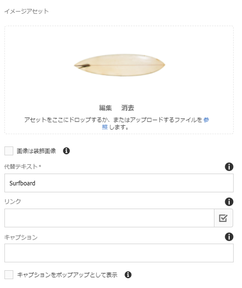
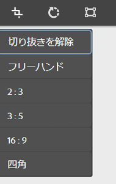
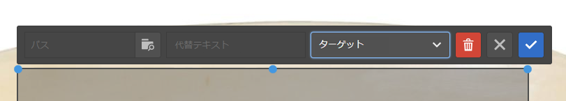
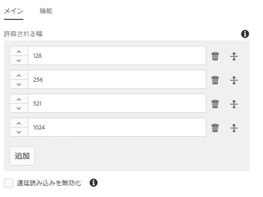
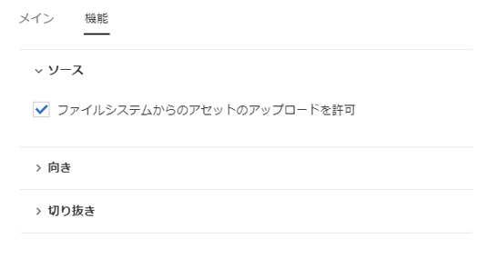
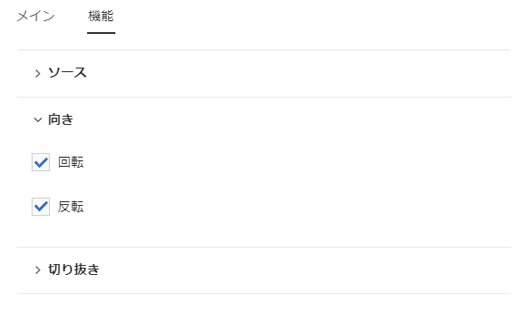
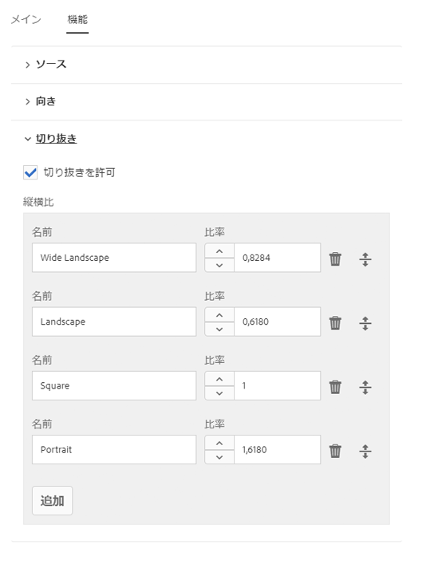

# 画像コンポーネント（v1）{#image-component-v}

コアコンポーネント画像コンポーネントは、インプレース編集のアダプティブ画像コンポーネント機能です。

## 使用方法 {#usage}

画像コンポーネントを使用すると、画像アセットを簡単に配置し、インプレース編集を行うことができます。これには、遅延読み込みとコンテンツ作成者の切り抜きを伴うアダプティブ画像選択機能があります。

使用できる画像の幅と、切り抜きや追加設定は、デザインダイアログの [テンプレート作成者によって定義](image-v1.md#main-pars_title_1995166862)できます。コンテンツエディターで [は、設定ダイアログ](image-v1.md#main-pars_title_55926120) でアセットをアップロードまたは選択し、 [編集ダイアログで画像を切り抜く](image-v1.md#main-pars_title)ことができます。便宜上、画像の単純な配置の変更も利用できます。

## バージョンと互換性 {#version-and-compatibility}

本書では、元々、コアコンポーネントのリリース1.0.0で導入された、AEM6.3のリリース1.0.0について説明します。

次の表に、Image Componentのv1との互換性を示します。

| AEM のバージョン | 画像コンポーネントv1 |
|--- |--- |
| 6.3 | 互換性 |
| 6.4 | 互換性 |

>[!CAUTION]
>
>本書では、画像コンポーネントのv1について説明します。
>
>画像コンポーネントの現在のバージョンについて詳しくは [、Image Component](image.md) ドキュメントを参照してください。

## サンプルコンポーネントの出力 {#sample-component-output}

以下は、We. Retailから [取得されたサンプル](https://helpx.adobe.com/experience-manager/6-4/sites/developing/using/we-retail.html)です。

### スクリーンショット {#screenshot}


### HTML {#html}

```
<div class="cmp cmp-image aem-GridColumn aem-GridColumn--default--12">
 
        <noscript data-cmp-image="{&#34;smartImages&#34;:[],&#34;smartSizes&#34;:[],&#34;lazyEnabled&#34;:true}">
            
        </noscript>

</div>
```

### JSON {#json}

```
"image": {
              "columnClassNames": "aem-GridColumn aem-GridColumn--default--12",
              "smartSizes": [],
              "smartImages": [],
              "lazyEnabled": true,
              "src": "/content/we-retail/us/en/equipment/equipment/jcr%3acontent/root/responsivegrid/image.img.jpeg",
              ":type": "weretail/components/content/image"
            }
```

>[!NOTE]
>
>コアコンポーネントからのJSONエクスポートには、コアコンポーネントのリリース1.1.0が必要です。詳しくは [、コアコンポーネントv1](versions.md#main-pars_title_236368006) の互換性情報を参照してください。

## ダイアログの設定 {#configure-dialog}

標準 [の編集ダイアログ](image-v1.md#main-pars_title) および [デザインダイアログ](image-v1.md#main-pars_title_1995166862)に加えて、画像コンポーネントには、画像自体が定義されているダイアログボックスと、その説明と基本プロパティが表示されます。



* **イメージアセット**
   * [アセットブラウザからアセットをドロップ](https://helpx.adobe.com/experience-manager/6-3/sites/authoring/using/author-environment-tools.html#main-pars_title) するか、 **または参照** オプションをタップしてローカルファイルシステムからアップロードします。
   * 「 **クリア」** をタップまたはクリックして、現在選択されている画像を選択解除します。
   * **アセット** エディターでアセットのレンディションを [作成するには、「編集」を](https://helpx.adobe.com/experience-manager/6-3/assets/using/managing-assets-touch-ui.html#main-pars_title_19) タップまたはクリックします。

* **画像は装飾的** です-画像が支援テクノロジーで無視される必要があるかどうかを確認し、代替テキストを必要としません。これは、装飾的な画像にのみ適用されます。
* **代替テキスト** -視覚障害のある読者のための、画像の意味や機能の代替テキスト。
* **リンク**
   * 画像を別のリソースにリンクします。
   * 選択ダイアログを使用して、別のAEMリソースにリンクします。
   * AEMリソースにリンクしていない場合は、絶対URLを入力します。非アクティブURLは、AEMに対して相対的に解釈されます。

* **キャプション** -画像の下に表示される追加情報は、初期設定の画像です。
* **キャプションをポップアップ** として表示-チェックをオンにすると、画像の下にキャプションが表示されませんが、画像の上にマウスポインターを置くとポップアップが表示されます。

## ダイアログを編集 {#edit-dialog}

編集ダイアログを使用すると、コンテンツ作成者は、コンテンツ作成者が起動、起動マップの変更、画像のズームを実行できます。


* 切り抜きを開始

   

   このオプションを選択すると、切り抜きの縦横比が定義済みのドロップダウンが表示されます。

   * 「 **無料ハンド」** オプションを選択して、独自の切り抜きを定義します。
   * 「切り抜き **** を削除」オプションを選択して、元のアセットを表示します。
   切り抜きオプションを選択したら、青いハンドルを使用して画像上の切り抜きのサイズを調整します。

   

* 右に回転

   

   画像を右（時計回り）に90°回転させるには、このオプションを使用します。

* Map Map

   

   このオプションを使用して、起動マップを画像に適用します。このオプションを選択すると、ユーザーがマップの形状を選択できる新しいウィンドウが開きます。

   * **長方形マップを追加**
   * **円形マップを追加**
   * **多角形マップを追加**

      * デフォルトでは、三角形のマップが追加されます。シェイプの行をダブルクリックして、新しい青いサイズ変更ハンドルを新しいサイドに追加します。
   マップシェイプを選択すると、サイズ変更可能な画像に重ね合わされます。青いサイズのサイズ変更ハンドルをドラッグ&amp;ドロップして、シェイプを調整します。

   

   起動マップをサイズ調整したら、クリックしてフローティングツールバーを開き、リンクのパスを定義します。

   * **パス**
      * パスピッカーオプションを使用してAEMでパスを選択する
      * パスがAEMにない場合は、絶対URLを使用します。絶対パスは、AEMに対する相対パスで解釈されます。

      * **代替テキスト**パス先の代替説明
      * **Target**
         * **同じタブ**
         * **新しいタブ**
         * **親フレーム**
         * **トップフレーム**
   青のチェックマークをタップまたはクリックして保存し、黒のxはキャンセルし、赤のごみ箱はマップを削除します。

   

* ズームをリセット

   

   画像が既にズームされている場合は、このオプションを使用してズームレベルをリセットします。

* Open Zoom Slider

   

   このオプションを使用して、画像のズームレベルを制御するスライダを表示します。

   

インプレースエディターを使用して画像を変更することもできます。スペースの制限により、基本オプションのみがインラインで使用できます。フルスクリーンモードの場合は、フルスクリーンモードを使用します。


>[!NOTE]
>
>画像編集操作（切り抜き、反転、回転）はGIF画像ではサポートされていません。編集モードで行われたそのような変更は、保持されません。

## デザインダイアログ {#design-dialog}

デザインダイアログでは、テンプレート作成者がこのコンポーネントを使用するときにコンテンツ作成者による切り抜き、アップロード、回転のアップロードを定義できます。

### メイン {#main}

**「メイン** 」タブでは、画像の許容幅のリストをピクセル単位で定義して、リストから最も適切な幅を自動的に読み込むことができます。



「追加」ボタンをタップまたはクリックして、別のサイズを追加します。

* グラブハンドルを使用して、サイズの順序を変更します。
* 幅を削除するには、削除アイコンを使用します。

デフォルトでは、画像の読み込みは表示されるまで延期されます。ページ読み込み時に画像を読み込むには、「遅延読み込み **** を無効にする」オプションを選択します。

### 機能 {#features}

**「機能** 」タブでは、アップロードオプション、方向、切り抜きオプションなど、コンポーネントの使用時にコンテンツ作成者が使用できるオプションを定義できます。

* ソース

   

   「 **ファイルシステム** からアセットをアップロード」オプションを選択して、コンテンツ作成者がローカルコンピューターから画像をアップロードできるようにします。コンテンツ作成者がAEMからアセットのみを選択できるようにするには、このオプションを選択解除します。

* 向き

   

   * **回転** -コンテンツ作成者が「右 **に回転」** オプションを使用できるようにするには、このオプションを使用します。
   * **フリップ**このオプションを使用すると、コンテンツ作成者は「水平 **方向に反転」** および「垂直 **方向に反転」** オプションを使用できます。
   >[!CAUTION]
   >
   >**「フリップ」** オプションはデフォルトで無効になっています。有効にすると、画像コンポーネントの編集ダイアログの「垂直方向 **** に反転»ボタンと **** «水平方向に反転»ボタンが表示されますが、この機能はAEMでは現在サポートされていません。また、これらのオプションを使用して行った変更は永続的ではありません。

<!-- 
Comment Type: remark
Last Modified By: Chris Bohnert (bohnert)
Last Modified Date: 2017-11-20T05:51:34.378-0500

<p>Added caution based on CQDOC-11457. Hid the flip options in the procedure using the <strong>Draft</strong> option so that when this feature is implemented in CQ-4221539, the <strong>Draft</strong> property can simply be removed along with the caution.</p>
-->

* 切り抜き

   

   「切り抜き **** を許可」オプションを選択すると、コンテンツ作成者は編集ダイアログでコンポーネントの画像を切り抜くことができます。
   * **「追加」** をクリックして、定義済みの切り抜き縦横比を追加します。
   * 説明的な名前を入力します。この名前は[切り抜き **の開始** ]ドロップダウンに表示されます。
   * 縦横比の数値を入力します。
   * ドラッグハンドルを使用して、縦横比の順序を再調整します
   * ごみ箱アイコンを使用して、縦横比を削除します。
   >[!CAUTION]
   >
   >AEMでは、切り抜き縦横比は **高さ/幅**として定義されています。これは、従来の幅と高さの定義とは異なり、従来の互換性の理由で行われます。コンテンツの作成者は、比率の明確な名前を指定している限り、割合を認識しません。これは、比率自体ではなく、UIに表示されるからです。

## 技術的詳細 {#technical-details}

Image Component [に関する最新の技術ドキュメントは、GitHubで入手](https://github.com/adobe/aem-core-wcm-components/tree/master/content/src/content/jcr_root/apps/core/wcm/components/image/v1/image)できます。

コアコンポーネントプロジェクト全体をGitHubからダウンロードできます。

コアコンポーネントの開発について詳しくは、 [コアコンポーネント開発者向けドキュメント](developing.md)を参照してください。
