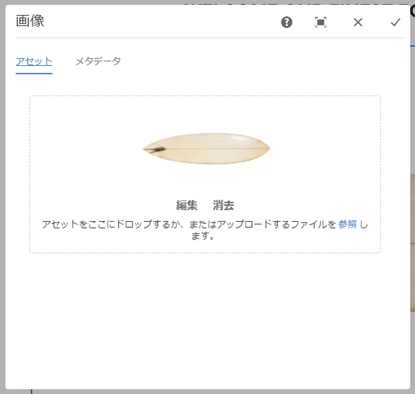
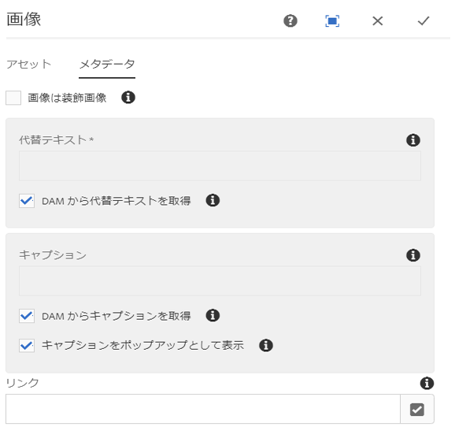
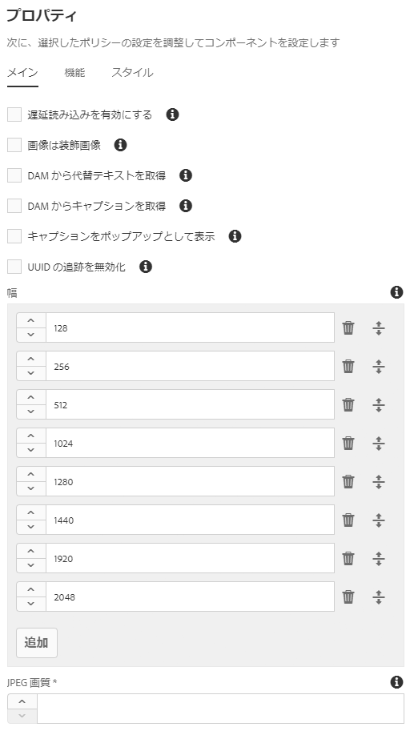

# 画像コンポーネント{#image-component}

Core Component Image Componentは、インプレース編集機能を備えたアダプティブ画像コンポーネントです。

## 使用方法 {#usage}

画像コンポーネントを使用すると、画像アセットを簡単に配置し、インプレース編集を行うことができます。これには、遅延読み込みとコンテンツ作成者の切り抜きを伴うアダプティブ画像選択機能があります。

画像の幅と、切り抜きや追加設定は、デザインダイアログの [テンプレート作成者によって定義](#design-dialog)できます。コンテンツエディターで [は、設定ダイアログ](#configure-dialog) でアセットをアップロードまたは選択し、 [編集ダイアログで画像を切り抜く](#edit-dialog)ことができます。便宜上、画像の単純な配置の変更も利用できます。

## バージョンと互換性 {#version-and-compatibility}

現在のバージョンのImage Componentはv2であり、2018年1月のコアコンポーネントのリリース2.0.0で導入されています。このドキュメントで説明しています。

次の表に、サポートされているコンポーネントのすべてのバージョン、コンポーネントのバージョンが互換性があるAEMバージョン、および以前のバージョンのドキュメントへのリンクを示します。

| コンポーネントバージョン | AEM 6.3 | AEM 6.4 | AEM 6.5 |
|--- |--- |--- |--- |
| v2 | 互換性 | 互換性 | 互換性 |
| [v1](image-v1.md) | 互換性 | 互換性 | 互換性 |

コアコンポーネントバージョンとリリースについて詳しくは、ドキュメント [コアコンポーネントバージョン](versions.md)を参照してください。

## SVGサポート {#svg-support}

Scalable Vector Graphics（SVG）はImage Componentでサポートされています。

* DAMからSVGアセットをドラッグ&amp;ドロップすると、ローカルファイルシステムからSVGファイルアップロードがアップロードされます。
* アダプティブ画像サーブレットストリームは、元のSVGファイルをストリーミングします（変換はスキップされます）。
* SVG画像の場合、画像モデルでは「スマート画像」と「スマートサイズ」が空の配列に設定されます。

### セキュリティ {#security}

セキュリティ上の理由から、元のSVGは画像エディターで直接呼び出されることはありません。呼び出さ ``れます。これにより、SVGファイルに埋め込まれているスクリプトが実行されなくなります。

>[!CAUTION]
>
>SVGサポートには、AEM内の新しいイメージエディター機能をサポートするために、AEM6.4以降のサービスパック2と [サービスパック2](https://helpx.adobe.com/experience-manager/6-4/release-notes/sp-release-notes.html) のリリース2.1.0とサービス [パック2のリリース2.1.0](https://helpx.adobe.com/experience-manager/6-4/sites/developing/using/image-editor.html) が必要です。

## サンプルコンポーネントの出力 {#sample-component-output}

以下は、We. Retailから [取得されたサンプル](https://helpx.adobe.com/experience-manager/6-5/sites/developing/using/we-retail.html)です。

### スクリーンショット {#screenshot}

### コンポーネントライブラリ

画像コンポーネントのエクスペリエンスと、HTMLおよびJSON出力の設定について詳しくは [、コンポーネントライブラリを参照](http://opensource.adobe.com/aem-core-wcm-components/library/image.html)してください。

### 技術的詳細 {#technical-details}

Image Component [に関する最新の技術ドキュメントは、GitHubで入手](https://github.com/adobe/aem-core-wcm-components/blob/master/content/src/content/jcr_root/apps/core/wcm/components/image/v2/image)できます。

コアコンポーネントの開発について詳しくは、 [コアコンポーネント開発者向けドキュメント](developing.md)を参照してください。

>[!NOTE]
>
>コアコンポーネントリリース2.1.0では、Image Componentは [schema.orgマイクロデータ](https://schema.org)をサポートしています。

## ダイアログの設定 {#configure-dialog}

標準 [の編集ダイアログ](#edit-dialog) および [デザインダイアログ](#design-dialog)に加えて、画像コンポーネントには、画像自体が定義されているダイアログボックスと、その説明と基本プロパティが表示されます。

### 「アセット」タブ {#asset-tab}

* **イメージアセット**
   * [アセットブラウザからアセットをドロップ](https://helpx.adobe.com/experience-manager/6-5/sites/authoring/using/author-environment-tools.html) するか、 **または参照** オプションをタップしてローカルファイルシステムからアップロードします。
   * 「 **クリア」** をタップまたはクリックして、現在選択されている画像を選択解除します。
   * **アセット** エディターでアセットのレンディションを [作成するには、「編集」を](https://helpx.adobe.com/experience-manager/6-5/assets/using/managing-assets-touch-ui.html) タップまたはクリックします。

### メタデータタブ {#metadata-tab}

* **画像は装飾的な**もので、画像が支援テクノロジーで無視される必要があるため、代替テキストを必要としません。これは、装飾的な画像にのみ適用されます。
* **視覚障害のある読者のための代替テキスト**の代替テキスト。
   * DAMから代替テキストを取得-チェックすると、画像の代替テキストにDAM内の `dc:description` メタデータの値が入力されます。

* **キャプション**画像に関する追加情報。初期設定で画像の下に表示されます。
   * **DAM**からキャプションを取得チェックをオンにすると、画像のキャプションテキストにDAM内の `dc:title` メタデータの値が入力されます。
   * **キャプションをポップアップ**として表示する場合、キャプションは画像の下に表示されませんが、画像の上にマウスポインターを置くとポップアップとして表示されます。

* **リンク**
   * 画像を別のリソースにリンクします。
   * 選択ダイアログを使用して、別のAEMリソースにリンクします。
   * AEMリソースにリンクしていない場合は、絶対URLを入力します。非アクティブURLは、AEMに対して相対的に解釈されます。

## ダイアログを編集 {#edit-dialog}

編集ダイアログを使用すると、コンテンツ作成者は、コンテンツ作成者が起動、起動マップの変更、画像のズームを実行できます。

* 切り抜きを開始

   

   このオプションを選択すると、切り抜きの縦横比が定義済みのドロップダウンが表示されます。

   * 「 **無料ハンド」** オプションを選択して、独自の切り抜きを定義します。
   * 「切り抜き **** を削除」オプションを選択して、元のアセットを表示します。
   切り抜きオプションを選択したら、青いハンドルを使用して画像上の切り抜きのサイズを調整します。

   

* 右に回転

   

   画像を右（時計回り）に90°回転させるには、このオプションを使用します。

* 水平方向に反転

   

   このオプションを使用すると、画像を水平方向に反転したり、Y軸に沿って画像を180°回転させたりできます。

* 垂直方向に反転

   

   このオプションを使用すると、画像を垂直方向に反転したり、x軸に沿って画像を180°回転させたりできます。

* Map Map

   >[!CAUTION]
   >
   >起動マップ機能には、AEM内の新しいイメージエディター機能をサポートするために、AEM6.4以降のサービスパック2と [ともに、コアコンポーネントのリリース2.1.0と、](https://helpx.adobe.com/experience-manager/6-4/release-notes/sp-release-notes.html) AEM6.3以上の [サービスパック3](https://helpx.adobe.com/experience-manager/6-3/release-notes/sp3-release-notes.html) が必要です。

   

   このオプションを使用して、起動マップを画像に適用します。このオプションを選択すると、ユーザーがマップの形状を選択できる新しいウィンドウが開きます。

   * **長方形マップを追加**
   * **円形マップを追加**
   * **多角形マップを追加**
      * デフォルトでは、三角形のマップが追加されます。シェイプの行をダブルクリックして、新しい青いサイズ変更ハンドルを新しいサイドに追加します。
   マップシェイプを選択すると、サイズ変更可能な画像に重ね合わされます。青いサイズのサイズ変更ハンドルをドラッグ&amp;ドロップして、シェイプを調整します。

   

   起動マップをサイズ調整したら、クリックしてフローティングツールバーを開き、リンクのパスを定義します。

   * **パス**
      * パスピッカーオプションを使用してAEMでパスを選択する
      * パスがAEMにない場合は、絶対URLを使用します。絶対パスは、AEMに対する相対パスで解釈されます。
   * **代替テキスト**パス先の代替説明
   * **Target**
      * **同じタブ**
      * **新しいタブ**
      * **親フレーム**
      * **トップフレーム**
   青のチェックマークをタップまたはクリックして保存し、黒のxはキャンセルし、赤のごみ箱はマップを削除します。

   

* ズームをリセット

   

   画像が既にズームされている場合は、このオプションを使用してズームレベルをリセットします。

* Open Zoom Slider

   

   このオプションを使用して、画像のズームレベルを制御するスライダを表示します。

   

インプレースエディターを使用して画像を変更することもできます。スペースの制限により、基本オプションのみがインラインで使用できます。フルスクリーンモードの場合は、フルスクリーンモードを使用します。

>[!NOTE]
>
>画像編集操作（切り抜き、反転、回転）はGIF画像ではサポートされていません。編集モードで行われたそのような変更は、保持されません。

## デザインダイアログ {#design-dialog}

デザインダイアログでは、テンプレート作成者がこのコンポーネントを使用するときに、コンテンツ作成者による切り抜き、アップロード、回転オプションおよびアップロードオプションを定義できます。

### メインタブ {#main-tab}

**「メイン** 」タブでは、画像の幅のリストをピクセル単位で定義して、リストから最も適切な幅を自動的に読み込むことができます。

また、ページにコンポーネントを追加するときに、自動または無効にする一般的なコンポーネントオプションを定義できます。

* **遅延読み込みを有効に**する画像コンポーネントをページに追加するときに遅延読み込みオプションが自動的に有効になっている場合に、定義を有効にします。
* **画像は、画像コンポーネントをページに追加するときに、装飾的な画像オプションが自動的に有効になっている場合に定義される装飾**的な定義です。
* **DAM**から代替テキストを取得する場合、画像コンポーネントをページに追加するときにDAMから代替テキストを取得するオプションが自動的に有効になっている場合に、このテキストを定義します。
* **DAM**からキャプションを取得するために、画像コンポーネントをページに追加するときにDAMからキャプションを取得するオプションが自動的に有効になっているかどうかを定義します。
* **キャプションをポップアップ**として表示するには、画像コンポーネントをページに追加するときに、画像キャプションをポップアップとして表示するオプションが自動的に有効になっているかどうかを定義します。
* **UUIDトラッキング**チェックを無効にすると、画像アセットのUUIDのトラッキングが無効になります。

* **幅**画像の幅のリストをピクセル単位で定義して、リストから最も適切な幅を自動的に読み込みます。
   * 「 **追加」** ボタンをタップまたはクリックして、別のサイズを追加します。
      * グラブハンドルを使用して、サイズの順序を変更します。
      * 幅を削除するには **、削除** アイコンを使用します。
   * 初期設定では、画像の読み込みは、表示されるまで延期されます。
      * ページ読み込み時に画像を読み込むには、「遅延読み込み **** を無効にする」オプションを選択します。
* **JPEG画質**変換（例えば、拡大縮小またはトリミング）
JPEG画像の画質係数（0~100のパーセンテージ）。

>[!CAUTION]
>
>&quot;JPEG画質」オプションは、コアコンポーネントのリリース2.2.0以降で使用できます。

>[!NOTE]
>
>コアコンポーネントのリリース2.2.0時点で、Image Componentは一意のUUID属性を画像アセット `data-asset-id` に追加して、個々のアセットが受け取るビュー数のトラッキングと分析を可能にします。

### 機能タブ {#features-tab}

**「機能** 」タブでは、アップロードオプション、方向、切り抜きオプションなど、コンポーネントの使用時にコンテンツ作成者が使用できるオプションを定義できます。

* ソース

   

   「 **ファイルシステム** からアセットをアップロード」オプションを選択して、コンテンツ作成者がローカルコンピューターから画像をアップロードできるようにします。コンテンツ作成者がAEMからアセットのみを選択できるようにするには、このオプションを選択解除します。

* 向き

   

* **回転**このオプションを使用すると、コンテンツ作成者は「右 **に回転」** オプションを使用できます。
* **フリップ**このオプションを使用すると、コンテンツ作成者は「水平 **方向に反転」** および「垂直 **方向に反転」** オプションを使用できます。

   >[!CAUTION]
   >
   >**「フリップ」** オプションはデフォルトで無効になっています。有効にすると、画像コンポーネントの編集ダイアログの「垂直方向 **** に反転»ボタンと **** «水平方向に反転»ボタンが表示されますが、この機能はAEMでは現在サポートされていません。また、これらのオプションを使用して行った変更は永続的ではありません。

<!-- 
Comment Type: remark
Last Modified By: Chris Bohnert (bohnert)
Last Modified Date: 2017-11-20T05:51:34.378-0500

Added caution based on CQDOC-11457. Hid the flip options in the procedure using the <strong>Draft</strong> option so that when this feature is implemented in CQ-4221539, the <strong>Draft</strong> property can simply be removed along with the caution.

 -->

* 切り抜き

   

   「切り抜き **** を許可」オプションを選択すると、コンテンツ作成者は編集ダイアログでコンポーネントの画像を切り抜くことができます。
   * **「追加」** をクリックして、定義済みの切り抜き縦横比を追加します。
   * 説明的な名前を入力します。この名前は[切り抜き **の開始** ]ドロップダウンに表示されます。
   * 縦横比の数値を入力します。
   * ドラッグハンドルを使用して、縦横比の順序を再調整します
   * ごみ箱アイコンを使用して、縦横比を削除します。
   >[!CAUTION]
   >
   >AEMでは、切り抜き縦横比は **高さ/幅**として定義されています。これは、従来の幅と高さの定義とは異なり、従来の互換性の理由で行われます。コンテンツの作成者は、比率の明確な名前を指定している限り、割合を認識しません。これは、比率自体ではなく、UIに表示されるからです。

### 「スタイル」タブ {#styles-tab-1}

Image Componentでは、AEM [スタイルシステム](authoring.md#component-styling)がサポートされています。