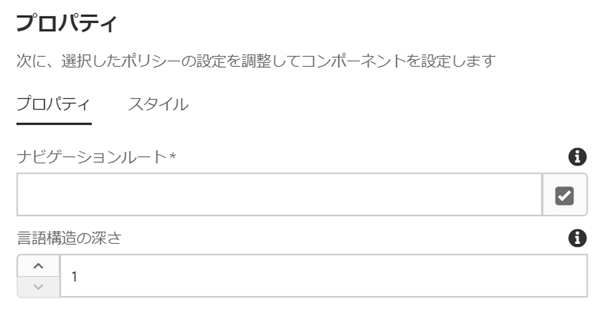
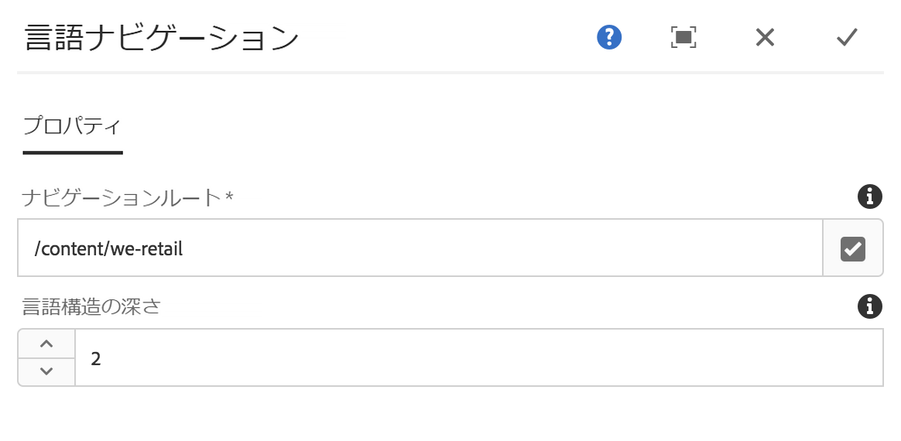

# 言語ナビゲーションコンポーネント{#language-navigation-component}

言語ナビゲーションコンポーネントは、言語／国を指定したサイトナビゲーション機能を提供し、訪問者が同じページを異なるロケールでナビゲートできるようにします。

## 使用方法 {#usage}

Web サイトは、多くの場合、様々な地域向けに複数の言語で提供されています。言語ナビゲーションコンポーネントを使用すれば、訪問者は同じページを異なる言語／ロケールで表示できます。そのため、Web サイトのドイツ語（スイス）バージョンの閲覧者の場合、同じページの英語（米国）バージョンに簡単に切り替えることができます。言語ナビゲーションコンポーネントは、サイトの言語構造の認識を処理し、対応するページを自動的に見つけます。

[編集ダイアログ](#edit-dialog)では、グローバルサイトナビゲーションのルートのほか、構造のナビゲーションの深さを定義できます。[デザインダイアログ](#design-dialog)では、同じオプションのデフォルト値をテンプレート作成者が設定できます。

## バージョンと互換性 {#version-and-compatibility}

このドキュメントでは、言語ナビゲーションコンポーネントの現在のバージョン（2018 年 1 月にコアコンポーネントのリリース 2.0.0 で導入された v1）について説明します。

コンポーネントのすべてのサポート対象バージョン、コンポーネントの各バージョンと互換性のある AEM バージョン、以前のバージョンのドキュメントへのリンクを次の表に示します。

| コンポーネントのバージョン | AEM 6.3 | AEM 6.4 | AEM 6.5 |
|--- |--- |--- |--- |
| v1 | 互換性あり | 互換性あり | 互換性あり |

コアコンポーネントのバージョンとリリースについて詳しくは、[コアコンポーネントのバージョン](versions.md)を参照してください。

## コンポーネント出力のサンプル {#sample-component-output}

To experience the Language Navigation Component as well as see examples of its configuration options as well as HTML and JSON output, visit the [Component Library](http://opensource.adobe.com/aem-core-wcm-components/library/language-navigation/language-structure/us/en/language-navigation.html).

## 技術的詳細 {#technical-details}

言語ナビゲーションコンポーネントに関する最新の技術ドキュメントは、GitHubにあり [ます](https://github.com/adobe/aem-core-wcm-components/blob/master/content/src/content/jcr_root/apps/core/wcm/components/languagenavigation/v1/languagenavigation)。

コアコンポーネントの開発について詳しくは、[コアコンポーネント開発者向けドキュメント](developing.md)を参照してください。

## デザインダイアログ{#design-dialog}

編集ダイアログでは、グローバルサイトナビゲーションのルートのほか、構造のナビゲーションの深さを定義できます。

通常、これらの設定は、ページテンプレートレベルでのみおこなう必要があります。ただし、[編集ダイアログ](#edit-dialog)を使用してページレベルで変更できます。

### 「プロパティ」タブ {#properties-tab}



* **ナビゲーションルート**
   * サイトの言語ナビゲーションを開始する場所。
   * サイトの言語構造は、このルートの下の次のレベルで開始する。
* **言語構造の深さ**
   * これは、サイトの言語構造を表す&#x200B;**ナビゲーションルート**&#x200B;の下のコンテンツツリーのレベルの数です。例：
      * `1` は、通常、言語の選択肢のみがあることを示します。
      * `2` は、通常、言語と国の選択肢があることを示します。
      * `3` は、通常、言語、国、地域の選択肢があることを示します。

#### 例 {#example}

コンテンツが次のような構造になっているとします。

```
/content
+-- we-retail
   +-- language-masters
   +-- us
      +-- en
      \-- es
   \-- ch
      +-- de
      +-- fr
      \-- it
+-- wknd-events
\-- wknd-shop
```

サイト We.Retail では、言語ナビゲーションコンポーネントを、ヘッダーの一部としてページテンプレート上に配置するとよいでしょう。Once part of the template, you can set the **Navigation Root** of the component to `/content/we-retail` since that is where your localized content for that site begins. また、「**言語構造の深さ**」を（構造が国と言語の 2 レベルなので）「`2`」に設定します。

言語コンポーネントは、**ナビゲーションルート**&#x200B;値によって、`/content/we-retail` の後にナビゲーションが開始されることを把握します。また、コンテンツツリーの次の 2 レベルを（**言語構造の深さ**&#x200B;の値で定義されたように）サイトの言語ナビゲーション構造として認識することで、言語ナビゲーションオプションを生成できます。

言語ナビゲーションコンポーネントは、現在のページの場所を把握し、ルートに戻ってから、対応するページに進むことで、ユーザーがどのページを閲覧していたとしても、別の言語の対応するページを見つけることができます。

### 「スタイル」タブ {#styles-tab}

言語ナビゲーションコンポーネントでは、AEM [スタイルシステム](authoring.md#component-styling)をサポートしています。

## 編集ダイアログ{#edit-dialog}

通常、言語ナビゲーションコンポーネントは、サイトのページテンプレートに対してのみ追加し、設定される必要があります。ただし、言語ナビゲーションコンポーネントを個別のコンテンツページに追加する必要がある場合、編集ダイアログを使用すると、コンテンツ作成者は[デザインダイアログ](#design-dialog)で説明したのと同じ値を設定できます。


