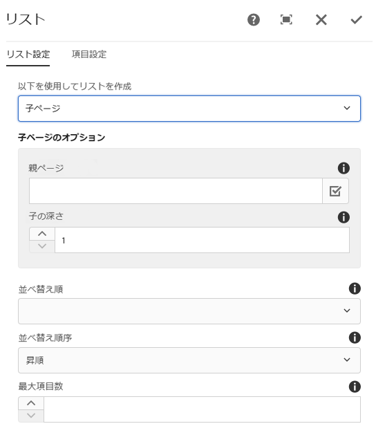
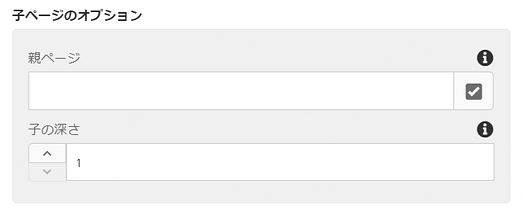
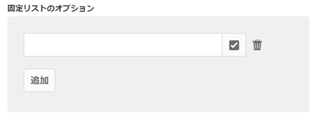
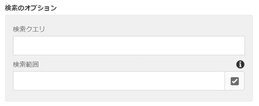
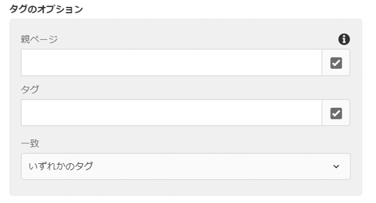
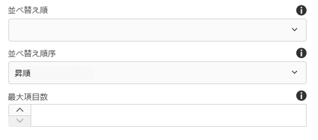
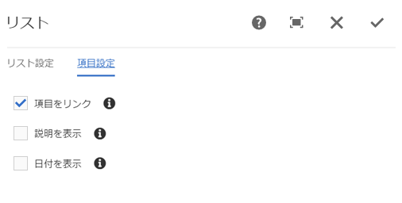
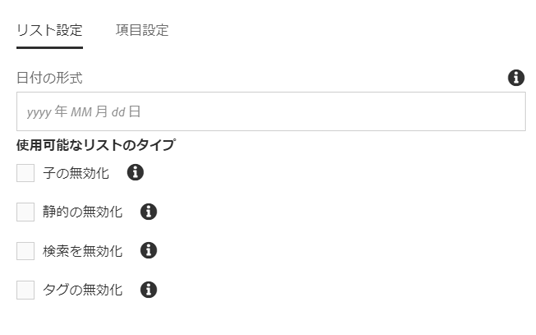
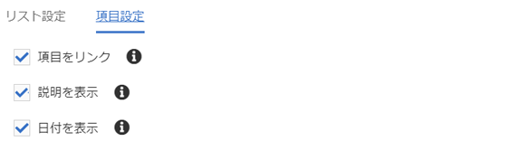

# リストコンポーネント（v1）{#list-component-v}

コアコンポーネントリストコンポーネントを使用すると、静的リストと静的リストを簡単に作成できます。

## 使用方法 {#usage}

リストコンポーネントは、子ページの動的リストや、恣意的に定義された項目の静的リストなどの作成に使用できます。

使用可能なリストの種類とフォーマットオプションは [、デザインダイアログのテンプレート作成者によって定義](list-v1.md#main-pars_title_1995166862)できます。コンテンツエディターでは、利用可能なリストタイプから選択したり、 [編集ダイアログでリスト要素の書式を設定](list-v1.md#main-pars_title)したりできます。

## バージョンと互換性 {#version-and-compatibility}

本書では、元々、コアコンポーネントのリリース1.0.0とAEM6.3で導入された、リストコンポーネントのv1について説明します。

次の表に、List Componentのv1との互換性を示します。

| AEM のバージョン | リストコンポーネントv1 |
|--- |--- |
| 6.3 | 互換性 |
| 6.4 | 互換性 |

>[!CAUTION]
>
>本書では、リストコンポーネントのv1について説明します。
>
>List Componentの現在のバージョンの詳細については [、&quot;List Component](list.md) 」ドキュメントを参照してください。

## サンプルコンポーネントの出力 {#sample-component-output}

以下は、We. Retailから [取得されたサンプル](https://helpx.adobe.com/experience-manager/6-4/sites/developing/using/we-retail.html)です。

### スクリーンショット {#screenshot}


### HTML {#html}

```
<div class="cmp cmp-list aem-GridColumn aem-GridColumn--default--12">

<ul>
    <li>
    <article>
        <a href="/content/we-retail/us/en/experience/arctic-surfing-in-lofoten.html">
            <span class="cmp-list--item-title">Arctic Surfing In Lofoten</span>
            
        </a>
        
    </article>
</li>

    <li>
    <article>
        <a href="/content/we-retail/us/en/experience/summit-success-in-the-himalayas.html">
            <span class="cmp-list--item-title">Summit Success in the Himalayas</span>
            
        </a>
        
    </article>
</li>

    <li>
    <article>
        <a href="/content/we-retail/us/en/experience/climbing-on-kalymnos-island--greece.html">
            <span class="cmp-list--item-title">Climbing on Kalymnos Island, Greece</span>
            
        </a>
        
    </article>
</li>

    <li>
    <article>
        <a href="/content/we-retail/us/en/experience/running-at-the-great-wall-marathon.html">
            <span class="cmp-list--item-title">Running at the Great Wall Marathon</span>
            
        </a>
        
    </article>
</li>

    <li>
    <article>
        <a href="/content/we-retail/us/en/experience/skiing-deep-powder-in-siberia.html">
            <span class="cmp-list--item-title">Skiing deep powder in Siberia</span>
            
        </a>
        
    </article>
</li>

    <li>
    <article>
        <a href="/content/we-retail/us/en/experience/climbing-in-the-massif-du-mont-blanc.html">
            <span class="cmp-list--item-title">Climbing in the Massif du Mont Blanc</span>
            
        </a>
        
    </article>
</li>
</ul>

</div>
```

### JSON {#json}

```
"articles_list": {
              "columnClassNames": "aem-GridColumn aem-GridColumn--default--12",
              ":type": "weretail/components/content/articleslist",
              "tagsMatch": "any",
              "displayAs": "teaser",
              "feedEnabled": "true",
              "listFrom": "children",
              "limit": "0",
              "orderBy": "cq:lastModified",
              "pageMax": "0"
            }
```

>[!NOTE]
>
>コアコンポーネントからのJSONエクスポートには、コアコンポーネントのリリース1.1.0が必要です。詳しくは [、コアコンポーネントv1](versions.md#main-pars_title_236368006) の互換性情報を参照してください。

## ダイアログを編集 {#edit-dialog}

編集ダイアログでは、コンテンツ作成者がリストとリスト要素を設定できます。

### リスト設定 {#list-settings}

リストは様々な方法で作成できます。

* [子ページ](list-v1.md#main-pars_title_1861279796)
* [固定リスト](list-v1.md#main-pars_title_1227896889)
* [検索](list-v1.md#main-pars_title_1224003560)
* [タグ](list-v1.md#main-pars_title_700759533)

リストのビルド方法に関係なく、常に設定できる [並べ替えオプション](list-v1.md#main-pars_title_1568376452) があります。



コンテンツ作成者がリストの作成をどのように選択するかによって、追加の設定オプションが変更されます。

#### 子ページ {#child-pages}

このリストは、現在のページまたは別のページの子ページから作成できます。



* **親ページ**
   * 子ページがリストを作成する必要があるページ
   * 現在のページを使用するには空白のままにします
* **子-深さ** -階層内の下位レベルのレベルを使用する

#### 固定リスト {#fixed-list}

リストは、項目の固定リストを使用して作成できます。



「 **追加」** ボタンをタップまたはクリックして、新しい項目をリストに挿入します。

* リスト内のアイテムのテキストを入力するか **、選択ダイアログ** を使用してAEMからアイテムを選択します。
* ドラッグハンドルを使用して、リスト内の項目を再配置します。
* ごみ箱アイコンを使用してリスト内の項目を削除します。

#### 検索 {#search}

リストは、AEMコンテンツの検索結果を使用して作成できます。



* **検索クエリ** -全文検索が実行され、リスト要素を生成するための文字列
* **検索先** -検索の実行場所
   * **選択ダイアログ** を使用したAEMの場所の選択
   * 空白の場合は現在のページを使用

#### タグ {#tags}

リストは特定の場所の特定のタグに一致するページを使用して作成できます。



* **親ページ** -タグの一致を開始する場所
   * **選択ダイアログ** を使用したAEMの場所の選択
   * 空白の場合は現在のページを使用
* **タグ** -どのタグを照合するか
   * **参照** ダイアログを使用したタグの選択
* **一致** -リストに含めるページに合致するのにどの種類の一致があるかを定義する
   * **いずれかのタグ**
   * **すべてのタグ**

#### 並べ替えオプション {#sort-options}

リストの作成方法にかかわらず、いつでも定義できる並べ替えオプションがあります。



* **順序-** 要素の順序付け
   * **タイトル**
   * **最終変更日**
* **並べ替え順序** -項目の順序付け順序
   * **昇順**
   * **降順**
* **最大項目** 数-リストに表示される項目の最大数。
   * すべての項目を返すには、空のままにします。

### 項目設定 {#item-settings}

「アイテムの設定 **」** タブを使用すると、リスト要素の書式設定を設定できます。



* **項目**リンク項目を対応するページにリンクする
* **リンク項目の説明**を表示の説明
* **リンク項目の日付**表示日を表示

## デザインダイアログ {#design-dialog}

デザインダイアログでは、テンプレート作成者がコンテンツ作成者に許可するリストの種類と使用可能な項目設定を定義できます。

### リスト設定 {#list-settings-1}

「リスト設定 **」** タブでは、日付形式を定義したり、コンテンツ作成者に対してコンポーネントで使用できるリストの種類を定義したりできます。



* **日付フォーマット** -最終変更日の表示に使用するフォーマット
* **子を無効に** する-コンポーネントの子リストタイプを無効にします
* **スタティック** を無効にする-コンポーネントの静的リストタイプを無効にします
* **検索を無効にする** -コンポーネント内の検索リストのタイプを無効にする
* **タグを無効にする** -コンポーネントのタグリストの種類を無効にします

### 項目設定 {#item-settings-1}

「 **アイテムの設定** 」タブでは、コンテンツ作成者用にコンポーネントで使用できる個々のリスト要素の書式設定オプションを定義できます。



* **「項目をリンク** - [編集」ダイアログで「項目をリンク」オプションを有効にする](list-v1.md#main-pars_title_550499279)
* **Show Descriptions** - Enable Show Descriptions option in the [edit dialog](list-v1.md#main-pars_title_550499279)
* **Show Date** - Enable Show Date option in the [edit dialog](list-v1.md#main-pars_title_550499279)

## 技術的詳細 {#technical-details}

リストコンポーネント [に関する最新の技術ドキュメントは、GitHubで確認](https://github.com/adobe/aem-core-wcm-components/tree/master/content/src/content/jcr_root/apps/core/wcm/components/list/v1/list)できます。

コアコンポーネントプロジェクト全体をGitHubからダウンロードできます。

コアコンポーネントの開発について詳しくは、 [コアコンポーネント開発者向けドキュメント](developing.md)を参照してください。
