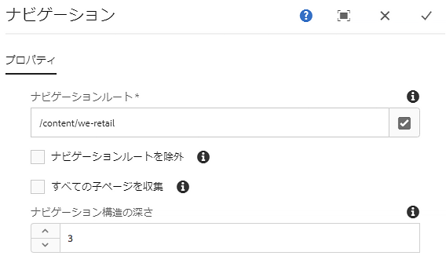
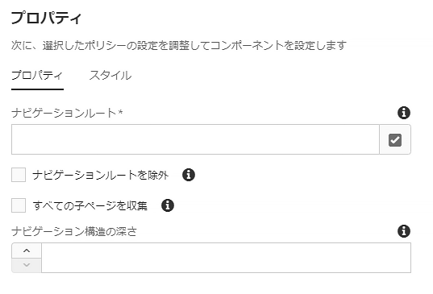

# ナビゲーションコンポーネント{#navigation-component}

ナビゲーションコンポーネントを使用すれば、グローバル化されたサイト構造を容易にナビゲートできます。

## 使用方法 {#usage}

ナビゲーションコンポーネントを使用すれば、ブループリントのライブコピー、言語マスターの言語コピー、単純なページツリーのいずれかから任意のナビゲーション階層を構築できます。ページのユーザーがページ構造を容易にナビゲートできます。

[編集ダイアログ](#edit-dialog)では、ナビゲーションルートページおよびナビゲーションの深さをコンテンツ作成者が定義できます。[デザインダイアログ](#design-dialog)では、ナビゲーションルートおよび深さのデフォルト値をテンプレート作成者が定義できます。

## バージョンと互換性 {#version-and-compatibility}

このドキュメントでは、ナビゲーションコンポーネントの現在のバージョン（2018 年 1 月にコアコンポーネントのリリース 2.2.0 で導入された v1）について説明します。

コンポーネントのすべてのサポート対象バージョン、コンポーネントの各バージョンと互換性のある AEM バージョン、以前のバージョンのドキュメントへのリンクを次の表に示します。

| コンポーネントのバージョン | AEM 6.3 | AEM 6.4 | AEM 6.5 |
|--- |--- |--- |--- |
| v1 | 互換性あり | 互換性あり | 互換性あり |

コアコンポーネントのバージョンとリリースについて詳しくは、[コアコンポーネントのバージョン](versions.md)を参照してください。

## コンポーネント出力のサンプル {#sample-component-output}

ナビゲーションコンポーネントを実際に体験し、その設定オプションや HTML および JSON 出力の例を確認するには、[コンポーネントライブラリ](http://opensource.adobe.com/aem-core-wcm-components/library/navigation.html)を参照してください。

## 技術的詳細 {#technical-details}

ナビゲーションコンポーネントに関する最新の技術ドキュメントについては、[GitHub](https://github.com/adobe/aem-core-wcm-components/blob/master/content/src/content/jcr_root/apps/core/wcm/components/navigation/v1/navigation) を参照してください。

コアコンポーネントの開発について詳しくは、[コアコンポーネント開発者向けドキュメント](developing.md)を参照してください。

>[!NOTE]
>
>コアコンポーネントリリース 2.1.0 の時点では、ナビゲーションコンポーネントは [schema.org microdata](https://schema.org) をサポートしています。

## 編集ダイアログ{#edit-dialog}

編集ダイアログでは、ナビゲーションのルートページとナビゲーション構造の深さをコンテンツ作成者が定義できます。

* **ナビゲーションルート** - ルートページ（ナビゲーションツリーの生成に使用されます）。
* **ナビゲーションルートを除外** - 生成されたツリーのナビゲーションルートを除外し、その下位ノードのみを含めます。
* **すべての子ページを収集** - ナビゲーションルートの下位ノードであるすべてのページを収集します。
* **ナビゲーション構造の深さ** - ナビゲーションツリーのルートを起点に表示する下位レベルの数を定義します（「**すべての子ページを収集**」が選択されていない場合のみ使用可能）。

## デザインダイアログ{#design-dialog}

デザインダイアログでは、コンテンツ作成者に表示されるナビゲーションルートページおよびナビゲーションの深さのデフォルト値をテンプレート作成者が設定できます。

### 「プロパティ」タブ {#properties-tab}

* **ナビゲーションルート** - ナビゲーション構造のルートページのデフォルト値（ナビゲーションツリーの生成に使用され、コンテンツ作成者がこのコンポーネントをページに追加したときにデフォルトとして使用されます）。
* **ナビゲーションルートを除外** - 生成されたツリーのナビゲーションルートを除外するオプションのデフォルト値。
* **すべての子ページを収集** - ナビゲーションルートの下位ノードであるすべてのページを収集するオプションのデフォルト値。
* **ナビゲーション構造の深さ** - ナビゲーション構造の深さのデフォルト値。

### 「スタイル」タブ {#styles-tab}

ナビゲーションコンポーネントでは、AEM [スタイルシステム](authoring.md#component-styling)をサポートしています。