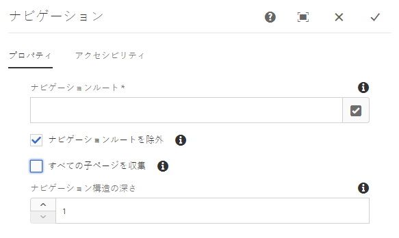

# ナビゲーションコンポーネント{#navigation-component}

ナビゲーションコンポーネントを使用すれば、グローバル化されたサイト構造を容易にナビゲートできます。

## 使用方法 {#usage}

ナビゲーションコンポーネントリストには、サイトのユーザがサイト構造を簡単にナビゲートできるように、ページのツリーがリストされています。

ナビゲーションコンポーネントは、サイトのグローバル化されたサイト構造を自動的に検出し、ローカライズされたページに自動 [的に適応させることができます。](#localized-site-strucutre) さらに [、シャドウリダイレクトページ](#shadow-structure) を使用して、メインコンテンツ構造以外の別の構造を表すことで、任意のサイト構造をサポートできます。

[編集ダイアログ](#edit-dialog)では、ナビゲーションルートページおよびナビゲーションの深さをコンテンツ作成者が定義できます。[デザインダイアログ](#design-dialog)では、ナビゲーションルートおよび深さのデフォルト値をテンプレート作成者が定義できます。

## ローカライズされたサイト構造のサポート {#localized-site-structure}

Web サイトは、多くの場合、様々な地域向けに複数の言語で提供されています。通常、ローカライズされた各ページには、ページテンプレートの一部として含まれるnavagation要素が含まれます。ナビゲーションコンポーネントを使用すると、サイトのすべてのページのテンプレートに一度配置でき、グローバル化されたサイト構造に基づいて、ローカライズされた各ページに自動的に適応できます。

* ナビゲーションコンポーネントのローカリゼーション機能の例については、以下の節を参照 [](#example-localiatzion)してください。
* コアコンポーネントのローカリゼーション機能の連携例については、コアコンポーネントページの [ローカリゼーション機能](localization.md)を参照してください。

### 例 {#example-localization}

コンテンツが次のような構造になっているとします。

```
/content
+-- we-retail
   +-- language-masters
      +-- de
         \-- experience
            \-- arctic-surfing-in-lofoten
      +-- en
         \-- experience
            \-- arctic-surfing-in-lofoten
      +-- es
      +-- fr
      \-- it
   +-- us
      +-- en
         \-- experience
            \-- arctic-surfing-in-lofoten
      \-- es
   \-- ch
      +-- de
         \-- experience
            \-- arctic-surfing-in-lofoten
      +-- fr
      \-- it
+-- wknd-events
\-- wknd-shop
```

サイトe. Retailの場合、ナビゲーションコンポーネントをヘッダーの一部としてページテンプレートに配置することをお勧めします。Once part of the template, you can set the **Navigation Root** of the component to `/content/we-retail/language-masters/en` since that is where your master content for that site begins. **また、コンテンツツリー全体をコンポーネントによって表示したく** ないの `2` で、ナビゲーション構造の深さを設定する必要もあります。ただし、最初の2つのレベルではなく、概要として機能するようにする必要があります。

**ナビゲーションルート** 値を使用すると、ナビゲーションコンポーネントはナビゲーション開始後 `/content/we-retail/language-masters/en` にそのナビゲーションを開始し、サイトの2つのレベル（ **ナビゲーション構造の深さ** の値で定義されているとおり）を繰り返し実行することでナビゲーションオプションを生成できます。

ユーザーがどのローカライズされたページを表示しているかにかかわらず、ナビゲーションコンポーネントは、現在のページの場所を知ることで、対応するローカライズされたページを見つけることができます。また、ルートに戻ると、対応するページに転送されます。

したがって、訪問者が表示 `/content/ch/de/experience/arctic-surfing-in-lofoten`している場合、コンポーネントは、そのコンポーネントに基づいてナビゲーション構造を生成することを認識 `/content/we-retail/language-masters/de`します。同様に、訪問者が表示 `/content/us/en/experience/arctic-surfing-in-lofoten`している場合、コンポーネントは、その訪問者に基づいてナビゲーション構造を生成することを認識 `/content/we-retail/language-masters/en`します。

## シャドウサイト構造のサポート {#shadow-structure}

実際のサイト構造とは異なる訪問者のナビゲーションメニューを作成する必要があります。おそらく、コンテンツリストを並べ替えて、メニュー内の特定のコンテンツを強調表示する必要があるとします。他のコンテンツページにリダイレクトするシャドウページを使用すると、ナビゲーションコンポーネントは必要な任意のナビゲーション構造を生成できます。

これを行うには、以下を行う必要があります。

1. 目的のサイト構造を表す、陰影ページとしてシャドウページを作成します。これは、多くの場合シャドウサイト構造と呼ばれます。
1. これらのページのページ関連性の **リダイレクト** 値を、実際のコンテンツページを指すように設定します。
1. シャドウページのページプロパティの **「ナビゲーション** に表示しない」オプションを設定します。
1. ナビゲーションコンポーネントの **ナビゲーションルート** 値を設定して、新しいシャドウサイト構造のルートを指すようにします。

次に、ナビゲーションコンポーネントはシャドウサイト構造に基づいてメニューをレンダリングします。コンポーネントによってレンダリングされるリンクは、シャドウページ自体にはリダイレクトされず、シャドウページ自体にリダイレクトされる実際のコンテンツページです。さらに、コンポーネントには、ナビゲーションがシャドウページに基づいている場合でも、実際のページの名前と、アクティブなページを正確にハイライトすることができます。ナビゲーションコンポーネントは、訪問者に対して、効果的にシャドウページを透明にします。

>[!NOTE]
>シャドウページではナビゲーションオプションが非常に柔軟になりますが、この構造の基礎となるのは完全に手動です。実際のサイトコンテンツを再配置するか、コンテンツを追加または削除する場合は、必要に応じてシャドウ構造を手動で更新する必要があります。

>[!NOTE]
>シャドウサイト構造をレンダリングする場合、シャドウページのみがナビゲーションロジックによって反復されます。このロジックでは、リダイレクト先の構造は繰り返されません。

## バージョンと互換性 {#version-and-compatibility}

このドキュメントでは、ナビゲーションコンポーネントの現在のバージョン（2018 年 1 月にコアコンポーネントのリリース 2.2.0 で導入された v1）について説明します。

コンポーネントのすべてのサポート対象バージョン、コンポーネントの各バージョンと互換性のある AEM バージョン、以前のバージョンのドキュメントへのリンクを次の表に示します。

| コンポーネントのバージョン | AEM 6.3 | AEM 6.4 | AEM 6.5 |
|--- |--- |--- |--- |
| v1 | 互換性あり | 互換性あり | 互換性あり |

コアコンポーネントのバージョンとリリースについて詳しくは、[コアコンポーネントのバージョン](versions.md)を参照してください。

## コンポーネント出力のサンプル {#sample-component-output}

ナビゲーションコンポーネントを実際に体験し、その設定オプションや HTML および JSON 出力の例を確認するには、[コンポーネントライブラリ](http://opensource.adobe.com/aem-core-wcm-components/library/navigation.html)を参照してください。

## 技術的詳細 {#technical-details}

ナビゲーションコンポーネント [に関する最新の技術ドキュメントは、GitHubで確認](https://github.com/adobe/aem-core-wcm-components/blob/master/content/src/content/jcr_root/apps/core/wcm/components/navigation/v1/navigation)できます。

コアコンポーネントの開発について詳しくは、[コアコンポーネント開発者向けドキュメント](developing.md)を参照してください。

>[!NOTE]
>
>コアコンポーネントリリース 2.1.0 の時点では、ナビゲーションコンポーネントは [schema.org microdata](https://schema.org) をサポートしています。

## 編集ダイアログ{#edit-dialog}

編集ダイアログでは、ナビゲーションのルートページとナビゲーション構造の深さをコンテンツ作成者が定義できます。

### 「プロパティ」タブ {#properties-tab}



* **ナビゲーションルート** - ルートページ（ナビゲーションツリーの生成に使用されます）。
* **ナビゲーションルートを除外** - 生成されたツリーのナビゲーションルートを除外し、その下位ノードのみを含めます。
* **すべての子ページを収集** - ナビゲーションルートの下位ノードであるすべてのページを収集します。
* **ナビゲーション構造の深さ** - ナビゲーションツリーのルートを起点に表示する下位レベルの数を定義します（「**すべての子ページを収集**」が選択されていない場合のみ使用可能）。

### アクセシビリティタブ {#accessibility-tab}


**「アクセシビリティ** 」タブでは、コンポーネントの [ARIAアクセシビリティ](https://www.w3.org/WAI/standards-guidelines/aria/) ラベルに値を設定できます。

* **ラベル** -コンポーネントのARIAラベル属性の値

## デザインダイアログ{#design-dialog}

デザインダイアログでは、コンテンツ作成者に表示されるナビゲーションルートページおよびナビゲーションの深さのデフォルト値をテンプレート作成者が設定できます。

### 「プロパティ」タブ {#properties-tab-design}


* **ナビゲーションルート** - ナビゲーション構造のルートページのデフォルト値（ナビゲーションツリーの生成に使用され、コンテンツ作成者がこのコンポーネントをページに追加したときにデフォルトとして使用されます）。
* **ナビゲーションルートを除外** - 生成されたツリーのナビゲーションルートを除外するオプションのデフォルト値。
* **すべての子ページを収集** - ナビゲーションルートの下位ノードであるすべてのページを収集するオプションのデフォルト値。
* **ナビゲーション構造の深さ** - ナビゲーション構造の深さのデフォルト値。

### 「スタイル」タブ {#styles-tab}

ナビゲーションコンポーネントでは、AEM [スタイルシステム](authoring.md#component-styling)をサポートしています。
