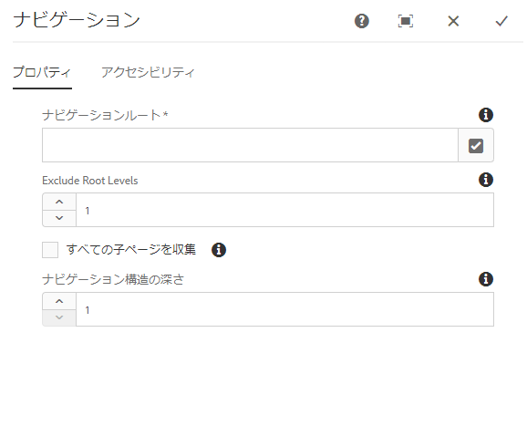
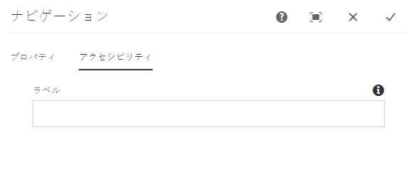
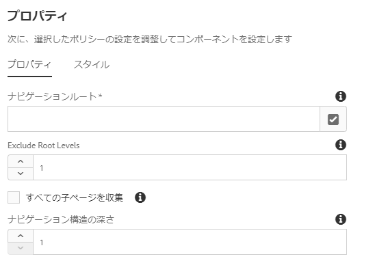

# ナビゲーションコンポーネント{#navigation-component}

ナビゲーションコンポーネントを使用すれば、グローバル化されたサイト構造を容易にナビゲートできます。

## 使用方法 {#usage}

ナビゲーションコンポーネントリストには、サイトのユーザーがサイト構造を容易にナビゲートできるように、ページのツリーが一覧表示されます。

ナビゲーションコンポーネントは、サイトのグローバル化されたサイト構造を自動的に検出し、[ローカライズされたページに自動的に適応することができます。](#localized-site-structure)さらに、[シャドウリダイレクトページ](#shadow-structure)を使用してメインコンテンツ構造以外の構造を表すことで、任意のサイト構造をサポートできます。

[編集ダイアログ](#edit-dialog)では、ナビゲーションルートページおよびナビゲーションの深さをコンテンツ作成者が定義できます。[デザインダイアログ](#design-dialog)では、ナビゲーションルートおよび深さのデフォルト値をテンプレート作成者が定義できます。

## ローカライズされたサイト構造のサポート {#localized-site-structure}

Web サイトは、多くの場合、様々な地域向けに複数の言語で提供されています。通常、ローカライズされた各ページには、ページテンプレートの一部としてナビゲーション要素が含まれます。ナビゲーションコンポーネントは、サイトのあらゆるページのテンプレートに一度配置すれば、グローバル化されたサイト構造に基づいて、ローカライズされた個々のページに自動的に適応できます。

* ナビゲーションコンポーネントのローカライゼーション機能の仕組みの例については、[以下のセクション](#example-localization)を参照してください。
* コアコンポーネントのローカライゼーション機能の連携の例については、[コアコンポーネントのローカライゼーション機能ページ](localization.md)を参照してください。

### 例 {#example-localization}

コンテンツが次のような構造になっているとします。

```
/content
+-- we-retail
   +-- language-masters
      +-- de
         \-- experience
            \-- arctic-surfing-in-lofoten
      +-- en
         \-- experience
            \-- arctic-surfing-in-lofoten
      +-- es
      +-- fr
      \-- it
   +-- us
      +-- en
         \-- experience
            \-- arctic-surfing-in-lofoten
      \-- es
   \-- ch
      +-- de
         \-- experience
            \-- arctic-surfing-in-lofoten
      +-- fr
      \-- it
+-- wknd-events
\-- wknd-shop
```

We.Retail サイトについては、ナビゲーションコンポーネントを、ヘッダーの一部としてページテンプレート上に配置するとよいでしょう。テンプレートの一部で、コンポーネントの&#x200B;**ナビゲーションルート**&#x200B;を `/content/we-retail/language-masters/en`（そのサイトのマスターコンテンツが開始される場所）に設定できます。また、コンテンツツリー全体をコンポーネントに表示するのではなく、最初の 2 レベルを概要として表示したい場合は、**ナビゲーション構造の深さ**&#x200B;を `2` に設定するとよいでしょう。

**ナビゲーションルート**&#x200B;の値を通じて、ナビゲーションコンポーネントは、`/content/we-retail/language-masters/en` の次からナビゲーションが開始されることを認識し、サイトの構造を（**ナビゲーション構造の深さ**&#x200B;の値で定義されているとおり）2 レベル下まで繰り返すことでナビゲーションオプションを生成できます。

ユーザーが閲覧しているローカライズ済みページによらず、ナビゲーションコンポーネントは、現在のページの場所を認識し、ルートまで戻ってから、対応するページまで進むことで、対応するローカライズ済みページを見つけることができます。

したがって、訪問者が `/content/ch/de/experience/arctic-surfing-in-lofoten` を閲覧している場合、コンポーネントは、`/content/we-retail/language-masters/de` に基づいてナビゲーション構造を生成する必要があることを認識します。同様に、訪問者が `/content/us/en/experience/arctic-surfing-in-lofoten` を閲覧している場合、コンポーネントは、`/content/we-retail/language-masters/en` に基づいてナビゲーション構造を生成する必要があることを認識します。

## シャドウサイト構造のサポート {#shadow-structure}

場合によっては、実際のサイト構造とは異なるナビゲーションメニューを訪問者向けに作成する必要があります。例えば、プロモーションの場合は、コンテンツリストを並べ替えて、メニュー内の特定のコンテンツを強調表示するかもしれません。シャドウページは他のコンテンツページにリダイレクトするだけですが、これを使用して、ナビゲーションコンポーネントは必要に応じて任意のナビゲーション構造を生成できます。

それには、以下の手順を実行します。

1. 目的のサイト構造を表すシャドウページを、空のページとして作成します。これは、多くの場合、シャドウサイト構造と呼ばれます。
1. これらのページのページプロパティで、実際のコンテンツページを指すように&#x200B;**リダイレクト**&#x200B;値を設定します。
1. シャドウページのページプロパティで、「**ナビゲーション内で非表示にする**」オプションを設定します。
1. ナビゲーションコンポーネントの&#x200B;**ナビゲーションルート**&#x200B;値を、新しいシャドウサイト構造のルートを指すように設定します。

この結果、ナビゲーションコンポーネントは、シャドウサイト構造に基づいてメニューをレンダリングします。コンポーネントによってレンダリングされるリンクは、シャドウページそのものではなく、シャドウページのリダイレクト先となる実際のコンテンツページを指しています。さらに、シャドウページに基づいたナビゲーションの場合でも、コンポーネントには実際のページの名前が表示されると共に、アクティブなページが正しく強調表示されます。ナビゲーションコンポーネントにより、事実上、シャドウページは訪問者に対して完全に透過的になります。

>[!NOTE]
>シャドウページの利用で、ナビゲーションオプションの柔軟性がはるかに高くなりますが、この構造の維持管理は完全に手動でおこなう必要があることに留意してください。実際のサイトコンテンツを再配置したり、コンテンツを追加または削除する場合は、必要に応じてシャドウ構造を手動で更新する必要があります。

>[!NOTE]
>シャドウサイト構造をレンダリングする場合、ナビゲーションロジックによって繰り返されるのはシャドウページだけです。このロジックでは、リダイレクト先の構造は繰り返されません。

## バージョンと互換性 {#version-and-compatibility}

このドキュメントでは、ナビゲーションコンポーネントの現在のバージョン（2018 年 1 月にコアコンポーネントのリリース 2.0.0 で導入された v1）について説明します。

コンポーネントのすべてのサポート対象バージョン、コンポーネントの各バージョンと互換性のある AEM バージョン、以前のバージョンのドキュメントへのリンクを次の表に示します。

| コンポーネントのバージョン | AEM 6.3 | AEM 6.4 | AEM 6.5 |
|--- |--- |--- |--- |
| v1 | 互換性あり | 互換性あり | 互換性あり |

コアコンポーネントのバージョンとリリースについて詳しくは、[コアコンポーネントのバージョン](versions.md)を参照してください。

## コンポーネント出力のサンプル {#sample-component-output}

ナビゲーションコンポーネントを実際に体験し、その設定オプションや HTML および JSON 出力の例を確認するには、[コンポーネントライブラリ](http://opensource.adobe.com/aem-core-wcm-components/library/navigation.html)を参照してください。

## 技術的詳細 {#technical-details}

ナビゲーションコンポーネントに関する最新の技術ドキュメントについては、[GitHub](https://github.com/adobe/aem-core-wcm-components/blob/master/content/src/content/jcr_root/apps/core/wcm/components/navigation/v1/navigation) を参照してください。

コアコンポーネントの開発について詳しくは、[コアコンポーネント開発者向けドキュメント](developing.md)を参照してください。

>[!NOTE]
>
>コアコンポーネントリリース 2.1.0 の時点では、ナビゲーションコンポーネントは [schema.org microdata](https://schema.org) をサポートしています。

## 編集ダイアログ{#edit-dialog}

編集ダイアログでは、ナビゲーションのルートページとナビゲーション構造の深さをコンテンツ作成者が定義できます。

### 「プロパティ」タブ {#properties-tab}



* **ナビゲーションルート** - ルートページ（ナビゲーションツリーの生成に使用されます）。
* **ルートレベルの除外** — 多くの場合、ルートはナビゲーションに含める必要はありません。このオプションを使用すると、除外するルートから上のレベル数を指定できます。例：
   * 0 =ルートレベルを表示
   * 1 =ルートレベルを除外
   * 2 =ルートとさらに 1 つ上のレベルを除外
   * 。
* **すべての子ページを収集** - ナビゲーションルートの下位ノードであるすべてのページを収集します。
* **ナビゲーション構造の深さ** - ナビゲーションツリーのルートを起点に表示する下位レベルの数を定義します（「**すべての子ページを収集**」が選択されていない場合のみ使用可能）。

### 「アクセシビリティ」タブ {#accessibility-tab}



「**アクセシビリティ**」タブでは、コンポーネントの「[ARIA アクセシビリティ](https://www.w3.org/WAI/standards-guidelines/aria/)」ラベルの値を設定できます。

* **ラベル** - コンポーネントの ARIA ラベル属性の値

## デザインダイアログ{#design-dialog}

デザインダイアログでは、コンテンツ作成者に表示されるナビゲーションルートページおよびナビゲーションの深さのデフォルト値をテンプレート作成者が設定できます。

### 「プロパティ」タブ {#properties-tab-design}



* **ナビゲーションルート** - ナビゲーション構造のルートページのデフォルト値（ナビゲーションツリーの生成に使用され、コンテンツ作成者がこのコンポーネントをページに追加したときにデフォルトとして使用されます）。
* **ルートレベルの除外** — 多くの場合、ルートはナビゲーションに含める必要はありません。このオプションを使用すると、除外するルートから上のレベル数のデフォルトを指定できます。例：
   * 0 =ルートレベルを表示
   * 1 =ルートレベルを除外
   * 2 =ルートとさらに 1 つ上のレベルを除外
   * 。
* **すべての子ページを収集** - ナビゲーションルートの下位ノードであるすべてのページを収集するオプションのデフォルト値。
* **ナビゲーション構造の深さ** - ナビゲーション構造の深さのデフォルト値。

### 「スタイル」タブ {#styles-tab}

ナビゲーションコンポーネントでは、AEM [スタイルシステム](authoring.md#component-styling)をサポートしています。
