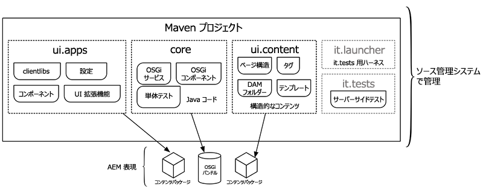

# AEM プロジェクトアーキタイプ {#aem-project-archetype}

AEMプロジェクトのアーキタイプは、最小限のベストプラクティスベースのAdobe Experience Managerプロジェクトを独自のAEMプロジェクトの起点として作成します。 このアーキタイプを使用する場合に指定する必要があるプロパティを使用すると、このプロジェクトのすべての部分の名前を指定し、特定のオプション機能を制御できます。

>[!NOTE]
>
>最新のAEMプロジェクトのアーキタイプと技術的な詳細につ [いては、GitHubを参照してください](https://github.com/adobe/aem-project-archetype)。

>[!NOTE]
>
>単純なプロ [ジェクトを実装するためのアーキタイプの使い方の実例については、AEMドキュメントの「AEM Sites - WKND Tutorial](https://docs.adobe.com/content/help/en/experience-manager-learn/getting-started-wknd-tutorial-develop/overview.html) 」を参照してください。

## 機能 {#features}

このアーキタイプには、新しいAEMプロジェクトを開始する際に便利な機能が用意されています。

* サンプルコンテンツを含む英語ページとフランス語ページ
* コンテンツポリシーの例を含む、編集可能なテンプレート機能に基づくコンテンツテンプレート
* [AEM Page coreコンポーネントに基づくページコンポーネント](page.md)
* 推奨プロキシパターンとhelloworldカスタムコンポーネントの例を使用して実装されたコンテンツコンポーネントの例は、すべて [AEMコアコンポーネントに基づいていま](introduction.md)す。
* フォームコンポーネ [ントの例](form-container.md)
* デバイスエミュレーター、ドラッグ&amp;ドロップ設定、および国際化対応の設定
* BEM命名規則に従うクライアントライブラリとコンポーネント固有のスタイル
* サンプルモデル、サーブレット、フィルター、スケジューラーを含むバンドルの例
* ユニット、統合、およびクライアント側のテスト

## アーキタイプを使用する理由 {#why-use-the-archetype}

AEMプロジェクトのアーキタイプを使用すると、数回のキー操作で、ベストプラクティスベースのAEMプロジェクトを構築するためのパスが設定されます。 アーキタイプを使用すると、すべての部品が既に配置され、結果のプロジェクトが最小限になる間は、AEMの主要機能すべてが実装されるので [](#features) 、必要な作業は上に構築して拡張するだけです。

もちろん、成功するAEMプロジェクトには多くの要素が含まれていますが、AEMプロジェクトのアーキタイプを使用することは健全な基盤であり、AEMプロジェクトに対して強くお勧めします。

## アーキタイプを使用して得られる情報 {#what-you-get}

AEMアーキタイプは、次のモジュールで構成されています。

* **[コア](core.md)**:は、OSGiサービス、リスナー、スケジューラーなどのすべてのコア機能に加え、サーブレットやリクエストフィルターなどのコンポーネント関連のJavaコードを含むJavaバンドルです。
* **[ui.apps](uiapps.md)**:には、プ `/apps``/etc` ロジェクトのとの部分（JSとCSSのclientlib、コンポーネント、テンプレート、実行モード固有の設定、Hobbesテストなど）が含まれています。
* **[ui.content](uicontent.md)**:ui.appsモジュールのコンポーネントを使用するサンプルコンテンツが含まれています。
* **ui.tests**:は、サーバー側で実行されるJUnitテストを含むJavaバンドルです。 このバンドルは実稼動環境にはデプロイされません。
* **ui.launcher**:ui.testsバンドル（および依存バンドル）をサーバーにデプロイし、リモートJUnit実行をトリガする接着コードが含まれます。
* **[ui.frontend](front-end-build.md)**: **（オプション）** 、Webpackベースのフロントエンドビルドモジュールの使用に必要なアーティファクトが含まれます。



Mavenで表されるAEM Archetypeのモジュールは、アプリケーション、コンテンツ、および必要なOSGiバンドルを表すコンテンツページとしてAEMにデプロイされます。

## 要件 {#requirements}

現在のバージョンのアーキタイプには、次の要件があります。

* Adobe Experience Manager 6.3.3.0以降
* Apache Maven（3.3.9以降）
* Adobe Public Maven RepositoryをMaven設定に追加します。 詳しくは、こ [のナレッジベース記事を参照してください](https://helpx.adobe.com/experience-manager/kb/SetUpTheAdobeMavenRepository.html)。

以前のアーキタイプバージョンでサポートされているAEMバージョンのリストについては、サポートされて [いるAEMバージョンの履歴を参照してくださ](https://github.com/adobe/aem-project-archetype/blob/master/VERSIONS.md)い。

## アーキタイプの使用方法 {#how-to-use-the-archetype}

アーキタイプを使用するには、まずプロジェクトを作成し、前述のとおりにローカルファイル構造でモジュールを生成する必要 [があります](#what-you-get)。 プロジェクトの生成の一環として、プロジェクト名、バージョンなど、プロジェクトの多くのプロパティを定義できます。

Mavenでプロジェクトを構築すると、AEMにデプロイできるアーティファクト（パッケージおよびOSGiバンドル）が作成されます。 追加のMavenコマンドおよびプロファイルを使用して、プロジェクトのアーティファクトをAEMインスタンスにデプロイできます。

### プロジェクトの作成 {#create-project}

最初に、最も簡単に [AEM Eclipse拡張機能を使用し、新しいプロジェクトウィザードに従って](https://helpx.adobe.com/experience-manager/6-5/sites/developing/using/aem-eclipse.html) 、「 **AEM Sample Multi-Module Project** 」を選択し、リリースされたバージョンのアーキタイプを使用できます。

もちろん、Mavenを直接呼び出すこともできます。

```
mvn archetype:generate \
 -DarchetypeGroupId=com.adobe.granite.archetypes \
 -DarchetypeArtifactId=aem-project-archetype \
 -DarchetypeVersion=XX
```

は、最 `XX` 新のAEMプ [ロジェクトアーキタイプ](https://github.com/adobe/aem-project-archetype/blob/master/VERSIONS.md) のバージョン番号です。

>[!NOTE]
>
>It is best practice to add the `adobe-public` profile to your Maven `settings.xml` file in order to automatically add repo.adobe.com to the maven build process.
>
>POMの例は [こちら](https://helpx.adobe.com/experience-manager/kb/SetUpTheAdobeMavenRepository.html)。

### プロパティ {#properties}

アーキタイプを使用してプロジェクトを作成する場合は、次のプロパティを使用できます。

| 名前 | デフォルト値は | 説明 |
----------------------------|---------|--------------------
| `groupId` |  | ベースマーベン `groupId` |
| `artifactId` |  | Base Maven ArtifactId |
| `version` |  | バージョン |
| `package` |  | Java ソースパッケージ |
| `appsFolderName` |  | `/apps` フォルダ名 |
| `artifactName` |  | Maven プロジェクト名 |
| `componentGroupName` |  | AEM コンポーネントグループ名 |
| `contentFolderName` |  | `/content` フォルダ名 |
| `confFolderName` |  | `/conf` フォルダ名 |
| `cssId` |  | 生成されたCSSで使用されるプレフィックス |
| `packageGroup` |  | コンテンツパッケージグループ名 |
| `siteName` |  | AEM サイト名 |
| `optionAemVersion` | 6.5.0 | 対象AEMバージョン |
| `optionIncludeExamples` | y | コンポーネントラ [イブラリのサンプルサイト](http://opensource.adobe.com/aem-core-wcm-components/library.html) を含める |
| `optionIncludeErrorHandler` | n | カスタム404応答ページを含める |
| `optionIncludeFrontendModule` | n | [専用のフロントエンド・モジュールを含める](front-end-build.md) |

>[!NOTE]
> アーキタイプが初めてインタラクティブモードで実行された場合、デフォルト値を持つプロパティは変更できません(詳しくは [ARCHETYPE-308](https://issues.apache.org/jira/browse/ARCHETYPE-308) を参照)。 この値は、最後のプロパティ確認が拒否され、アンケートが繰り返された場合、またはコマンドラインでパラメータを渡す(例： `-DoptionIncludeExamples=n`)。

### プロファイル {#profiles}

生成されたMavenプロジェクトは、実行時に様々な配置プロファイルをサポートしま `mvn install`す。

| プロファイルID | 説明 |
--------------------------|------------------------------
| `autoInstallBundle` | maven-sling-pluginを含むコアバンドルをOSGiにインストールします |
| `autoInstallPackage` | パッケージマネージャーに、content-package-maven-pluginと共にui.contentとui.appsのコンテンツパッケージをlocalhostのポート4502のデフォルトの作成者インスタンスにインストールします。 ホスト名とポートは、およびユーザー定義のプ `aem.host` ロパティ `aem.port` を使用して変更できます。 |
| `autoInstallPackagePublish` | デフォルトの発行インスタンスをlocalhostのポート4503に設定するには、content-package-maven-pluginと共にui.contentとui.appsのコンテンツパッケージをパッケージマネージャーにインストールします。 ホスト名とポートは、およびユーザー定義のプ `aem.host` ロパティ `aem.port` を使用して変更できます。 |
| `integrationTests` | 提供された統合テストをAEMインスタンスで実行します(フェーズの `verify` み)。 |

### 建物と設置 {#building-and-installing}

プロジェクトのルートディレクトリで実行するすべてのモジュールを構築するには、次のMavenコマンドを使用します。

```
mvn clean install
```

実行中のAEMインスタンスがある場合は、次のMavenコマンドを使用して、プロジェクト全体を構築してパッケージ化し、AEMにデプロイできます。

```
mvn clean install -PautoInstallPackage
```

パブリッシュインスタンスにデプロイするには、次のコマンドを実行します。

```
mvn clean install -PautoInstallPackagePublish
```

または、パブリッシュインスタンスにデプロイするには、このコマンドを実行します。

```
mvn clean install -PautoInstallPackage -Daem.port=4503
```

または、作成者にバンドルのみをデプロイするには、このコマンドを実行します。

```
mvn clean install -PautoInstallBundle
```

## 親 POM {#parent-pom}

プロジ `pom.xml` ェクトのルート(`<src-directory>/<project>/pom.xml`)にあるは親POMと呼ばれ、プロジェクトの構造を駆動し、プロジェクトの依存関係と特定のグローバルプロパティを管理します。

### グローバルプロジェクトプロパティ {#global-properties}

親POM `<properties>` のセクションでは、ユーザー名/パスワード、ホスト名/ポートなど、AEMインスタンスにプロジェクトをデプロイする際に重要なグローバルプロパティを定義します。

これらのプロパティは、ローカルの AEM インスタンスにデプロイするために設定されています。これは、開発者がおこなう最も一般的なビルドです。発行インスタンスと同様に、作成者インスタンスにデプロイするプロパティが存在することに注意してください。 ここでは AEM インスタンスを認証するための 認証も設定されます。デフォルトの admin:admin 認証が使用されています。

これらのプロパティは、上位レベルの環境にデプロイする際に上書きできるように設定されます。 In this way the POM files do not have to change, but variables like `aem.host` and `sling.password` can be overridden via command line arguments:

````
mvn -PautoInstallPackage clean install -Daem.host=production.hostname -Dsling.password=productionpasswd
````

### モジュール構造 {#module-structure}

親POMのセ `<modules>` クションは、プロジェクトが構築するモジュールを定義します。 デフォルトでは、プロジェクトは以 [前に定義された標準モジュールを構築します](#what-you-get)。core、ui.apps、ui.content、ui.testsおよびit.launcher。 プロジェクトの拡大に合わせて、いつでもモジュールを追加できます。

### 依存関係 {#dependencies}

親POMの `<dependencyManagement>` セクションは、プロジェクトで使用されるAPIの依存関係とバージョンをすべて定義します。 バージョンは、親POMで管理する必要があります。coreやui.appsのようなサブモジュールには、バージョン情報を含めないでください。

#### Uber-Jar {#uber-jar}

One of the key dependencies is the [AEM uber-jar](https://helpx.adobe.com/experience-manager/6-5/sites/developing/using/ht-projects-maven.html#ExperienceManagerAPIDependencies). これにより、AEM のバージョンに対して、すべての AEM API が単一の依存関係のエントリで含められます。

>[!NOTE]
>
>ベストプラクティスとしては、AEM のターゲットバージョンに合わせて uber-jar のバージョンを更新することが推奨されます。例えば、AEM 6.4にデプロイする予定の場合は、uber-jarのバージョンを6.4.0に更新する必要があります。

#### コアコンポーネント {#core-components}

もちろん、AEMプロジェクトのアーキタイプはコアコンポーネントを利用します。

コアコンポーネントは、デフォルトの実行モードで自動的にAEMにインストールされ、サンプルのWe.Retailサイトで使用されます。 実稼動ラ [ンモード](https://helpx.adobe.com/experience-manager/6-5/sites/administering/using/production-ready.html) (`nosamplecontent`)では、コアコンポーネントは使用できません。

したがって、すべてのデプロイメントでコアコンポーネントを活用するには、Mavenプロジェクトの一部としてコアコンポーネントを含めることをお勧めします。

>[!NOTE]
>
>コアコンポーネントの各リリースに続いて、通常はAEM Project Archtypeのリリースが行われ、最新のアーキテクチャではコアコンポーネントの最新バージョンが使用されます。
>
>ただし、新しいバージョンのアーキタイプは、新しいバージョンのコアコンポーネントに直接従っていない可能性があるので、コアコンポーネントの依存関係を最新バージョンに更新する必要があります。

>[!NOTE]
>
>core.wcm.components.examplesは、コアコンポーネントの例を示す一連のサンプルページです。 ベストプラクティスとして、実稼働用にプロジェクトを展開する場合は、この依存関係とサブパッケージを含めるのを削除する必要があります。

## テスト {#testing}

プロジェクトには3つのレベルのテストが含まれ、テストのタイプが異なるので、実行方法も場所も異なります。

* コアでの単体テスト：この例は、バンドルに含まれるコードの従来のユニットテストを示しています。 テストするには、次を実行します。
   * `mvn clean test`
* サーバー側統合テスト：これらのテストは、AEM環境（AEMサーバー上など）で実行されます。 テストするには、次を実行します。
   * `mvn clean verify -PintegrationTests`
* クライアント側のHobbes.jsテスト：ブラウザー側の動作を検証するJavaScriptベースのブラウザー側テストです。 テストするには：
   1. ページの作成時と同様に、ブラウザーにAEMを読み込みます。
   1. Open the page in [Developer mode](https://helpx.adobe.com/experience-manager/6-5/sites/developing/using/developer-mode.html)
   1. 左のパネルを開き、「 **Tests** 」タブに切り替えます。
   1. 生成された **MyName Testsを検索し** 、実行します。

## 次の手順 {#next-steps}

AEM Project Archtypeを構築し、インストールしました。 今は？ アーキタイプは小さいですが、推奨ベストプラクティスに従って設定された強力なAEM機能の例が多く含まれています。 これらの機能は、プロジェクトでどのように利用できるかを示すものです。 どのプロジェクトに対しても、次の作業が必要になる可能性があります。

* [既存のコアコンポーネントを拡張するコンポーネントのカスタマイズ](customizing.md)
* [テンプレートの追加](https://helpx.adobe.com/content/help/en/experience-manager/6-5/sites/authoring/using/templates.html)
* [ローカリゼーション構造の適応](https://helpx.adobe.com/experience-manager/6-5/sites/administering/using/tc-prep.html)
* [フロントエンドビルドモジュールの詳細](front-end-build.md)
