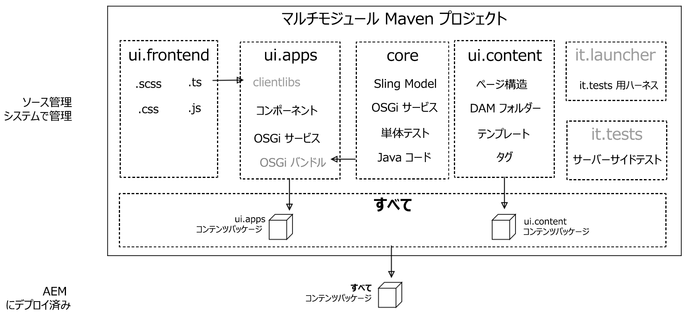

# AEM プロジェクトアーキタイプ {#aem-project-archetype}

AEM プロジェクトのアーキタイプは、最小限のベストプラクティスベースの Adobe Experience Manager プロジェクトを独自の AEM プロジェクトの起点として作成します。このアーキタイプを使用する際に指定する必要があるプロパティにより、このプロジェクトのすべての部分の名前を指定し、特定のオプション機能を制御できます。

>[!NOTE]
>
>最新の AEM プロジェクトのアーキタイプと技術的な詳細については、[GitHub を参照してください](https://github.com/adobe/aem-project-archetype)。

>[!NOTE]
>
>単純なプロジェクトを実装するためのアーキタイプの使い方の実例については、AEM ドキュメントの「[AEM Sites - WKND チュートリアル](https://docs.adobe.com/content/help/en/experience-manager-learn/getting-started-wknd-tutorial-develop/overview.html)」を参照してください。

## 機能 {#features}

このアーキタイプには、新しい AEM プロジェクトの便利な起点を提供する機能が多数用意されています。

* 英語ページおよびフランス語ページとコンテンツの例
* 編集可能なテンプレート機能に基づくコンテンツテンプレートとコンテンツポリシーの例
* [AEM ページコアコンポーネント](page.md)に基づくページコンポーネント
* 推奨プロキシパターンと helloworld カスタムコンポーネントの例を使用して実装されたコンテンツコンポーネントの例はすべて、[AEM　コアコンポーネント](introduction.md)に基づいています。
* [フォームコンポーネント](form-container.md)の例
* デバイスエミュレーター、ドラッグ&amp;ドロップ設定、および国際化対応の設定
* BEM 命名規則に従うクライアントライブラリとコンポーネント固有のスタイル
* サンプルモデル、サーブレット、フィルター、スケジューラーを含むバンドルの例
* ユニット、統合、およびクライアントサイドのテスト

## アーキタイプを使用する理由 {#why-use-the-archetype}

AEM　プロジェクトのアーキタイプを使用すると、数回のキー操作で、ベストプラクティスベースの AEM プロジェクトを構築するためのパスが設定されます。アーキタイプを使用すると、すべての要素が配置され、結果として生成されるプロジェクトを最小限に抑えながら、AEM の[主要機能](#features)すべてが実装されることになります。これにより、必要な作業はその上に構築して拡張するだけとなります。

もちろん、成功する AEM プロジェクトには多数の要素がありますが、AEM プロジェクトのアーキタイプを使用すると健全な基盤を構築できるので、あらゆる AEM プロジェクトで強くお勧めします。

## アーキタイプを使用して得られる結果 {#what-you-get}

AEM アーキタイプは、次のモジュールで構成されています。

* **[core](core.md)**：OSGi サービス、リスナー、スケジューラなどのすべてのコア機能、およびサーブレットや要求フィルターなどのコンポーネント関連の Java コードが含まれる Java バンドル。
* **[ui.apps](uiapps.md)**：プロジェクトの`/apps`部分と`/etc`部分（JS と CSS の clientlib、コンポーネント、テンプレート、実行モード固有の設定、Hobbes テストなど）が含まれます。
* **[ui.content](uicontent.md)**：ui.apps モジュールのコンポーネントを使用するサンプルコンテンツが含まれます。
* **ui.tests**：サーバー側で実行される JUnit テストが含まれる Java バンドル。このバンドルは実稼動環境にはデプロイされません。
* **ui.launcher**：ui.tests バンドル（および依存するバンドル）をサーバーにデプロイし、JUnit のリモート実行をトリガーするグルーコードが含まれます。
* **[ui.frontend](uifrontend.md)**:**(optional)**contains the artifacts required to use the Webpack-based front-end build module.



Maven で表される AEM アーキタイプのモジュールは、アプリケーション、コンテンツ、および必要な OSGi バンドルを表すコンテンツページとして AEM にデプロイされます。

## 要件 {#requirements}

現在のバージョンのアーキタイプには、次の要件があります。

* Adobe Experience Manager 6.3.3.0 以降
* Apache Maven（3.3.9 以降）
* Adobe Public Maven リポジトリを Maven 設定に追加します。詳しくは、この[ナレッジベース記事](https://helpx.adobe.com/experience-manager/kb/SetUpTheAdobeMavenRepository.html)を参照してください。

以前のアーキタイプバージョンでサポートされている　AEM　バージョンのリストについては、[過去にサポートされていた AEM バージョン](https://github.com/adobe/aem-project-archetype/blob/master/VERSIONS.md)を参照してください。

## アーキタイプの使用方法{#how-to-use-the-archetype}

アーキタイプを使用するには、最初にプロジェクトを作成し、[前述のとおりに](#what-you-get)ローカルファイル構造でモジュールを生成する必要があります。プロジェクト生成の一環として、プロジェクト名、バージョンなど、プロジェクトの多数のプロパティを定義できます。

Maven でプロジェクトを構築すると、AEM にデプロイできるアーティファクト (パッケージおよび OSGi バンドル) が作成されます。追加の Maven コマンドおよびプロファイルを使用して、プロジェクトのアーティファクトを AEM インスタンスにデプロイできます。

### プロジェクトの作成 {#create-project}

最初に、最も簡単に [AEM Eclipse 拡張機能](https://docs.adobe.com/content/help/en/experience-manager-65/developing/devtools/aem-eclipse.html)を使用し、新しいプロジェクトウィザードに従って「**AEM Sample Multi-Module Project**」を選択し、リリースされたバージョンのアーキタイプを使用できます。

もちろん、Maven を直接呼び出すこともできます。

```
mvn archetype:generate \
 -DarchetypeGroupId=com.adobe.granite.archetypes \
 -DarchetypeArtifactId=aem-project-archetype \
 -DarchetypeVersion=XX
```

ここで、`XX` は、最新の AEM プロジェクトの[バージョン番号](https://github.com/adobe/aem-project-archetype/blob/master/VERSIONS.md)です。

>[!NOTE]
>
>ベストプラクティスとしては、repo.adobe.com を自動で maven のビルドプロセスに追加するために、`adobe-public` プロファイルを Maven の `settings.xml` ファイルに追加することが推奨されます。
>
>POM の例は[こちらにあります](https://helpx.adobe.com/experience-manager/kb/SetUpTheAdobeMavenRepository.html)。

### プロパティ {#properties}

アーキタイプを使用してプロジェクトを作成する場合は、次のプロパティを使用できます。

| 名前 | デフォルト値は | 説明 |
----------------------------|---------|--------------------
| `groupId` |  | ベース  Maven `groupId` |
| `artifactId` |  | ベース  Maven ArtifactId |
| `version` |  | バージョン |
| `package` |  | Java ソースパッケージ |
| `appsFolderName` |  | `/apps` フォルダー名 |
| `artifactName` |  | Maven プロジェクト名 |
| `componentGroupName` |  | AEM コンポーネントグループ名 |
| `contentFolderName` |  | `/content` フォルダー名 |
| `confFolderName` |  | `/conf` フォルダー名 |
| `cssId` |  | 生成された CSS で使用されるプレフィックス |
| `packageGroup` |  | コンテンツパッケージグループ名 |
| `siteName` |  | AEM サイト名 |
| `optionAemVersion` | 6.5.0 | 対象 AEM バージョン |
| `optionIncludeExamples` | y | [コンポーネントライブラリの](http://opensource.adobe.com/aem-core-wcm-components/library.html)サンプルサイトを含める |
| `optionIncludeErrorHandler` | n | カスタム 404 応答ページを含める |
| `optionIncludeFrontendModule` | n | [専用のフロントエンド・モジュールを含める](uifrontend.md) |

>[!NOTE]
> アーキタイプを初めてインタラクティブモードで実行する際には、デフォルト値のプロパティは変更できません（詳しくは [ARCHETYPE-308](https://issues.apache.org/jira/browse/ARCHETYPE-308) を参照してください）。この値は、最後のプロパティ確認が拒否され、質問が繰り返された場合や、コマンドラインでパラメータを渡す際に変更できます（例：`-DoptionIncludeExamples=n`）。

### プロファイル {#profiles}

生成された Maven プロジェクトは、`mvn install` の実行時に様々なデプロイメントプロファイルをサポートします。

| プロファイル ID | 説明 |
--------------------------|------------------------------
| `autoInstallBundle` | maven-sling-plugin を含むコアバンドルを OSGi にインストールします。 |
| `autoInstallPackage` | パッケージマネージャーに content-package-maven-plugin を使用し、ui.content と ui.apps のコンテンツパッケージをローカルホスト（ポート 4502）のデフォルトのオーサーインスタンスにインストールします。ホスト名とポートは、`aem.host` および `aem.port` ユーザー定義プロパティを使用して変更できます。 |
| `autoInstallPackagePublish` | パッケージマネージャーに content-package-maven-plugin を使用し、ui.content と ui.apps のコンテンツパッケージをローカルホスト（ポート 4503）のデフォルトのパブリッシュインスタンスにインストールします。ホスト名とポートは、`aem.host` および `aem.port` ユーザー定義プロパティを使用して変更できます。 |
| `integrationTests` | 提供された統合テストを AEM インスタンスで実行します(`verify` フェーズのみ)。 |

### ビルドとインストール {#building-and-installing}

プロジェクトのルートディレクトリで実行するすべてのモジュールを構築するには、次の Maven コマンドを使用します。

```
mvn clean install
```

実行中の AEM インスタンスがある場合は、次の Maven コマンドを使用して、プロジェクト全体を構築およびパッケージ化し、AEM にデプロイできます。

```
mvn clean install -PautoInstallPackage
```

パブリッシュインスタンスにデプロイするには、次のコマンドを実行します。

```
mvn clean install -PautoInstallPackagePublish
```

または、パブリッシュインスタンスにデプロイするには、次のコマンドを実行します。

```
mvn clean install -PautoInstallPackage -Daem.port=4503
```

または、オーサーにバンドルのみをデプロイするには、次のコマンドを実行します。

```
mvn clean install -PautoInstallBundle
```

## 親 POM {#parent-pom}

プロジェクトのルートにある`<src-directory>/<project>/pom.xml`（`pom.xml`）は親 POM と呼ばれ、プロジェクトの構造を駆動し、プロジェクトの依存関係と特定のグローバルプロパティを管理します。

### グローバルプロジェクトプロパティ {#global-properties}

親 POM の `<properties>` セクションでは、ユーザー名／パスワード、ホスト名／ポートなど、AEM インスタンスにプロジェクトをデプロイする際に重要なグローバルプロパティを定義します。

これらのプロパティは、ローカルの AEM インスタンスにデプロイするために設定されています。これは、開発者がおこなう最も一般的なビルドです。オーサーインスタンスにデプロイするためのプロパティおよびパブリッシュインスタンスにデプロイするためのプロパティが存在することに注意してください。ここでは AEM インスタンスを認証するための認証も設定されます。デフォルトの admin:admin 認証が使用されています。

これらのプロパティは、より上位の環境にデプロイされる際には上書きされるよう設定されています。そうすることで、POM ファイルを変更する必要がなく、`aem.host` および `sling.password` などの変数をコマンドライン引数で上書きできます。

````
mvn -PautoInstallPackage clean install -Daem.host=production.hostname -Dsling.password=productionpasswd
````

### モジュール構造 {#module-structure}

親　POM　の　`<modules>`　セクションは、プロジェクトが構築するモジュールを定義します。デフォルトでは、プロジェクトは[以前に定義された標準モジュール](#what-you-get)（core、ui.apps、ui.content、ui.tests および it.launcher）を構築します。プロジェクトの拡大に合わせて、いつでもモジュールを追加できます。

### 依存関係 {#dependencies}

親POMの `<dependencyManagement>` セクションは、プロジェクトで使用される API のすべての依存関係とバージョンを定義します。バージョンは親 POM 内で管理する必要があり、コア や ui.apps などのサブモジュールにはバージョン情報を一切含めてはなりません。

#### Uber-Jar {#uber-jar}

主要な依存関係の 1 つに [AEM uber-jar](https://docs.adobe.com/content/help/en/experience-manager-65/developing/devtools/ht-projects-maven.html#ExperienceManagerAPIDependencies) があります。これにより、AEM のバージョンに対して、すべての AEM API が単一の依存関係のエントリで含められます。

>[!NOTE]
>
>ベストプラクティスとしては、AEM のターゲットバージョンに合わせて uber-jar のバージョンを更新することが推奨されます。例えば、AEM 6.4 をデプロイする予定であれば、uber-jar のバージョンを 6.4.0 に更新します。

#### コアコンポーネント {#core-components}

もちろん、AEM プロジェクトのアーキタイプはコアコンポーネントを活用します。

コアコンポーネントは、デフォルトの実行モードで AEM に自動的にインストールされます。また、サンプルの We.Retail サイトで使用されます。[実稼動実行モード](https://docs.adobe.com/content/help/en/experience-manager-65/administering/security/production-ready.html)（`nosamplecontent`）では、コアコンポーネントは使用できません。

そのため、すべてのデプロイメントでコアコンポーネントを使用するには、それらを Maven プロジェクトの一部に組み込むことが推奨されます。

>[!NOTE]
>
>最新のアーキテクチャでコアコンポーネントの最新バージョンが使用されるよう、通常は、コアコンポーネントの各リリースに続き、AEM プロジェクトアーキタイプがリリースされます。
>
>ただし、新しいバージョンのアーキタイプは、新しいバージョンのコアコンポーネントに直接従っていない可能性があるので、コアコンポーネントの依存関係を最新バージョンに更新することができます。

>[!NOTE]
>
>core.wcm.components.examples は、コアコンポーネントの例を示す一連のサンプルページです。ベストプラクティスとして、実稼働用にプロジェクトをデプロイする場合は、この依存関係とサブパッケージのインクルージョンを削除する必要があります。

## テスト {#testing}

プロジェクトには 3 つのレベルのテストが含まれており、テストのタイプが異なるので、実行方法も場所も異なります。

* コアでの単体テスト：バンドルに含まれるコードの従来のユニットテストを示しています。テストするには、次の手順を実行します。
   * `mvn clean test`
* サーバーサイド統合テスト：これらのテストは、AEM 環境（AEMサーバー上など）で実行されます。テストするには、次の手順を実行します。
   * `mvn clean verify -PintegrationTests`
* クライアントサイドの Hobbes.js テスト：ブラウザー側の動作を検証する JavaScript ベースのブラウザーサイドテストです。テストするには：
   1. ページの作成時と同様に、ブラウザーに AEM を読み込みます。
   1. ページを[開発者モード](https://docs.adobe.com/content/help/en/experience-manager-65/developing/components/developer-mode.html)で開きます。
   1. 左のパネルを開き、「**Tests**」タブに切り替えます。
   1. 生成された **MyName Tests** を見つけ、実行します。

## 次の手順 {#next-steps}

AEM プロジェクトアーキタイプを構築し、インストールしました。次は何をすればよいでしょうか。アーキタイプは小さいとはいえ、推奨ベストプラクティスに従って設定された、多数の強力な AEM 機能の例で構成されています。これらを使用すれば、プロジェクトで機能をどのように活用できるかがわかります。どのプロジェクトでも、次の作業が必要になる可能性があります。

* [既存のコアコンポーネントを拡張するコンポーネントのカスタマイズ](customizing.md)
* [テンプレートの追加](https://docs.adobe.com/content/help/en/experience-manager-cloud-service/sites/authoring/features/templates.html)
* [ローカリゼーション構造の適応](https://docs.adobe.com/content/help/en/experience-manager-65/administering/introduction/tc-prep.html)
* [フロントエンドビルドモジュールの詳細](uifrontend.md)
