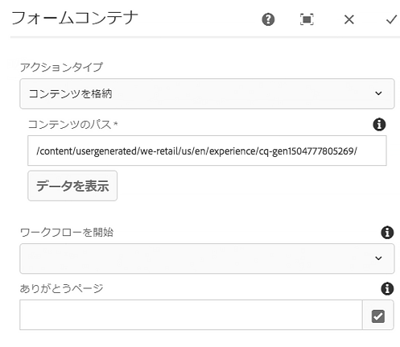
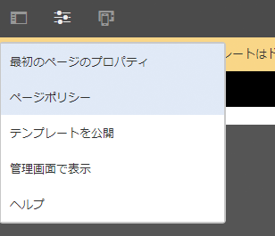
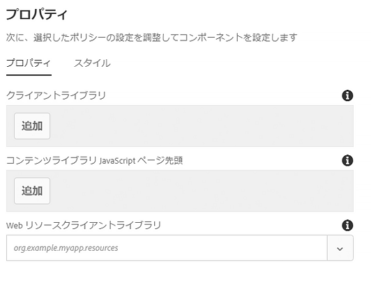

# ページコンポーネント{#page-component}

The Page Component is an extensible page component designed to work with the [template editor](https://docs.adobe.com/content/help/en/experience-manager-cloud-service/sites/authoring/features/templates.html) and allows page header/footer and structure components to be assembled with the template editor.

## 使用方法 {#usage}

ページコンポーネントは、コアコンポーネントと編集可能なテンプレートを使用して設計されるあらゆるページの基礎となるものです。ページコンポーネントを使用すれば、ページのヘッダーやフッター、構造を、他のコアコンポーネントを使用する際のテンプレートとして定義できます。

[デザインダイアログ](#design-dialog)を使用すれば、カスタムのクライアント側ライブラリをページ用に定義できます。コンポーネントから編集ダイアログに直接アクセスできる他のコンポーネントとは異なり、ページコンポーネントはページそのものなので、ページコンポーネントの[編集ダイアログ](#edit-dialog)はページプロパティウィンドウになります。

## バージョンと互換性 {#version-and-compatibility}

このドキュメントでは、ページコンポーネントの現在のバージョン（2018 年 1 月にコアコンポーネントのリリース 2.0.0 で導入された v2）について説明します。

コンポーネントのすべてのサポート対象バージョン、コンポーネントの各バージョンと互換性のある AEM バージョン、以前のバージョンのドキュメントへのリンクを次の表に示します。

| コンポーネントのバージョン | AEM 6.3 | AEM 6.4 | AEM 6.5 | クラウドサービスとしてのAEM |
|---|---|---|---|---|
| [v2](page-v1.md) | 互換性あり | 互換性あり | 互換性あり | 互換性あり |
| v1 | 互換性あり | 互換性あり | 互換性あり | - |

コアコンポーネントのバージョンとリリースについて詳しくは、[コアコンポーネントのバージョン](versions.md)を参照してください。

>[!NOTE]
>
>To enable redirect at `cq:Page` level for version 2 of the page component and AEM 6.3, [service pack 2](https://helpx.adobe.com/experience-manager/6-3/release-notes/sp2-release-notes.html) or later is required. このようなリダイレクトは、以前のリリースでは使用できませんでした。

## コンポーネント出力のサンプル {#sample-component-output}

以下は [We.Retailのサンプルです](https://docs.adobe.com/content/help/en/experience-manager-65/developing/bestpractices/we-retail/we-retail.html)。

### スクリーンショット {#screenshot}

### 技術的詳細 {#technical-details}

The latest technical documentation about the Page Component [can be found on GitHub](https://adobe.com/go/aem_cmp_tech_page_v2).

コアコンポーネントの開発について詳しくは、[コアコンポーネント開発者向けドキュメント](developing.md)を参照してください。

## 編集ダイアログ{#edit-dialog}

Because the component represents the entire page, settings that would normally be in an edit dialog are found in the [Page Properties](https://docs.adobe.com/content/help/en/experience-manager-cloud-service/sites/authoring/fundamentals/page-properties.html) window.

## デザインダイアログ{#design-dialog}

ページコンポーネントはページ全体を表しているので、ページテンプレートを編集する際は、**ページ情報／ページポリシー**&#x200B;でデザインダイアログにアクセスします。

>[!NOTE]
>
>以前のバージョンの AEM では、**ページポリシー**&#x200B;は&#x200B;**ページデザイン**&#x200B;と呼ばれていました。

### 「プロパティ」タブ {#properties-tab}

ページデザインウィンドウを使用すれば、読み込むクライアントライブラリとページの Web リソースライブラリを定義できます。

* **クライアントライブラリ** - 読み込むクライアントライブラリカテゴリを定義します。JavaScript が本文の末尾に追加され、CSS がページの先頭に追加されます。
* **クライアントライブラリ JavaScript ページ先頭** - ページの先頭に読み込む JavaScript クライアントライブラリカテゴリを定義します。
   * ここで定義したカテゴリが「**クライアントライブラリ**」フィールドにも存在する場合は、JavaScript が本文の末尾ではなくページの先頭に読み込まれます。
   * カテゴリが「**クライアントライブラリ**」フィールドにも存在する場合を除き、CSS は読み込まれません。

* **Web リソースクライアントライブラリ** - favicon などの Web リソースを提供するために使用されるクライアントライブラリカテゴリです。

「**クライアントライブラリ**」と「**クライアントライブラリ JavaScript ページ先頭**」の両方のフィールドにライブラリを次のように設定できます。

* 新しいフィールドを追加するには、フィールドの下にある「**追加**」ボタンをクリックまたはタップします。
* フィールドを削除するには、削除するフィードの横にあるごみ箱アイコンをクリックまたはタップします。
* 読み込み順序を変更するには、移動するフィールドの横にあるハンドルをクリックまたはタップしてドラッグします。

クライアント側ライブラリの使用に関する詳細は、「クライアント側ライブラリの使 [用」を参照してくださ](https://helpx.adobe.com/experience-manager/6-5/sites/developing/using/clientlibs.html)い。

>[!CAUTION]
>
>ページ先頭のクライアントライブラリを個別に定義する機能は、コアコンポーネントリリース 2.2.0 で導入されました。

### 「スタイル」タブ {#styles-tab}

ページコンポーネントでは、AEM [スタイルシステム](authoring.md#component-styling)をサポートしています。
