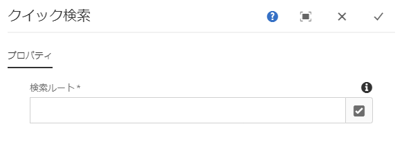
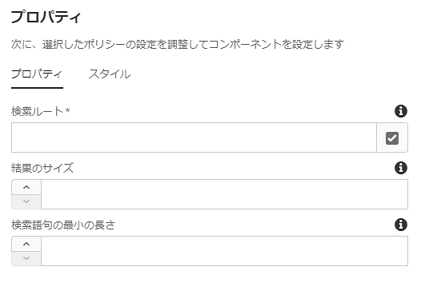

# クイック検索コンポーネント{#quick-search-component}

クイック検索コンポーネントは、Webサイトに検索機能を提供し、訪問者が一致するコンテンツを簡単に見つけて結果を表示できるように検索結果を表示します。

## 使用方法 {#usage}

クイック検索コンポーネントでは、サイト訪問者がコンテンツを検索し、その結果をインプレースで表示し、一致するページに簡単に移動できます。ユーザーが検索結果をスクロールすると、新しい結果が動的に取得されます。

[編集ダイアログ](#edit-dialog) では、コンテンツ作成者がコンテンツツリー内のどこで検索を開始するかを定義できます。[デザインダイアログ](#design-dialog)を使用すると、テンプレート作成者は、コンテンツツリー内のどこに検索を開始するか、最大結果セットサイズおよび最小検索語句の長さを設定することができます。

## バージョンと互換性 {#version-and-compatibility}

クイック検索コンポーネントの現在のバージョンは、2018年1月のコアコンポーネントのリリース2.0.0で導入されたv1であり、このドキュメントで説明しています。

次の表に、サポートされているコンポーネントのすべてのバージョン、コンポーネントのバージョンが互換性があるAEMバージョン、および以前のバージョンのドキュメントへのリンクを示します。

| コンポーネントバージョン | AEM 6.3 | AEM 6.4 | AEM 6.5 |
|--- |--- |--- |--- |
| v1 | 互換性 | 互換性 | 互換性 |

コアコンポーネントバージョンとリリースについて詳しくは、ドキュメント [コアコンポーネントバージョン](versions.md)を参照してください。

## サンプルコンポーネントの出力 {#sample-component-output}

以下は、We. Retailから [取得されたサンプル](https://helpx.adobe.com/experience-manager/6-5/sites/developing/using/we-retail.html)です。

### スクリーンショット {#screenshot}


### HTML {#html}

```
<section class="cmp-search" role="search" data-cmp-is="search" data-cmp-min-length="3" data-cmp-results-size="10">
    <form class="cmp-search__form" data-cmp-hook-search="form" method="get" action="/content/we-retail/us/en/equipment.searchresults.json/_jcr_content/root/responsivegrid/search" autocomplete="off">
        <div class="cmp-search__field">
            <i class="cmp-search__icon" data-cmp-hook-search="icon"></i>
            <span class="cmp-search__loading-indicator" data-cmp-hook-search="loadingIndicator"></span>
            <input class="cmp-search__input" data-cmp-hook-search="input" type="text" name="fulltext" placeholder="Search" role="combobox" aria-autocomplete="list" aria-haspopup="true" aria-invalid="false">
            <button class="cmp-search__clear" data-cmp-hook-search="clear">
                <i class="cmp-search__clear-icon"></i>
            </button>
        </div>
    </form>
    <div class="cmp-search__results" data-cmp-hook-search="results" role="listbox" aria-multiselectable="false"></div>
    
<script data-cmp-hook-search="itemTemplate" type="x-template">
    <a class="cmp-search__item" data-cmp-hook-search="item">
        <span class="cmp-search__item-title" data-cmp-hook-search="itemTitle"></span>
    </a>
</script>
</section>
```

### JSON {#json}

```
"search":{  
                     "columnClassNames":"aem-GridColumn aem-GridColumn--default--12",
                     "relativePath":"/jcr:content/root/responsivegrid/search",
                     "resultsSize":10,
                     "searchTermMinimumLength":3,
                     ":type":"core/wcm/components/search/v1/search"
                  }
```

### 技術的詳細 {#technical-details}

>[!NOTE]
>
>検索コンポーネントまたはAEMベースのアプリケーションのDOS攻撃に対する保護は、例えばディスパッチャーで使用 `mod_security` すると、より高いレベルで実装する必要があります。

クイック検索コンポーネント [に関する最新の技術ドキュメントは、GitHubで入手](https://github.com/adobe/aem-core-wcm-components/blob/master/content/src/content/jcr_root/apps/core/wcm/components/search/v1/search)できます。

コアコンポーネントの開発について詳しくは、 [コアコンポーネント開発者向けドキュメント](developing.md)を参照してください。

## ダイアログを編集 {#edit-dialog}

編集ダイアログでは、コンテンツ作成者がコンテンツツリー内のどこで検索を開始するかを定義できます。



**検索ルート** -検索を開始する場所のルートページ。検索ルートは、blueprintマスター、言語マスターまたは通常のページにすることができます。

## デザインダイアログ {#design-dialog}

デザインダイアログを使用すると、テンプレート作成者はコンテンツツリー内のどこに検索開始するか、最大結果セットサイズおよび最小検索語句の長さを設定できます。デザインダイアログでは、テンプレート作成者がコンテンツ作成者に使用できるテキスト書式オプションを定義できます。

### 「プロパティ」タブ {#properties-tab}



* **コンテンツ作成者がコンテンツページにクイック検索コンポーネントを配置したときに、検索**ルートのデフォルト値を検索する
* **結果のサイズ**検索リクエストによって取得された結果の最大数
* **検索を開始する検索用語の検索用語の最小長**の最小長

>[!NOTE]
>
>**Results Size** and **Search Term Minimum Length** can only be set in design mode and therefore only at the template level, meaning content authors are not able to modify these values.

>[!CAUTION]
>
>**Results Size** and **Search Term Minimum Length** can have performance impacts if they are set too high or too low, respectively.

### 「スタイル」タブ {#styles-tab}

クイック検索コンポーネントでは、AEM [スタイルシステム](authoring.md#component-styling)をサポートしています。