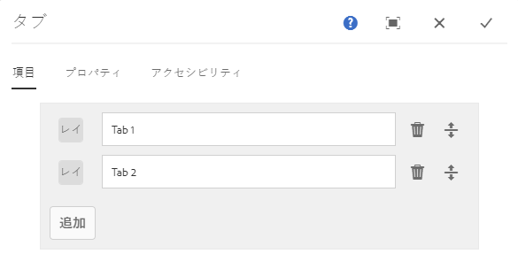
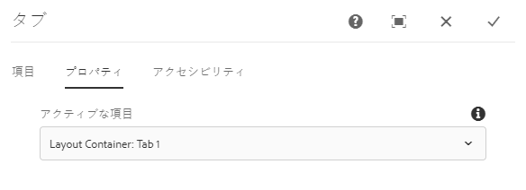
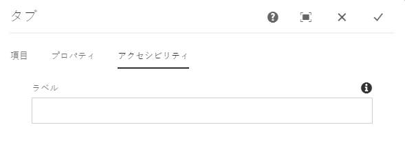

# タブコンポーネント

コアコンポーネントのタブコンポーネントを使用すれば、コンテンツを複数のタブ上に配置できます。

## 使用方法 {#usage}

タブコンポーネントを使用すれば、コンテンツ作成者はコンテンツを複数のタブ内に配置できます。

[編集ダイアログ](#edit-dialog)では、コンテンツ作成者が、複数のタブを定義したりアクティブなタブを設定したりできます。[デザインダイアログ](#design-dialog)を使用すれば、テンプレート作成者は、タブに追加できるコンポーネントを定義したり、スタイルをカスタマイズしたりできます。

>[!NOTE]
>
>ネストされたタブコンポーネント（タブ内のタブ）はサポートされています。
>
>Simple (non-nested) tab components can be located/selected using the [content tree](https://helpx.adobe.com/experience-manager/6-5/sites/authoring/using/author-environment-tools.html), however nested tabs can not be.

## バージョンと互換性 {#version-and-compatibility}

このドキュメントでは、タブコンポーネントの現在のバージョン（2018 年 10 月にコアコンポーネントのリリース 2.2.0 で導入された v1）について説明します。

コンポーネントのすべてのサポート対象バージョン、コンポーネントの各バージョンと互換性のある AEM バージョン、以前のバージョンのドキュメントへのリンクを次の表に示します。

| コンポーネントのバージョン | AEM 6.3 | AEM 6.4 | AEM 6.5 |
|--- |--- |--- |--- |
| v1 | 互換性あり | 互換性あり | 互換性あり |

コアコンポーネントのバージョンとリリースについて詳しくは、[コアコンポーネントのバージョン](versions.md)を参照してください。

## コンポーネント出力のサンプル {#sample-component-output}

タブコンポーネントを体験したり、その設定オプションの例や、HTML 出力や JSON 出力の例を確認したりするには、[コンポーネントライブラリ](http://opensource.adobe.com/aem-core-wcm-components/library/tabs.html)にアクセスしてください。

### 技術的詳細 {#technical-details}

タブコンポーネント [に関する最新の技術ドキュメントは、GitHubで確認](https://github.com/adobe/aem-core-wcm-components/blob/master/content/src/content/jcr_root/apps/core/wcm/components/tabs/v1/tabs)できます。

コアコンポーネントの開発について詳しくは、[コアコンポーネント開発者向けドキュメント](developing.md)を参照してください。

## 編集ダイアログ{#edit-dialog}

編集ダイアログでは、コンテンツ作成者がタブの作成、名前変更、並べ替えをおこなったり、アクティブなタブを定義したりできます。

### 「項目」タブ {#items-tab}

タブとして追加するコンポーネントを選択するためのコンポーネントセレクターを開くには、「**追加**」ボタンを使用します。追加が完了すると、以下の列を含むエントリがリストに追加されます。

* **アイコン** - リスト内で簡単に識別できるようにするための、タブのコンポーネントタイプのアイコン。マウスポインターを置くと、完全なコンポーネント名がツールチップとして表示されます。
* **説明** - タブのテキストとして使用される説明。デフォルトでは、タブ用に選択されたコンポーネントの名前に設定されます。
* **削除** - タップまたはクリックすると、タブコンポーネントからタブが削除されます。
* **並べ替え** - タップまたはクリックしてドラッグすると、タブを並べ替えることができます。

### 「プロパティ」タブ {#properties-tab}

「**プロパティ**」タブでは、コンテンツ作成者はページの読み込み時にアクティブになるタブを定義できます。「**デフォルト**」オプションの場合、最初のタブが選択されます。

### アクセシビリティタブ {#accessibility-tab}

**「アクセシビリティ** 」タブでは、コンポーネントの [ARIAアクセシビリティ](https://www.w3.org/WAI/standards-guidelines/aria/) ラベルに値を設定できます。

* **ラベル** -コンポーネントのARIAラベル属性の値

## パネルを選択{#select-panel}

コンポーネントツールバーの&#x200B;**パネルを選択**&#x200B;オプションを使用すれば、コンテンツ作成者は編集用に別のパネルに切り替えたり、簡単にタブを並べ替えたりできます。

コンポーネントツールバーの&#x200B;**パネルを選択**&#x200B;オプションを選択すると、設定済みのタブがドロップダウンとして表示されます。

* リスト内のタブは割り当てられた順番で並べられ、その順番が通し番号に反映されます。
* まずタブのコンポーネントタイプが表示され、次にタブの説明が明るい色のフォントで表示されます。

* ドロップダウン内の 1 つのエントリをタップまたはクリックすると、エディターのビューがそのタブに切り替わります。
* ドラッグハンドルを使用すれば、タブをインプレースで並べ替えることができます。

>[!NOTE]
>
>**編集**&#x200B;モードでは、作成者がタブを選択することはできません。公開済みコンテンツの読者としてタブを操作するには [**、プレビュー** モード](https://helpx.adobe.com/experience-manager/6-5/sites/authoring/using/editing-content.html) または「公開済みとして **[表示」](https://helpx.adobe.com/experience-manager/6-5/sites/authoring/using/editing-content.html)** オプションを使用します。

## デザインダイアログ{#design-dialog}

デザインダイアログでは、テンプレート作成者が、タブコンポーネントに項目として追加できるコンポーネントを定義したり、コンテンツ作成者が利用できるカスタムスタイルを定義したりできます。

### 「許可されるコンポーネント」タブ {#allowed-components-tab}

「**許可されるコンポーネント**」タブでは、コンテンツ作成者がタブコンポーネントに項目として追加できるコンポーネントを定義できます。

「許可されるコンポーネント」タブの動作は、[テンプレートエディターでレイアウトコンテナのポリシーやプロパティを定義する](https://helpx.adobe.com/experience-manager/6-5/sites/authoring/using/templates.html)

### 「スタイル」タブ {#styles-tab}

タブコンポーネントは AEM [スタイルシステム](authoring.md#component-styling)をサポートします。
