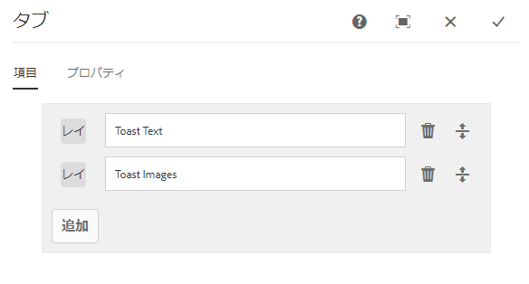
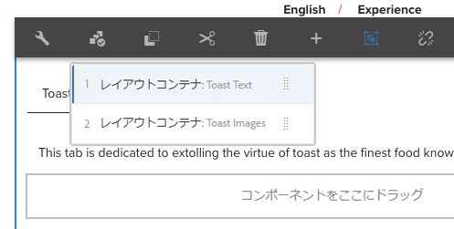

# タブコンポーネント

コアコンポーネントタブコンポーネントを使用すると、複数のタブにコンテンツを編成できます。

## 使用方法 {#usage}

タブコンポーネントを使用すると、コンテンツ作成者は複数のタブ内でページコンテンツを整理できます。

[編集ダイアログ](#edit-dialog) では、コンテンツ作成者が複数のタブを定義し、アクティブなタブを設定することができます。テンプレート作成者は [、デザインダイアログ](#design-dialog)を使用して、タブに追加できるコンポーネントを定義したり、スタイルをカスタマイズしたりできます。

>[!NOTE]
>
>ネストされたタブコンポーネント（タブ内のタブ）はサポートされています。
>
>コンテンツツリーを使用して、単純（ネストされていない）タブコンポーネントを配置または選択 [できます](https://helpx.adobe.com/experience-manager/6-5/sites/authoring/using/author-environment-tools.html)が、ネストされたタブは使用できません。

## バージョンと互換性 {#version-and-compatibility}

現在のバージョンのタブコンポーネントはv1であり、2018年10月のコアコンポーネントのリリース2.2.0で導入されています。このドキュメントで説明しています。

次の表に、サポートされているコンポーネントのすべてのバージョン、コンポーネントのバージョンが互換性があるAEMバージョン、および以前のバージョンのドキュメントへのリンクを示します。

| コンポーネントバージョン | AEM 6.3 | AEM 6.4 | AEM 6.5 |
|--- |--- |--- |--- |
| v1 | 互換性 | 互換性 | 互換性 |

コアコンポーネントバージョンとリリースについて詳しくは、ドキュメント [コアコンポーネントバージョン](versions.md)を参照してください。

## サンプルコンポーネントの出力 {#sample-component-output}

以下は、We. Retailから [取得されたサンプル](https://helpx.adobe.com/experience-manager/6-5/sites/developing/using/we-retail.html)です。

### スクリーンショット {#screenshot}

### コンポーネントライブラリ

タブコンポーネントを体験するには、およびHTMLおよびJSON出力の設定オプションと、 [HTMLおよびJSON出力の例を参照](http://opensource.adobe.com/aem-core-wcm-components/library/tabs.html)してください。

### 技術的詳細 {#technical-details}

タブコンポーネント [に関する最新の技術ドキュメントは、GitHubで確認](https://github.com/adobe/aem-core-wcm-components/blob/master/content/src/content/jcr_root/apps/core/wcm/components/tabs/v1/tabs)できます。

コアコンポーネントの開発について詳しくは、 [コアコンポーネント開発者向けドキュメント](developing.md)を参照してください。

## ダイアログを編集 {#edit-dialog}

編集ダイアログでは、コンテンツ作成者がタブを作成、名前変更および並べ替え、アクティブなタブを定義することができます。

### 「アイテム」タブ {#items-tab}

**「追加」** ボタンを使用してコンポーネントセレクターを開き、タブとして追加するコンポーネントを選択します。追加すると、エントリがリストに追加され、次の列が含まれます。

* **アイコン** -リストで簡単に識別できるようにする、タブのコンポーネントタイプのアイコン。マウスを移動すると、コンポーネント名がツールチップとして表示されます。
* **説明** -タブのテキストとして使用される説明。タブに対して選択されたコンポーネントの名前にデフォルトで設定されます。
* **削除** -タブコンポーネントからタブをタップまたはクリックして削除します。
* **整列** -タップまたはクリックしてドラッグし、タブの順序を並べ替えます。

### 「プロパティ」タブ {#properties-tab}

**「プロパティ** 」タブでは、コンテンツ作成者はページの読み込み時にアクティブなタブを定義できます。**「デフォルト」** オプションでは、最初のタブが選択されます。

## パネルを選択 {#select-panel}

コンテンツ作成者は、コンポーネントツールバーの **「パネル** を選択」オプションを使用して、編集用に別のパネルに変更したり、タブの順序を簡単に並べ替えることができます。

コンポーネントツールバーの **「パネル** を選択」オプションを選択すると、設定済みのタブがドロップダウンとして表示されます。

* リストは、割り当てられたタブの割り当て順に並べ替えられ、番号付けに反映されます。
* タブのコンポーネントタイプが最初に表示され、その後に薄いフォントでタブの説明が表示されます。

* ドロップダウンのエントリをタップまたはクリックして、エディターのビューをそのタブに切り替えます。
* タブは、ドラッグハンドルを使用して配置し直すことができます。

>[!NOTE]
>
>**編集** モードでは、作成者がタブを選択できません。公開済みコンテンツの読者としてタブを操作するには [**、プレビュー** モード](https://helpx.adobe.com/experience-manager/6-5/sites/authoring/using/editing-content.html) または「公開済みとして **[表示」](https://helpx.adobe.com/experience-manager/6-5/sites/authoring/using/editing-content.html)** オプションを使用します。

## デザインダイアログ {#design-dialog}

デザインダイアログでは、テンプレート作成者がタブコンポーネントにアイテムとして追加できるコンポーネントを定義したり、コンテンツ作成者が使用できるカスタムスタイルを定義したりできます。

### 許可されているコンポーネントタブ {#allowed-components-tab}

**「許可されているコンポーネント** 」タブを使用して、コンテンツ作成者がタブコンポーネントにアイテムとして追加できるコンポーネントを定義します。

「許可されているコンポーネント」タブの機能は、テンプレートエディターでレイアウトコンテナのポリシーとプロパティ [を定義するときに、同じ名前のタブと同じ方法で機能します。](https://helpx.adobe.com/experience-manager/6-5/sites/authoring/using/templates.html)

### 「スタイル」タブ {#styles-tab}

タブコンポーネントは、AEM [スタイルシステムをサポート](authoring.md#component-styling)しています。