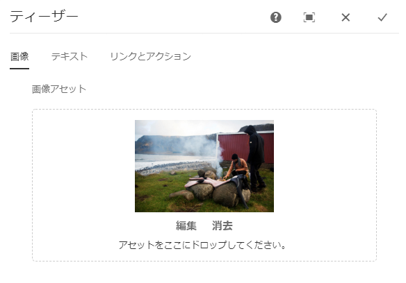
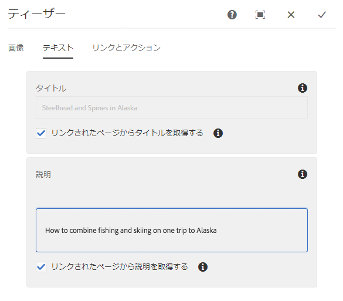
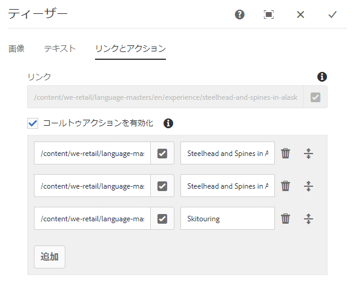
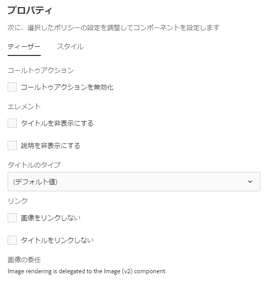

# Teaser Component{#teaser-component}

Core Component Teaserコンポーネントでは、画像、タイトル、リッチテキストおよびオプションのコンテンツへのリンクを表示できます。

## 使用 {#usage}

Teaserコンポーネントを使用すると、コンテンツ、タイトルまたはリッチテキストを使用してコンテンツ、タイトル、またはその他のアクションにリンクすることで、コンテンツ作成者がより簡単にコンテンツにティーザーを作成できます。

The template author can use the [design dialog](#design-dialog) to define if the options to create call-to-actions and add links are available as well as disabling various display options. The content author can use the [configure dialog](#configure-dialog) to set an image, define CTAs, set titles and descriptions, and configure links to the individual teaser. The [edit dialog](image.md#edit-dialog) of the [Image Component](image.md) can be accessed to modify the teaser image.

## Version and Compatibility {#version-and-compatibility}

Teaserコンポーネントの現在のバージョンはv1であり、2018年7月のコアコンポーネントのリリース2.1.0で導入されています。このドキュメントで説明しています。

次の表に、サポートされているコンポーネントのすべてのバージョン、コンポーネントのバージョンが互換性があるAEMバージョン、および以前のバージョンのドキュメントへのリンクを示します。

| コンポーネントバージョン | AEM 6.3 | AEM 6.4 | AEM 6.5 |
|---|---|---|---|
| v1 | 互換性 | 互換性 | 互換性 |

## Sample Component Output {#sample-component-output}

To experience the Teaser Component as well as see examples of its configuration options as well as HTML and JSON output, visit the [Component Library](http://opensource.adobe.com/aem-core-wcm-components/library/teaser.html).

### Technical Details {#technical-details}

The latest technical documentation about the Teaser Component [can be found on GitHub](https://github.com/adobe/aem-core-wcm-components/blob/master/content/src/content/jcr_root/apps/core/wcm/components/teaser/v1/teaser).

Further details about developing Core Components can be found in the [Core Components developer documentation](developing.md).

## Configure Dialog {#configure-dialog}

コンテンツ作成者は、設定ダイアログを使用して個別のTeaserのプロパティを定義できます。There is also an [edit dialog](#edit-dialog) to modify the teaser image if one is selected.

### 画像 {#image}

* **イメージアセット**
   * [アセットブラウザからアセットをドロップ](https://helpx.adobe.com/experience-manager/6-5/sites/authoring/using/author-environment-tools.html) するか、 **または参照** オプションをタップしてローカルファイルシステムからアップロードします。
   * Tap or click **Clear** to de-select the currently selected image.
   * **アセット** エディターでアセットのレンディションを [作成するには、「編集」を](https://helpx.adobe.com/experience-manager/6-5/assets/using/managing-assets-touch-ui.html) タップまたはクリックします。

### テキスト {#text}

* **タイトル** Teaserのヘッドラインとして表示するタイトルを定義します。
* **リンクされたページ** からタイトルを取得するオンにすると、リンクされたページのタイトルがタイトルに入力されます。
* **説明**:
Teaserの下位見出しとして表示する説明を定義します。
* **リンクされたページ** から説明を取得するオンにすると、説明にリンクされたページの説明が入力されます。

### Links &amp; Actions {#links-actions}

* **リンク** リンクがTeaserに適用されました。パスブラウザーを使用して、リンクターゲットを選択します。
* **「誘い文句（CTA:コールトゥアクション）を有効にする**」チェックボックスをオンにすると、誘い文句（CTA:コールトゥアクション）の定義が有効になります。リスト内の最初の誘い文句（CTA:コールトゥアクション）リンクが他のTeaser要素のリンクとして使用されます。

## Edit Dialog {#edit-dialog}

The Teaser Component delegates image rendering to the [Image Component](image.md). Therefore the [edit dialog](image.md#edit-dialog of the Image Component is available to the content author to manipulate the teaser image.

## Design Dialog {#design-dialog}

デザインダイアログでは、テンプレート作成者がこのコンポーネントを使用するときにコンテンツ作成者によって割り当てられるTeaserオプションを定義できます。

### Teaser Tab {#teaser-tab}

* **コールトゥアクション**
   * **コンテンツ作成者の誘い文句（CTA:コールトゥアクション****** ）オプションを非表示にする
* **要素**
   * **タイトルを非表示にする**
      * Hides the **Title** option for content authors
      * When selected the **Title Type** is hidden
   * **「非表示の説明**»コンテンツ作成者の?«説明?を非表示 ****
* **タイトルタイプ** Teaserのタイトルで使用するHタグを定義します。
* **リンク**
   * **選択** した画像をリンクしない場合、Teaser画像はリンクされません
   * **タイトル** をリンクしない場合、Teaserのタイトルはリンクされません

### Styles Tab {#styles-tab}

The Teaser Component supports the AEM [Style System](authoring.md#component-styling).
