# テキストコンポーネント（v1）{#text-component-v}

テキストコンポーネントは、インプレース編集機能を備えたリッチテキスト編集と構成コンポーネントです。

## 使用方法 {#usage}

テキストコンポーネントには堅牢なリッチテキストエディターが用意されています。これにより、シンプルなインラインエディターやフルスクリーン形式で簡単にテキスト編集を行うことができます。

[編集ダイアログ](text-v1.md#main-pars_title) 機能の編集ダイアログ機能には、フルスクリーン編集ダイアログで利用できる機能が制限されています。[デザインダイアログ](text-v1.md#main-pars_title_1995166862)を使用すると、コンテンツ作成者のテンプレート用に、見出し、特殊文字、段落スタイルなどのテキスト書式オプションを設定できます。

## バージョンと互換性 {#version-and-compatibility}

本書では、元々、コアコンポーネントのリリース1.0.0とAEM6.3で導入された、テキストコンポーネントのv1について説明します。

次の表に、Text Componentのv1との互換性を示します。

| AEM のバージョン | テキストコンポーネントv1 |
|--- |--- |
| 6.3 | 互換性 |
| 6.4 | 互換性 |

>[!CAUTION]
>
>本書では、テキストコンポーネントのv1について説明します。
>
>テキストコンポーネントの現在のバージョンについて詳しくは [、テキストコンポーネント](text.md) ドキュメントを参照してください。

## サンプルコンポーネントの出力 {#sample-component-output}

以下は、We. Retailから [取得されたサンプル](https://helpx.adobe.com/experience-manager/6-4/sites/developing/using/we-retail.html)です。

### スクリーンショット {#screenshot}


### HTML {#html}

```
<div class="cmp cmp-text aem-GridColumn aem-GridColumn--default--12">
<p>Lorem ipsum dolor sit amet, consectetur adipiscing elit. Integer porttitor ante a tortor volutpat maximus. Donec eu porta eros. Aenean sit amet eleifend arcu, eu vestibulum magna. Fusce eget nisi tincidunt, tristique felis quis, tincidunt est. Aliquam consequat aliquam quam non eleifend. Phasellus ut magna luctus, aliquam risus eget, fermentum augue. Aliquam lobortis accumsan magna, quis efficitur enim dictum eu. Pellentesque iaculis felis eget felis commodo, non euismod dolor euismod. Quisque nec arcu rutrum, mollis tortor non, sollicitudin odio. Sed dictum nulla mauris, eu pretium dui vulputate a. Maecenas lacus massa, egestas vitae tincidunt eu, interdum et magna. Lorem ipsum dolor sit amet, consectetur adipiscing elit. In eleifend ex lacus, in consectetur nunc interdum et. Donec interdum mi vitae dolor pretium mattis. In quis arcu sapien. Phasellus at metus vitae nisi tincidunt varius.<br />
</p>
</div>
```

### JSON {#json}

```
"text": {
              "columnClassNames": "aem-GridColumn aem-GridColumn--default--12",
              "text": "<p>Lorem ipsum dolor sit amet, consectetur adipiscing elit. Integer porttitor ante a tortor volutpat maximus. Donec eu porta eros. Aenean sit amet eleifend arcu, eu vestibulum magna. Fusce eget nisi tincidunt, tristique felis quis, tincidunt est. Aliquam consequat aliquam quam non eleifend. Phasellus ut magna luctus, aliquam risus eget, fermentum augue. Aliquam lobortis accumsan magna, quis efficitur enim dictum eu. Pellentesque iaculis felis eget felis commodo, non euismod dolor euismod. Quisque nec arcu rutrum, mollis tortor non, sollicitudin odio. Sed dictum nulla mauris, eu pretium dui vulputate a. Maecenas lacus massa, egestas vitae tincidunt eu, interdum et magna. Lorem ipsum dolor sit amet, consectetur adipiscing elit. In eleifend ex lacus, in consectetur nunc interdum et. Donec interdum mi vitae dolor pretium mattis. In quis arcu sapien. Phasellus at metus vitae nisi tincidunt varius.</p>\n",
              "richText": true,
              ":type": "weretail/components/content/text"
            }
```

>[!NOTE]
>
>コアコンポーネントからのJSONエクスポートには、コアコンポーネントのリリース1.1.0が必要です。詳しくは [、コアコンポーネントv1](versions.md#main-pars_title_236368006) の互換性情報を参照してください。

## ダイアログを編集 {#edit-dialog}

編集ダイアログには、ユーザーがテキストを構成することが予想される標準のリッチテキスト書式ツールが用意されています。


* 太字

   

   選択したテキストに太字書式を適用したり、カーソルの後に入力したテキスト形式を太字で適用したりするために使用します。

   **Ctrl+ B** はキーボードショートカットとして使用できます。

* 斜体

   

   選択したテキストに斜体書式を適用したり、カーソルの後に入力したテキストを斜体で適用したりするために使用します。

   **Ctrl+ I** キーをキーボードショートカットとして使用できます。

* 下線

   

   カーソルの後に入力したテキストまたは下線のテキストに下線付きの書式設定を適用するために使用します。

   **Ctrl+ U** はキーボードショートカットとして使用できます。

* 下付き文字

   

   カーソルの後に入力したテキストまたはテキストの書式設定に使用します。

* 上付き文字

   

   カーソルの後に入力したテキストまたはテキストの書式設定に使用します。

* テキストとして貼り付け

   

   コピーしたテキストを書式設定なしでプレーンテキストとして貼り付けます。

   このオプションを選択すると、テキストがテキストに挿入される前に、プレビューとしてテキストを貼り付けることができるプレーンテキストとして、ウィンドウが開きます。チェックマークをタップまたはクリックして受け入れ、xをタップまたはクリックしてキャンセルします。

   

* Word から貼り付け

   

   このオプションを選択すると、テキストがテキストに挿入される前に、テキストの書式設定をプレビューとして保持するウィンドウが開きます。チェックマークをタップまたはクリックして受け入れ、xをタップまたはクリックしてキャンセルします。

   

* ハイパーリンク

   

   このオプションを使用して、選択したテキストをハイパーリンクに変換したり、既に定義済みのリンクを変更したりします。このオプションは、テキストが既に選択されていて、リンクを設定するための追加オプションがあるウィンドウを開く場合にのみ有効です。

   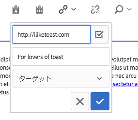

   * 場所を入力

      * Select Selectionダイアログを使用してAEMでパスを選択する
      * リンクがAEM内にない場合は、絶対URLを入力します（絶対パスはAEMに対する相対パスと解釈されます）。
   * リンクの代替説明テキストを入力します
   * リンクの動作の選択

      * Target
      * 同じタブ
      * 新しいタブ
      * 親フレーム
      * トップフレーム
   チェックマークをタップまたはクリックすると、リンクが適用されます。または、xがキャンセルされます。

* リンク解除

   

   選択したテキストに既に適用されているリンクを削除するには、このオプションを使用します。このオプションは、リンクが既に選択されている場合にのみ有効です。

* 　  検索

   

   指定したテキスト文字列のオカレンスのテキストを検索するには、このオプションを使用します。このオプションを選択すると、検索オプションを指定するウィンドウが開きます。

   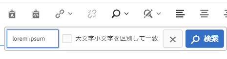

   検索するテキストを入力し、「 **検索** 」をクリックして検索を開始します。&quot;x&quot;をタップまたはクリックしてキャンセルします。

   大文字と小文字を完全に一致させる場合は、「大文字と小文字 **** を区別」オプションを選択してから検索を開始します。

   一致が見つかった場合、ハイライト表示され、検索ダイアログが淡色表示になります。次のオカレンスを検索するには、グレー表示のダイアログで **「検索」** ボタンをもう一度クリックするか、ボタンをクリックします。

   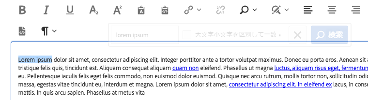

   追加の回数が見つからない場合は、メッセージが表示され、テキストの先頭から検索が再開されます。

   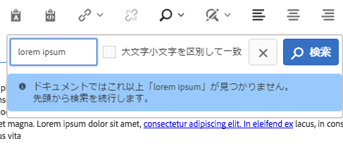

* Replace

   

   このオプションを使用して、指定したテキスト文字列のテキストを検索し、一致を別の文字列と置換します。このオプションを選択すると、検索および置換オプションを指定するウィンドウが開きます。

   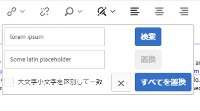

   検索するテキストと、置換するテキストを入力します。

   検索を開始するには、「 **検索」** をタップまたはクリックします。&quot;x&quot;をクリックまたはタップしてキャンセルします。

   大文字と小文字を完全に一致させる場合は、「大文字と小文字 **** を区別」オプションを選択してから検索を開始します。

   一致が見つかった場合、ハイライト表示され、検索ダイアログが淡色表示になります。灰色表示のダイアログで **「検索」** ボタンを再度クリックすると、次のオカレンスが検索されます。 **または、置換** ボタンを選択すると、ハイライトされている一致したテキストが置換されます。**「置換** 」ボタンは、一致が作成されるとアクティブになります。

   「すべて **** 置換」を選択すると、すべてのテキストが一度に置換されます。

* テキストを左揃え

   

   テキストを左マージンに揃えます。

* テキストを中央揃え

   

   テキストの中央揃えに使用します。

* テキストを右揃え

   

   テキストを右マージンに揃えます。

* ビュレット

   

   選択したテキストをバレットリストとしてフォーマットするか、カーソルの後にバレットリストを挿入するために使用します。

   バレットリストを終了するには **、「ブレット** 」ボタンをタップまたはクリックするか、2つのキャリッジリターンを入力します。

* 番号付き

   

   選択したテキストを番号付きリストとして書式設定するか、カーソルの後に番号付きリストを挿入するために使用します。

   番号付きリストを終了するには、「 **番号付き** 」ボタンをタップまたはクリックするか、2つのキャリッジリターンを入力します。

* アウトデント

   

   カーソルの後に入力したテキストまたはテキストのインデントレベルを減らすために使用します。

   選択したテキストまたはカーソルの位置が既にインデントされている場合のみアクティブです。

* インデント

   

   カーソルの後に入力したテキストまたはテキストのインデントレベルを上げるために使用します。

* テーブル

   

   テキストにテーブルを挿入するために使用します。このオプションを選択すると、テーブルの詳細を指定するウィンドウが開きます。

   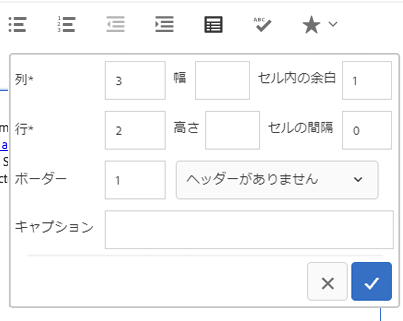

   * **列** -テーブルの列数（必須）
   * **行** -テーブルの行数（必須）
   * **幅** -テーブルの幅
   * **高さ** -テーブルの高さ
   * **セルパディング**-セルコンテンツの周囲のスペース
   * **セルの間隔** -セル間のスペース
   * **境界線** -テーブルの境界線線の太さ
   * テーブルのヘッダーの場合:

      * 最初の行は、
      * 最初の列は、
      * 最初の行と最初の列は、
      * または、ヘッダーを使用しないでください。
   * **キャプション** -テーブルのキャプション


* スペルチェック

   

   テキストコンテンツのスペルをチェックするために使用します。スペルミスのあるスペルには、改行された赤い線が引かれています。

* 特殊文字

   

   テキストに特殊文字を挿入するために使用します。このオプションを選択すると、使用可能な文字が表示されるウィンドウが開きます。

   

   目的の文字をタップまたはクリックして、カーソルの後のテキストに挿入します。複数文字を挿入できます。&quot;x&quot;をタップまたはクリックして選択ウィンドウを閉じます。

* ソースの編集

   

   テキストのHTMLソースを表示および変更するために使用します。

   **ソース編集** アイコンをタップまたはクリックして、書式化されたビューからテキストの内容を変更し、生のHTMLを表示します。このモードでは、その他の書式設定オプションはすべて無効になっています。**ソース編集** アイコンをタップまたはクリックして、形式設定されたビューに戻ります。

   >[!CAUTION]
   >
   >生のHTMLにアクセスする場合は常に、 **ソース編集** オプションを使用するときに注意する必要があります。
   >
   >
   >ソース編集で **入力したHTMLがXSSのリスクをスキャン** し、挿入されるスクリプトは削除され、結果のページには表示されません。**ただし、ソース編集** で入力されたHTMLの形式が正しくない場合、ページのテンプレートが破損し、予期しない書式設定や結果ページのレンダリングができなくなります。

* 段落書式

   

   選択したテキストまたはカーソルの後に挿入されるテキストに段落書式を適用するために使用します。このオプションを選択すると、段落形式を選択したドロップダウンが開きます。

   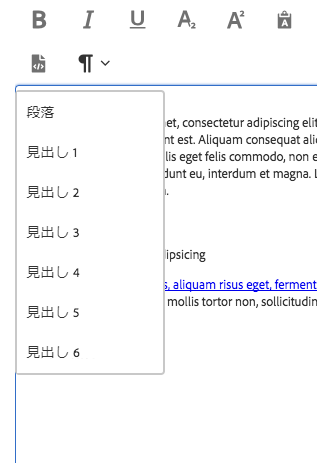

テキストコンポーネントはインラインでも編集できますが、スペース制限により、すべての書式設定オプションがインラインで使用できるわけではありません。すべてのオプションを表示するには、フルスクリーンモードに切り替えます。


## デザインダイアログ {#design-dialog}

デザインダイアログでは、テンプレート作成者がコンテンツ作成者が使用できるテキスト書式オプションを定義できます。

### 機能 {#features}

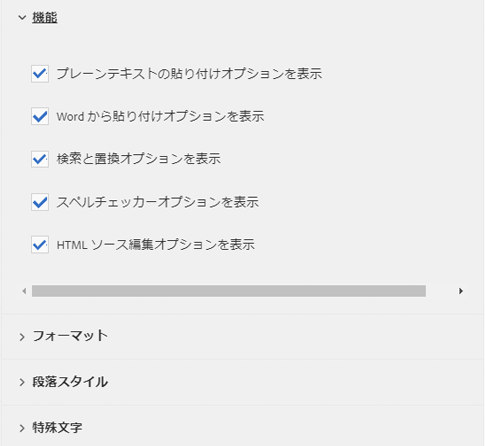

コンポーネントの次の機能をアクティブ化または非アクティブ化できます。

* プレーンテキストを貼り付け
* 過去の単語
* 検索と置換
* スペルチェッカー
* ソース編集

### 書式設定 {#formatting}

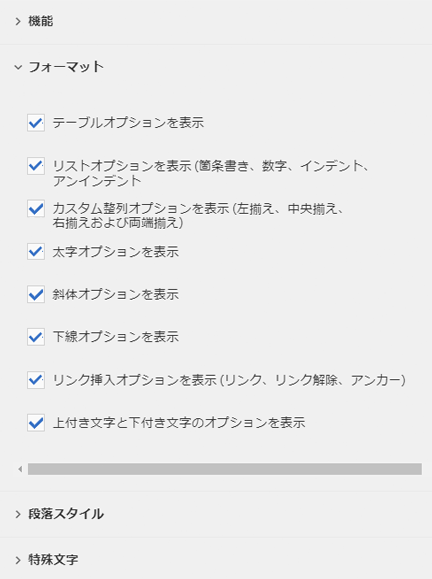

コンポーネントの次の形式設定オプションをアクティブ化または非アクティブ化できます。

* テーブル
* リスト
* 整列
* 太字、斜体、下線
* リンク
* サブスクリプト/上付き文字

### 段落スタイル {#paragraph-styles}

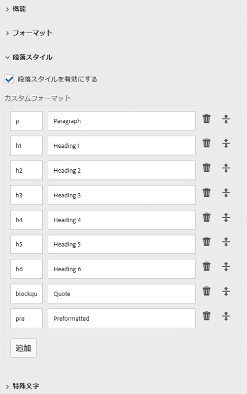

コンポーネントの段落スタイルをアクティブ化または非アクティブ化できます。アクティベートすると、許可されている形式を定義できます。

* 「 **追加」** ボタンをタップまたはクリックして、新しいスタイルを挿入します。
* 編集ダイアログに表示するスタイルと説明のコードを入力します。
* スタイルを削除するには、タップするか **、削除** ボタンをクリックします。
* 形式の順序を並べ替えるには、をタップまたはクリックしてハンドルをドラッグします。

### Special Characters {#special-characters}

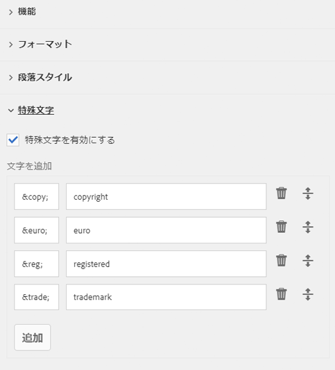

特殊文字を挿入するオプションは、コンポーネントのアクティブ化または非アクティブ化できます。アクティブ化すると、許可されている文字を定義できます。

* 「 **追加」** ボタンをタップまたはクリックして、新しい文字を挿入します。
* 編集ダイアログに表示する文字のHTMLコードと説明を入力します。
* 文字をタップするか **、削除** ボタンをクリックします。
* 文字の順序を並べ替えるには、タップまたはクリックしてハンドルをドラッグします。

## 技術的詳細 {#technical-details}

テキストコンポーネント [に関する最新の技術ドキュメントは、GitHubで入手](https://github.com/adobe/aem-core-wcm-components/tree/master/content/src/content/jcr_root/apps/core/wcm/components/text/v1/text)できます。

コアコンポーネントプロジェクト全体をGitHubからダウンロードできます。

コアコンポーネントの開発について詳しくは、 [コアコンポーネント開発者向けドキュメント](developing.md)を参照してください。
