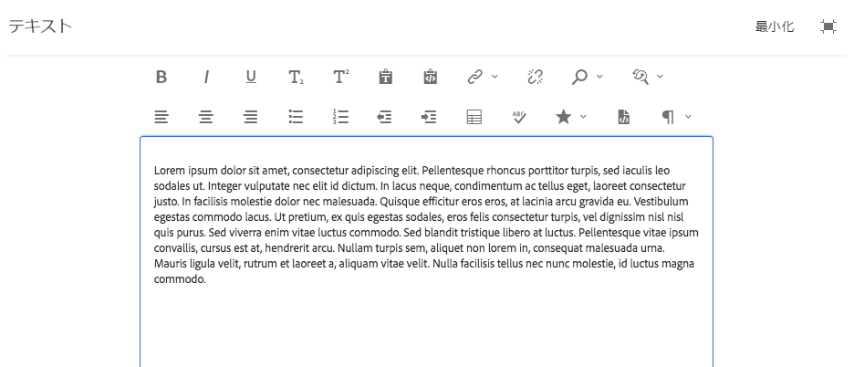
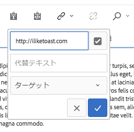
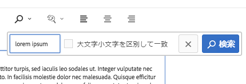
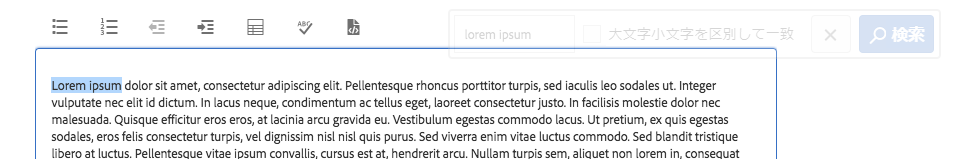
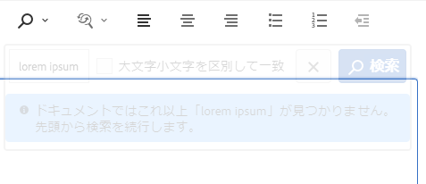
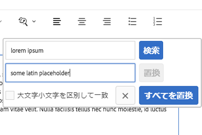
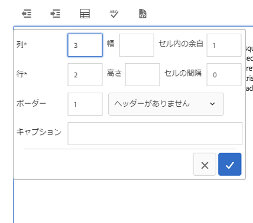
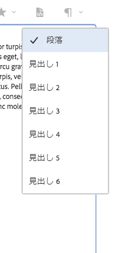

# テキストコンポーネント{#text-component}

コアコンポーネントのテキストコンポーネントは、インプレース編集機能を備えたリッチテキスト編集および作成用コンポーネントです。

## 使用方法 {#usage}

テキストコンポーネントは、シンプルなインラインエディターでもフルスクリーン形式でも容易にテキスト編集をおこなえる堅牢なリッチテキストエディターを提供します。

[編集ダイアログ](#edit-dialog)には、限定的なオプションのみのインライン編集機能と、すべての機能を利用できるフルスクリーン編集機能が用意されています。[デザインダイアログ](#design-dialog)では、見出し、特殊文字、段落スタイルなどのテキスト書式設定オプションをコンテンツ作成者のテンプレートに設定できます。

## バージョンと互換性 {#version-and-compatibility}

このドキュメントでは、テキストコンポーネントの現在のバージョン（2018 年 1 月にコアコンポーネントのリリース 2.2.0 で導入された v2）について説明します。

コンポーネントのすべてのサポート対象バージョン、コンポーネントの各バージョンと互換性のある AEM バージョン、以前のバージョンのドキュメントへのリンクを次の表に示します。

| コンポーネントのバージョン | AEM 6.3 | AEM 6.4 | AEM 6.5 |
|---|---|---|---|
| v2 | 互換性あり | 互換性あり | 互換性あり |
| [v1](text-v1.md) | 互換性あり | 互換性あり | 互換性あり |

コアコンポーネントのバージョンとリリースについて詳しくは、[コアコンポーネントのバージョン](versions.md)を参照してください。

## コンポーネント出力のサンプル {#sample-component-output}

テキストコンポーネントを実際に体験し、その設定オプションや HTML および JSON 出力の例を確認するには、[コンポーネントライブラリ](http://opensource.adobe.com/aem-core-wcm-components/library/text.html)を参照してください。

### 技術的詳細 {#technical-details}

テキストコンポーネントに関する最新の技術ドキュメ [ントは、GitHubで入手できます](https://github.com/adobe/aem-core-wcm-components/blob/master/content/src/content/jcr_root/apps/core/wcm/components/text/v2/text)。

コアコンポーネントの開発について詳しくは、[コアコンポーネント開発者向けドキュメント](developing.md)を参照してください。

## テキストコンポーネントとリッチテキストエディター {#the-text-component-and-the-rich-text-editor}

コアコンポーネントのテキストコンポーネントでは、AEM リッチテキストエディター（RTE）を利用します。RTE には、コンテンツ作成者がテキストコンテンツの編集に使用できる幅広い機能が用意されています。RTE は設定の柔軟性が非常に高く、数多くのオプションを提供しています。RTEの設定方法の詳細については、「リッチテキストエディターの設定 [」および「リッチテキストエディタ](https://helpx.adobe.com/experience-manager/6-5/sites/administering/using/rich-text-editor.html) ープラグインの設定」を参照してください 。

コアコンポーネントのテキストコンポーネントでは、RTE がすぐに使用できる状態に設定されています。このドキュメントではこの後、テキストコンポーネントの標準設定について説明します。

>[!NOTE]
>
>Only options enabled by [UI configurations of the RTE](https://chl-author-preview.corp.adobe.com/content/help/en/experience-manager/6-5/sites/administering/using/rich-text-editor.html) are available by in the Text Component.

## 編集ダイアログ{#edit-dialog}

編集ダイアログには、テキストの作成を支援する標準のリッチテキスト書式設定ツールが用意されています。

### 太字

選択したテキストに太字書式を適用したり、カーソルの後に入力したテキストに太字書式を設定したりするために使用します。

**Ctrl + B** をキーボードショートカットとして使用できます。

### 斜体

選択したテキストに斜体書式を適用したり、カーソルの後に入力したテキストに斜体書式を設定したりするために使用します。

**Ctrl + I** をキーボードショートカットとして使用できます。

### 下線

選択したテキストに下線書式を適用したり、カーソルの後に入力したテキストに下線書式を設定したりするために使用します。

**Ctrl + U** をキーボードショートカットとして使用できます。

### 下付き文字

選択したテキストまたはカーソルの後に入力したテキストを下付き文字として書式設定するために使用します。

### 上付き文字

選択したテキストまたはカーソルの後に入力したテキストを上付き文字として書式設定するために使用します。

### テキストとして貼り付け

コピーしたテキストを書式設定のないプレーンテキストとして貼り付けます。

このオプションを選択すると、ウィンドウが開き、テキストを書式設定のないプレーンテキストとして貼り付けた状態を、実際に挿入する前にプレビューできます。続行する場合はチェックマークをタップまたはクリックし、キャンセルする場合は「x」をタップまたはクリックします。

### Word から貼り付け

このオプションを選択すると、ウィンドウが開き、書式設定を維持しながらテキストを貼り付けた状態を、実際に挿入する前にプレビューできます。続行する場合はチェックマークをタップまたはクリックし、キャンセルする場合は「x」をタップまたはクリックします。

### ハイパーリンク

このオプションを使用すれば、選択したテキストをハイパーリンクに変換したり、定義済みのリンクを変更したりできます。このオプションは、テキストが既に選択されている場合にのみ有効で、選択すると、リンクを設定するための追加オプションのウィンドウが開きます。

* 場所を入力します
   * 「選択ダイアログを開く」を使用して、AEM 内のパスを選択します
   * リンクが AEM 内にない場合は、絶対 URL を入力します（絶対パス以外のパスは AEM に対する相対パスと解釈されます）
* リンクの説明用代替テキストを入力します
* リンクの動作を選択します
   * ターゲット
   * 同じタブ
   * 新しいタブ
   * 親フレーム
   * トップフレーム
   リンクを適用する場合はチェックマークをタップまたはクリックし、キャンセルする場合は「x」をタップまたはクリックします。

### リンク解除

選択したテキストに既に適用されているリンクを削除する場合は、このオプションを使用します。このオプションは、リンクが既に選択されている場合にのみ有効です。

### 検索

指定した文字列をテキスト内で検索する場合は、このオプションを使用します。このオプションを選択すると、検索オプションを指定するためのウィンドウが開きます。

検索するテキストを入力し、「**検索**」をタップまたはクリックして検索を開始します。キャンセルする場合は。「x」をタップまたはクリックします。大文字と小文字を区別して完全一致検索をおこなう場合は、「**大文字小文字を区別して一致**」オプションを選択してから検索を開始します。一致する文字列が見つかった場合は、それが強調表示され、検索ダイアログが淡色表示になります。一致する次の文字列を検索するには、淡色表示のダイアログで「**検索**」ボタンを再度タップまたはクリックします。

一致する文字列がそれ以上見つからない場合は、メッセージが表示され、テキストの先頭から検索が再開されます。

### 置換

指定した文字列をテキスト内で検索し、一致する文字列を別の文字列に置き換える場合は、このオプションを使用します。このオプションを選択すると、検索および置換オプションを指定するためのウィンドウが開きます。

検索する文字列と置換後の文字列を入力します。

検索を開始するには、「**検索**」をタップまたはクリックします。キャンセルする場合は。「x」をタップまたはクリックします。

大文字と小文字を区別して完全一致検索をおこなう場合は、「**大文字小文字を区別して一致**」オプションを選択してから検索を開始します。

一致する文字列が見つかった場合は、それが強調表示され、検索ダイアログが淡色表示になります。一致する次の文字列を検索するには、淡色表示のダイアログで「**検索**」ボタンを再度タップまたはクリックします。強調表示されている一致文字列を置き換えるには、「**置換**」ボタンをタップまたはクリックします。なお、「**置換**」ボタンは、一致する文字列が見つかった場合にのみ有効になります。

「**すべてを置換**」をタップまたはクリックすると、一致するすべての文字列が一度に置換されます。

### テキストを左揃え

テキストを左マージンに揃えます。

### テキストを中央揃え

テキストを中央に揃えます。

### テキストを右揃え

テキストを右マージンに揃えます。

### 箇条書き

選択したテキストを箇条書きリストとして書式設定するか、カーソルの後に箇条書きリストを挿入するために使用します。

箇条書きリストを終了するには、「**箇条書き**」ボタンをタップまたはクリックするか、キャリッジリターンを 2 回入力します。

### 番号付き

選択したテキストを番号付きリストとして書式設定するか、カーソルの後に番号付きリストを挿入するために使用します。

番号付きリストを終了するには、「**番号付き**」ボタンをタップまたはクリックするか、キャリッジリターンを 2 回入力します。

### アウトデント

選択したテキストまたはカーソルの後に入力するテキストのインデントレベルを減らすために使用します。

選択したテキストまたはカーソルの位置が既にインデントされている場合にのみ有効です。

### インデント

選択したテキストまたはカーソルの後に入力するテキストのインデントレベルを増やすために使用します。

### テーブル

テキストにテーブルを挿入するために使用します。このオプションを選択すると、テーブルの詳細を指定するためのウィンドウが開きます。

* **列** - テーブルの列数（必須）
* **行** - テーブルの行数（必須）
* **幅** - テーブルの幅
* **高さ** - テーブルの高さ
* **セル内の余白** - セルコンテンツの周囲の空白
* **セルの間隔** - セル間の空白
* **ボーダー** - テーブルの罫線の太さ
* テーブルの見出しについては次の選択肢があります。
   * 最初の行を使用する
   * 最初の列を使用する
   * 最初の行と最初の列を使用する
   * 見出しを使用しない
* **キャプション** - テーブルのキャプション

### スペルチェック

テキストコンテンツのスペルをチェックするために使用します。スペルミスの可能性がある場合は、赤い破線が該当箇所の下に引かれます。

Further details about spell checking and customizing spell check dictionaries can be found in the document [Configure the Rich Text Editor Plug-Ins](https://helpx.adobe.com/experience-manager/6-5/sites/administering/using/configure-rich-text-editor-plug-ins.html).

### 特殊文字 {#special-characters}

テキストに特殊文字を挿入するために使用します。このオプションを選択するとウィンドウが開き、使用可能な文字が表示されます。

目的の文字をタップまたはクリックすると、テキストのカーソルの後に文字が挿入されます。複数の文字を挿入できます。「x」をタップまたはクリックすると、選択ウィンドウが閉じます。

### ソース編集

テキストの HTML ソースを表示および変更するために使用します。

**ソース編集**&#x200B;アイコンをタップまたはクリックすると、テキストの内容が、書式設定された表示から HTML コードの表示に変わります。このモードでは、他の書式設定オプションはすべて無効になっています。**ソース編集**&#x200B;アイコンを再度タップまたはクリックすると、書式設定された表示に戻ります。

>[!CAUTION]
>
>生の HTML コードにアクセスする場合は常にそうですが、「**ソース編集**」オプションを使用する際には注意する必要があります。
>
>**ソース編集**&#x200B;で入力した HTML コードはスキャンされて、XSS のリスクがないか確認されます。スクリプトを挿入してもすべて削除され、生成されるページには出現しません。ただし、**ソース編集**&#x200B;で入力した HTML コードの形式が正しくない場合は、ページのテンプレートが破損して、予期しない書式設定になったり、生成されるページが使用できなくなるおそれがあります。

>[!NOTE]
>
>**ソース編集**&#x200B;で入力した HTML コードはスキャンされて、XSS のリスクやスクリプトがないか確認され、検出されたものはすべて自動的に削除されます。したがって、実際に保存されたコンテンツは、**ソース編集**&#x200B;で入力した内容と異なる可能性があります。そのため、**ソース編集**&#x200B;を使用しておこなった変更を保存する場合は、まず、**ソース編集**&#x200B;を終了して、テキストを通常のエディターで表示する必要があります。

### 段落書式

選択したテキストまたはカーソルの後に挿入されるテキストに段落書式を適用するために使用します。このオプションを選択すると、段落形式を選択するためのドロップダウンが開きます。

テキストコンポーネントはインラインでも編集できますが、スペースの制限により、必ずしもすべての書式設定オプションがインラインで使用できるわけではありません。すべてのオプションを表示するには、フルスクリーンモードに切り替えます。

## デザインダイアログ{#design-dialog}

デザインダイアログでは、コンテンツ作成者が使用できるテキスト書式設定オプションをテンプレート作成者が定義できます。

### 「プラグイン」タブ {#plugins-tab}

「プラグイン」タブでは、コンテンツ作成者が使用できる様々なテキスト書式設定オプションを有効または無効にします。

### 機能 {#features}

コンポーネントに対して次の機能を有効または無効にすることができます。

* プレーンテキストを貼り付け
* Word から貼り付け
* 検索と置換
* スペルチェッカー
* ソース編集

### 書式設定 {#formatting}

コンポーネントに対して次の書式設定オプションを有効または無効にすることができます。

* テーブル
* リスト
* 整列
* 太字、斜体、下線
* リンク
* 下付き／上付き文字

### 段落スタイル {#paragraph-styles}

コンポーネントに対して段落スタイルを有効または無効にすることができます。有効にすると、使用できる書式を定義できます。

* 「**追加**」ボタンをタップまたはクリックすると、新しいスタイルを挿入できます。
* スタイルのコードと、編集ダイアログに表示される説明を入力します。
* スタイルを削除するには、「**削除**」ボタンをタップまたはクリックします。
* 書式の順序を並べ替えるには、ハンドルをタップまたはクリックしてドラッグします。

### 特殊文字の設定 {#configuring-special-characters}

コンポーネントに対して、特殊文字を挿入するオプションを有効または無効にすることができます。有効にすると、使用できる文字を定義できます。

* 「**追加**」ボタンをタップまたはクリックすると、新しい文字を挿入できます。
* 文字の HTML コードと、編集ダイアログに表示される説明を入力します。
* 文字を削除するには、「**削除**」ボタンをタップまたはクリックします。
* 文字の順序を並べ替えるには、ハンドルをタップまたはクリックしてドラッグします。

## 「スタイル」タブ {#styles-tab}

テキストコンポーネントでは、AEM [スタイルシステム](authoring.md#component-styling)をサポートしています。