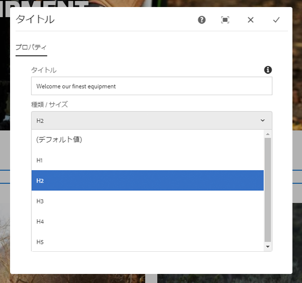
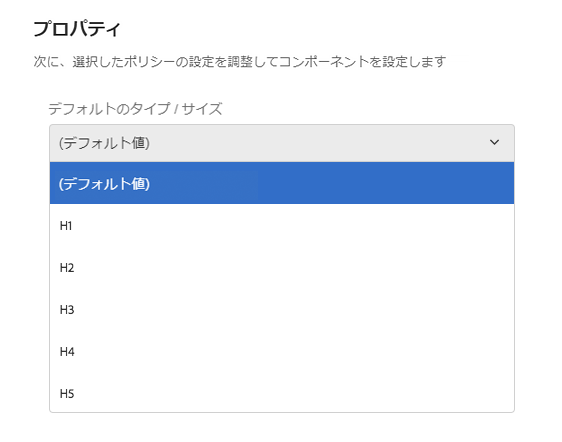

# タイトルコンポーネント（v1）{#title-component-v}

コアコンポーネントタイトルコンポーネントは、インプレース編集機能のセクション見出しコンポーネントです。

## 使用方法 {#usage}

タイトルコンポーネントは、コンテンツのセクションのタイトルまたは見出しとして使用することを目的としています。

使用可能な見出しレベルは [、デザインダイアログのテンプレート作成者によって定義](title-v1.md#main-pars_title_1995166862)できます。コンテンツエディターで [は、編集ダイアログで使用可能な見出しレベルから選択](title-v1.md#main-pars_title)できます。便宜上、見出しテキストの単純なインプレース編集も可能です。

## バージョンと互換性 {#version-and-compatibility}

本書では、元々、コアコンポーネントのリリース1.0.0とAEM6.3で導入された、タイトルコンポーネントのv1について説明します。

次の表に、タイトルコンポーネントのv1の互換性を示します。

| AEM のバージョン | タイトルコンポーネントv1 |
|--- |--- |
| 6.3 | 互換性 |
| 6.4 | 互換性 |

>[!CAUTION]
>
>本書では、タイトルコンポーネントのバージョン1について説明します。
>
>タイトルコンポーネントの現在のバージョンについて詳しくは [、タイトルコンポーネント](title.md) ドキュメントを参照してください。

## サンプルコンポーネントの出力 {#sample-component-output}

以下は、We. Retailから [取得されたサンプル](https://helpx.adobe.com/experience-manager/6-4/sites/developing/using/we-retail.html)です。

### スクリーンショット {#screenshot}


### HTML {#html}

```
<div class="cmp cmp-title aem-GridColumn aem-GridColumn--default--12">
     <h2>Welcome! This is our finest equipment!</h2>
</div>
```

### JSON {#json}

```
"title": {
              "columnClassNames": "aem-GridColumn aem-GridColumn--default--12",
              ":type": "weretail/components/content/title",
              "jcr:title": "Welcome! This is our finest equipment!",
              "type": "h2"
            }
```

>[!NOTE]
>
>コアコンポーネントからのJSONエクスポートには、コアコンポーネントのリリース1.1.0が必要です。詳しくは [、コアコンポーネントv1](versions.md#main-pars_title_236368006) の互換性情報を参照してください。

## ダイアログを編集 {#edit-dialog}

編集ダイアログでは、コンテンツ作成者がタイトルテキストを定義したり、見出しレベルを選択したりできます。

>[!NOTE]
>
>タイトルの空の値を指定すると、ページタイトルが表示されます。



インプレースエディターを使用して、タイトルコンポーネントのテキストを編集することもできます。


## デザインダイアログ {#design-dialog}

デザインダイアログでは、テンプレート作成者がコンテンツ作成者によって作成されるときにタイトルコンポーネントにデフォルトの見出しレベルを定義できます。



## 技術的詳細 {#technical-details}

タイトルコンポーネント [に関する最新の技術ドキュメントは、GitHubで確認](https://github.com/adobe/aem-core-wcm-components/tree/master/content/src/content/jcr_root/apps/core/wcm/components/title/v1/title)できます。

コアコンポーネントプロジェクト全体をGitHubからダウンロードできます。

コアコンポーネントの開発について詳しくは、 [コアコンポーネント開発者向けドキュメント](developing.md)を参照してください。
