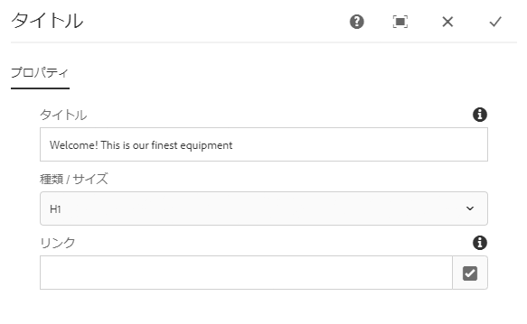
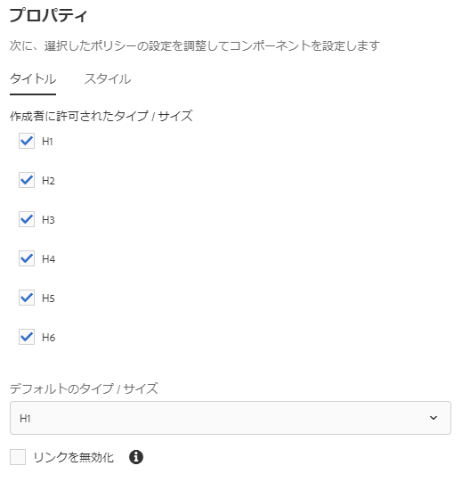

# タイトルコンポーネント{#title-component}

コアコンポーネントタイトルコンポーネントは、インプレース編集機能のセクション見出しコンポーネントです。

## 使用 {#usage}

タイトルコンポーネントは、コンテンツのセクションのタイトルまたは見出しとして使用することを目的としています。The available heading levels can be defined by the template author in the [design dialog](#design-dialog). The content editor can select from available headings levels in the [edit dialog](#edit-dialog). 便宜上、見出しテキストの単純なインプレース編集も可能です。

## Version and Compatibility {#version-and-compatibility}

現在のバージョンのタイトルコンポーネントはv2であり、2018年1月のコアコンポーネントのリリース2.0.0で導入されています。このドキュメントで説明しています。

次の表に、サポートされているコンポーネントのすべてのバージョン、コンポーネントのバージョンが互換性があるAEMバージョン、および以前のバージョンのドキュメントへのリンクを示します。

| コンポーネントバージョン | AEM 6.3 | AEM 6.4 | AEM 6.5 |
|---|---|---|---|
| v2 | 互換性 | 互換性 | 互換性 |
| [v1](title-v1.md) | 互換性 | 互換性 | 互換性 |

For more information about Core Component versions and releases, see the document [Core Components Versions](versions.md).

## Sample Component Output {#sample-component-output}

To experience the Title Component as well as see examples of its configuration options as well as HTML and JSON output, visit the [Component Library](http://opensource.adobe.com/aem-core-wcm-components/library/title.html).

### Technical Details {#technical-details}

The latest technical documentation about the Title Component [can be found on GitHub](https://github.com/adobe/aem-core-wcm-components/blob/master/content/src/content/jcr_root/apps/core/wcm/components/title/v2/title).

Further details about developing Core Components can be found in the [Core Components developer documentation](developing.md).

## Edit Dialog {#edit-dialog}

編集ダイアログでは、コンテンツ作成者がタイトルテキストを定義したり、見出しレベルを選択したりできます。

* **タイトル** -空白の場合、ページタイトルが使用される
* **タイプ/サイズ** -タイトルの見出しレベルを定義します
* **リンク** -タイトルをリンクするコンテンツを定義します。コンテンツページ、外部URLまたはページアンカーへのパスです。

>[!CAUTION]
>
>タイトルのリンクを定義する機能は、コアコンポーネントのリリース2.2.0で導入されました。

インプレースエディターを使用して、タイトルコンポーネントのテキストを編集することもできます。

## Design Dialog {#design-dialog}

デザインダイアログでは、テンプレート作成者がコンテンツ作成者によって作成されるときにタイトルコンポーネントにデフォルトの見出しレベルを定義できます。

### Sizes Tab {#sizes-tab}

* **作成者の許可されたタイプ/サイズ** -タイトルコンポーネントを使用するときにコンテンツ作成者が使用できる見出しタイプを有効または無効にします。
* **デフォルトのタイプ/サイズ**-コンテンツ作成者がページにタイトルコンポーネントを追加したときに自動的に割り当てられる見出しタイプを定義します。
* **リンクを無効にする-** タイトルコンポーネント内のリンクのサポートを無効にして、コンテンツ作成者がタイトルからリンクできないようにします。

>[!CAUTION]
>
>タイトルのリンクを定義する機能は、コアコンポーネントのリリース2.2.0で導入されました。

### Styles Tab {#styles-tab}

The Title Component supports the AEM [Style System](authoring.md#component-styling).