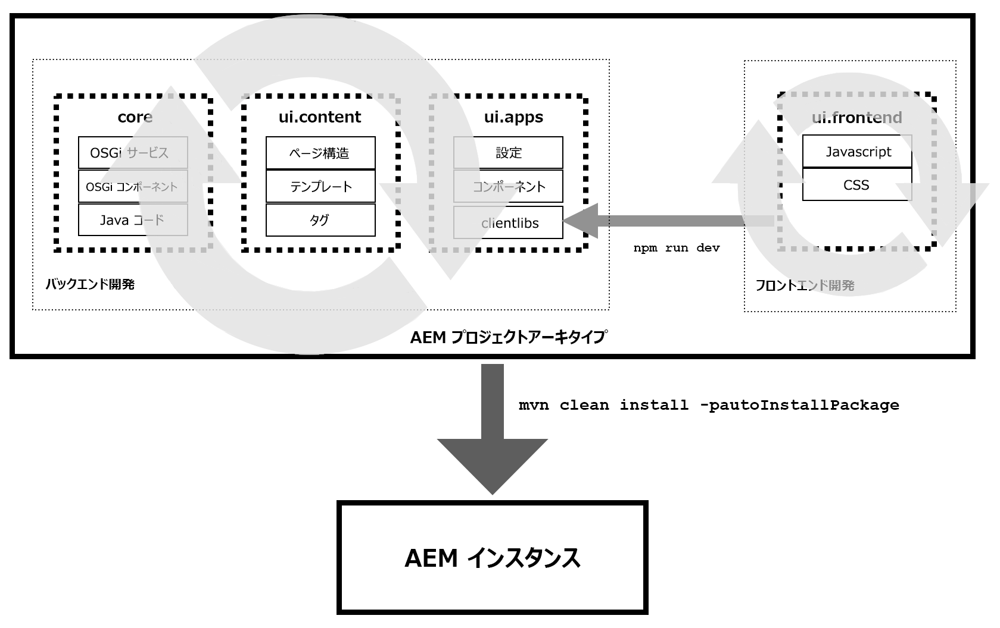

# ui.frontend Module of the AEM Project Archetype {#uifrontend-module}

AEMプロジェクトのアーキタイプには、Webpackベースの専用フロントエンドビルドメカニズムがオプションで用意されています。 このように、ui.frontendモジュールは、JavaScriptやCSSファイルを含む、プロジェクトのすべてのフロントエンドリソースの中心となります。 この便利で柔軟な機能を最大限に活用するには、AEMプロジェクトにフロントエンド開発がどのように適合するかを理解することが重要です。

## AEMプロジェクトとフロントエンド開発 {#aem-and-front-end-development}

AEMプロジェクトは、非常にシンプルな用語で、2つの異なる関連部分から成ると考えることができます。

* AEMのロジックを駆動し、Javaライブラリ、OSGiサービスなどを生成するバックエンドの開発。
* 結果のWebサイトの表示と動作を推進し、JavaScriptライブラリとCSSライブラリを生成するフロントエンド開発

これらの2つの開発プロセスはプロジェクトの異なる部分に焦点を当てているので、バックエンドとフロントエンドの開発が並行して行われる可能性があります。



ただし、作成されるプロジェクトでは、バックエンドとフロントエンドの両方の開発作業の出力を使用する必要があります。

を実行 `npm run dev` すると、ui.frontendモジュールに保存されているJavaScriptファイルとCSSファイルを収集し、縮小された2つのクライアントライブラリまたはclientlibを作成して `clientlib-site` ui.appsモジュールに `clientlib-dependencies` デポジットするフロントエンドビルドプロセスが開始されます。 clientlibsはAEMにデプロイでき、クライアント側のコードをリポジトリに保存できます。

AEMプロジェクトのアーキタイプ全体が、clientlibsを含むすべてのプ `mvn clean install -PautoInstallPackage` ロジェクトアーティファクトを使用して実行されたら、AEMインスタンスにプッシュされます。

>[!TIP]
>clientlibの詳細については、 [AEM開発ドキュメントを参照し](https://helpx.adobe.com/experience-manager/6-5/sites/developing/using/clientlibs.html) 、ui.frontendモ [ジュールで次に示すように使用します](#clientlib-generation)。

## 可能なフロントエンド開発ワークフロー {#possible-workflows}

フロントエンドビルドモジュールは、便利で柔軟なツールですが、どのように使用すべきかについて特に意見を述べません。 使用例は以下の2つですが ** 、個々のプロジェクトで他の使用モデルが必要になる場合があります。

### Webpack静的開発サーバーの使用 {#using-webpack}

Webpackを使用すると、ui.frontendモジュール内のAEM webページの静的出力に基づいてスタイルを設定し、開発することができます。

1. ページプレビューモードを使用するか、URLで渡すことによって、AEMでページをプ `wcmmode=disabled` レビューする
1. ページソースを表示し、ui.frontendモジュール内に静的HTMLとして保存
1. [Webpackを起動し](#webpack-dev-server) 、必要なJavaScriptとCSSのスタイル設定と生成を開始します。
1. を実行し `npm run dev` てclientlibsを生成します

このフローでは、AEM開発者が手順1と2を実行し、静的HTMLをAEM HTML出力に基づいて開発を行うフロントエンド開発者に渡すことができます。

>[!TIP]
>
>また、コンポーネントライブラリ [を利用して](https://opensource.adobe.com/aem-core-wcm-components/library.html) 、各コンポーネントのマークアップ出力のサンプルを取り込み、ページレベルではなくコンポーネントレベルで作業することもできます。

### ストーリーブックの使用 {#using-storybook}

Storybookを使用 [すると](https://storybook.js.org) 、よりアトミックなフロントエンド開発を実行できます。 AEMプロジェクトのアーキタイプにはStorybookが含まれていませんが、Storybookをインストールして、ui.frontendモジュール内にStorybookアーティファクトを保存することができます。 AEM内でテストを行う準備が整ったら、を実行してclientlibとしてデプロイできま `npm run dev`す。

>[!NOTE]
>
>[ストーリーブック](https://storybook.js.org) はAEMプロジェクトのアーキタイプには含まれていません。 使用する場合は、個別にインストールする必要があります。

### マークアップの決定 {#determining-markup}

プロジェクトに実装するフロントエンド開発ワークフローに関しては、まずバックエンド開発者とフロントエンド開発者がマークアップに同意する必要があります。 通常、AEMはコアコンポーネントが提供するマークアップを定義します。 [ただし、必要に応じてカスタマイズできます](https://docs.adobe.com/content/help/en/experience-manager-core-components/using/developing/customizing.html#customizing-the-markup)。

## ui.frontendモジュール {#ui-frontend-module}

AEM プロジェクトのアーキタイプには、次の機能を備えた Webpack ベースの専用フロントエンドビルドメカニズム（オプション）が含まれています。

* Full TypeScript、ES6 および ES5 のサポート（適用可能な Webpack ラッパーを使用）
* TSLintルールセットを使用したTypeScriptおよびJavaScriptの構文チェック
* レガシーブラウザーサポート用 ES5 出力
* グロビング
   * インポートをどこにも追加する必要がない
   * すべての JS ファイルと CSS ファイルを各コンポーネントに追加できるようになりました。。
      * ベストプラクティスの追加先は、`/clientlib/js`、`/clientlib/css` または `/clientlib/scss` の配下です。
   * No `.content.xml` or `js.txt`/`css.txt` files are needed as everything is run through Webpack.
   * グローバーは、`/component/` フォルダーの下にあるすべての JS ファイルを取り込みます。
      * Webpack を使用すると、JS ファイル経由で CSS／SCSS ファイルをチェーンにすることができます。
      * 2 つのエントリポイント（`sites.js` および `vendors.js`）から取り込まれます。
   * AEM が使用すファイルは、`/clientlib-site` の出力ファイル `site.js` と `site.css`、および `/clientlib-dependencies` の `dependencies.js` と `dependencies.css` のみです。
* チャンク
   * メイン（サイトの js／css）
   * ベンダー（依存関係の js／css）
* 完全なSass/Scssのサポート（SassはWebpackを使用してCSSにコンパイルされます）
* AEMのローカルインスタンスに対するプロキシが組み込まれた静的WebPack開発サーバー

>[!NOTE]
>
>ui.frontendモジュールに関する技術的な情報については、GitHubのドキュメントを参 [照してください](https://github.com/adobe/aem-project-archetype/blob/master/src/main/archetype/ui.frontend/README.md)。

## インストール {#installation}

1. [NodeJS](https://nodejs.org/en/download/)（v10 以降）をグローバルにインストールします。これにより、npm もインストールされます。
1. プロジェクト内の ui.frontend に移動し、`npm install` を実行します。

>[!NOTE]
>
>ui.frontendフォルダーに入 [力するには](overview.md) 、オプションを使用 `-DoptionIncludeFrontendModule=y` してアーキタイプを実行する必要があります。

## 使用方法 {#usage}

次の npm スクリプトは、フロントエンドワークフローを動かします。

* `npm run dev` - JS 最適化を無効（ツリーシェイクなど）、ソースマップを有効、CSS 最適化を無効にした完全なビルド。
* `npm run prod` - JS 最適化を有効（ツリーシェイクなど）、ソースマップを無効、CSS 最適化を有効にした完全なビルド。
* `npm run start` - AEMへの依存性を最小限に抑えて、ローカル開発用の静的WebPack開発サーバーを起動します。

## 出力 {#output}

ui.frontendモジュールは、フォルダーの下にコードをコンパイルし、コ `ui.frontend/src` ンパイル済みのCSSとJS、およびという名前のフォルダーの下にあるリソースを出力しま `ui.frontend/dist`す。

* **Site** - 、およびレイ `site.js`アウト依存の画 `site.css` 像とフォントのフォルダーは、clientlib-siteフォルダー `resources/``dist/`に作成されます。
* **依存関係** - `dependencies.js` とは `dependencies.css` 、フォルダに作成さ `dist/clientlib-dependencies` れます。

### JavaScript {#javascript}

* 最適化 — 実稼働ビルドでは、使用や呼び出しがおこなわれていないすべての JS が削除されます。

### CSS {#css}

* 自動修正 — すべての CSS がプリフィクサーを介して実行され、プリフィックスが必要なプロパティは CSS に自動で追加されます。
* 最適化 — 投稿時、すべての CSS はオプティマイザー（cssnano）を通じて実行され、以下のデフォルトのルールに従って正規化されます。
   * CSS 計算式を可能な限り縮小し、ブラウザの互換性と圧縮の両方を確保します。同等の長さ、時間、角度の値が変換されます。デフォルトでは、長さの値は変換されません。
   * ルール、セレクターおよび宣言に関するコメントを削除する
   * 重複するルール、@ ルールおよび宣言を削除する
      * これは、完全な複製に対してのみ機能します。
   * 空のルール、メディアクエリ、空のセレクターを含むルールは、出力に影響を与えないので削除する
   * 隣接するルールをセレクター、および重なっているプロパティと値のペア別に結合する
   * CSS ファイルに 1 つの @charset のみが存在することを確認し、ドキュメントの先頭に移動させる
   * 結果の出力が小さい場合、CSS の初期キーワードを実際の値に置き換える
   * インライン SVG 定義を SVGO で圧縮する
* クリーニング — 生成されたCSS、JS、およびマップファイルをオンデマンドで消去するための明示的なクリーンタスクを含みます。
* ソースマッピング — 開発ビルドのみ

>[!NOTE]
>フロントエンドビルドオプションでは、共通の設定ファイルを使用する開発専用と製品専用の webpack 設定ファイルを利用します。これにより、開発設定と実稼働設定を個別に変更できます。

### クライアントライブラリの生成 {#clientlib-generation}

ui.frontendモジュールの構築プロセスでは、 [aem-clientlib-generatorプラグインを利用して](https://www.npmjs.com/package/aem-clientlib-generator) 、コンパイル済みのCSS、JSおよびすべてのリソースをui.appsモジュールに移動します。 aem-clientlib-generatorの設定は、で定義されています `clientlib.config.js`。 次のクライアントライブラリが生成されます。

* **clientlib-site** - `ui.apps/src/main/content/jcr_root/apps/<app>/clientlibs/clientlib-site`
* **clientlib-dependencies** - `ui.apps/src/main/content/jcr_root/apps/<app>/clientlibs/clientlib-dependencies`

### ページへのクライアントライブラリの追加 {#clientlib-inclusion}

`clientlib-site` およびカ `clientlib-dependencies` テゴリは、デフォルトテンプレートの一部とし [て、ページポリシー設定を使用して](https://helpx.adobe.com/experience-manager/6-5/sites/developing/using/page-templates-editable.html#TemplateDefinitions) 、ページに含められます。 ポリシーを表示するには、コンテンツページテ **ンプレート/ページ情報/ページポリシーを編集します**。

サイトページにクライアントライブラリを最終的に含める方法は次のとおりです。

```
<HTML>
    <head>
        <link rel="stylesheet" href="clientlib-base.css" type="text/css">
        <script type="text/javascript" src="clientlib-dependencies.js"></script>
        <link rel="stylesheet" href="clientlib-dependencies.css" type="text/css">
        <link rel="stylesheet" href="clientlib-site.css" type="text/css">
    </head>
    <body>
        ....
        <script type="text/javascript" src="clientlib-site.js"></script>
        <script type="text/javascript" src="clientlib-base.js"></script>
    </body>
</HTML>
```

上記の組み込みは、ページポリシーを更新し、各クライアントライブラリのカテゴリや埋め込みプロパティを変更することで、もちろん変更できます。

### 静的Webpack開発サーバー {#webpack-dev-server}

ui.frontendモジュールには、AEMの外部での迅速なフロントエンド開発のためのライブリロードを提供するWebpack-dev-serverが含まれています。 この設定では、html-webpack-pluginを利用して、ui.frontendモジュールからコンパイルされたCSSとJSを静的HTMLテンプレートに自動的に挿入します。

#### 重要なファイル {#important-files}

* `ui.frontend/webpack.dev.js`
   * webpack-dev-serveの設定が含まれ、使用するhtmlテンプレートを指します。
   * また、localhost:4502上で実行されているAEMインスタンスへのプロキシ設定も含まれます。
* `ui.frontend/src/main/webpack/static/index.html`
   * これは、サーバーが実行する静的HTMLです。
   * これにより、開発者はCSS/JSの変更を行い、それらをマークアップに直ちに反映させることができます。
   * このファイルに配置されたマークアップは、AEMコンポーネントによって生成されたマークアップを正確に反映していると想定されます。
   * このファイル内のマークアップは、AEMコンポーネントのマークアップと自動的に同期されません。
   * また、このファイルには、コアコンポーネントCSSやレスポンシブグリッドCSSなど、AEMに保存されるクライアントライブラリへの参照も含まれています。
   * WebPack開発サーバーは、で見つかった設定に基づいて、ローカルで実行されているAEMインスタンスからこれらのCSS/JSインクルードをプロキシするように設定されていま `ui.frontend/webpack.dev.js`す。

#### 使用 {#using-webpack-server}

1. プロジェクトのルート内から、で実行しているAEMインスタンスにプ `mvn -PautoInstallSinglePackage clean install` ロジェクト全体をインストールするコマンドを実行しま `localhost:4502`す。
1. フォルダー内を移動 `ui.frontend` します。
1. 次のコマンドを実行し `npm run start` て、webpack devサーバを起動します。 起動したら、ブラウザ(または次に使用可能`localhost:8080` なポート)を開きます。

CSS、JS、SCSSおよびTSファイルを変更して、変更がWebPack開発サーバーに直ちに反映されることを確認できるようになりました。
